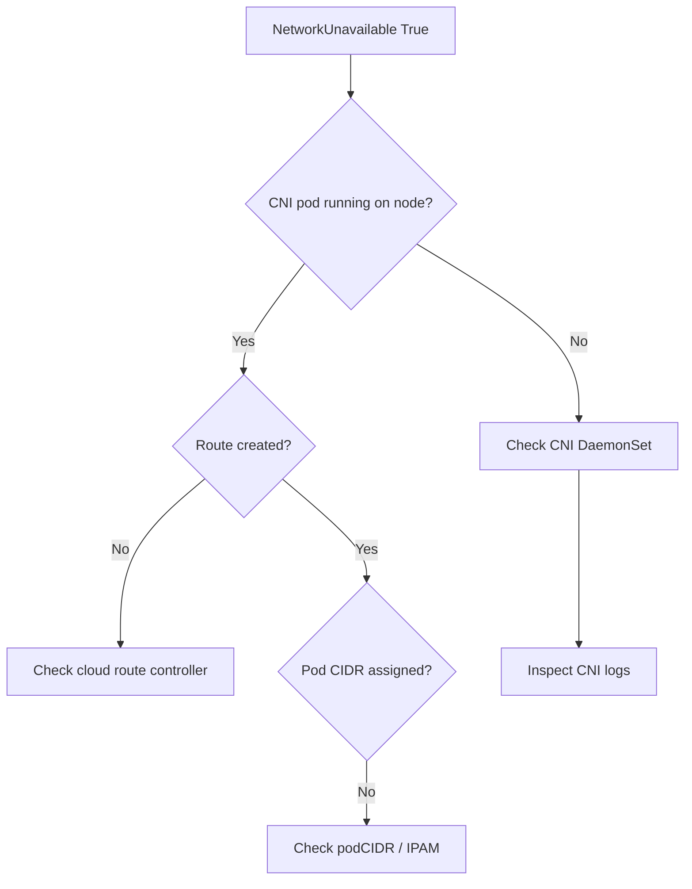

# Node NetworkUnavailable

> **Severity:** High · **Typical recovery time:** 10–45 min · **Affected versions:** 1.20+

## Error Message

```text
Conditions:
  Type                 Status   Reason                        Message
  NetworkUnavailable   True     NoRouteCreated                Node created without a route

Taints: node.kubernetes.io/network-unavailable:NoSchedule
```

## Description

`NetworkUnavailable=True` means the node's network is not correctly configured —
specifically that pod networking routes have not been set up. This condition is
managed by the cloud route controller or the CNI plugin: until the network is
ready, the node carries a `network-unavailable:NoSchedule` taint so pods are not
scheduled onto a host that cannot route their traffic.

During an incident, a freshly joined node may stay unschedulable, or an existing
node may lose pod connectivity if its CNI agent crashes. This is distinct from
`NotReady`: the kubelet may be healthy while the network layer is not.

## Affected Kubernetes Versions

Applies to 1.20+. The condition is set by the cloud-controller-manager route
controller (for providers using node routes) or cleared by the CNI (e.g.
Calico, Cilium, flannel) when it programs the node. Behaviour is consistent
across modern releases; cloud-provider out-of-tree migration does not change it.

## Likely Root Causes

- CNI plugin DaemonSet pod not running or crash-looping on the node
- Cloud route controller failed to create the node's pod-CIDR route
- Missing/incorrect pod CIDR allocation for the node
- IP exhaustion in the cluster/VPC CIDR
- Misconfigured CNI binary/config (`/etc/cni/net.d`, `/opt/cni/bin`)

## Diagnostic Flow



## Verification Steps

Confirm `NetworkUnavailable=True` and that the CNI DaemonSet pod for this node
is healthy; check the node has a `podCIDR` assigned before deeper debugging.

## kubectl Commands

```bash
kubectl describe node worker-2 | sed -n '/Conditions/,/Events/p'
kubectl get node worker-2 -o jsonpath='{.spec.podCIDR}{"\n"}'
kubectl get pods -n kube-system -o wide --field-selector spec.nodeName=worker-2
kubectl get events --field-selector involvedObject.name=worker-2 --sort-by=.lastTimestamp
kubectl logs -n kube-system <cni-pod-on-worker-2>
# Host-level read-only checks:
systemctl status kubelet
```

## Expected Output

```text
Conditions:
  NetworkUnavailable   True   NoRouteCreated   Node created without a route

NAME                READY   STATUS             RESTARTS
calico-node-7gk2x   0/1     CrashLoopBackOff   6
podCIDR: (empty)
```

## Common Fixes

1. Restart or fix the CNI DaemonSet pod on the node.
2. Ensure the cloud route controller is healthy and has permissions.
3. Assign/repair the node `podCIDR` and resolve IP exhaustion.

## Recovery Procedures

1. Inspect the CNI pod logs and node `podCIDR` first.
2. Delete the crash-looping CNI pod so the DaemonSet recreates it — **blast
   radius: node networking only**; pod traffic on that node may blip during
   reprogramming.
3. If the node cannot be repaired, **cordon then drain** and replace it. Drain
   evicts all pods and may violate PDBs. Safer alternative: cordon, provision a
   replacement node, then drain once capacity exists.
4. Reboot only if the host network stack is wedged — full node blast radius.

## Validation

`NetworkUnavailable` returns to `False`, the taint clears, the node shows a
`podCIDR`, and a test pod on the node has cross-node connectivity.

## Prevention

- Monitor CNI DaemonSet readiness per node and alert on crash loops.
- Verify cloud-controller-manager RBAC/permissions for route creation.
- Size pod and VPC CIDRs with headroom; track IP utilization.
- Pin CNI versions and validate config in CI before rollout.

## Related Errors

- [NodeNotReady](./nodenotready.md)
- [Node Unreachable](./node-unreachable.md)
- [Node Registration / CSR Pending](./node-registration-csr-pending.md)

## References

- [Node conditions](https://kubernetes.io/docs/concepts/architecture/nodes/#condition)
- [Network plugins (CNI)](https://kubernetes.io/docs/concepts/extend-kubernetes/compute-storage-net/network-plugins/)

## Further Reading

- [DevOps AI ToolKit — Kubernetes guides](https://devopsaitoolkit.com/blog/)
