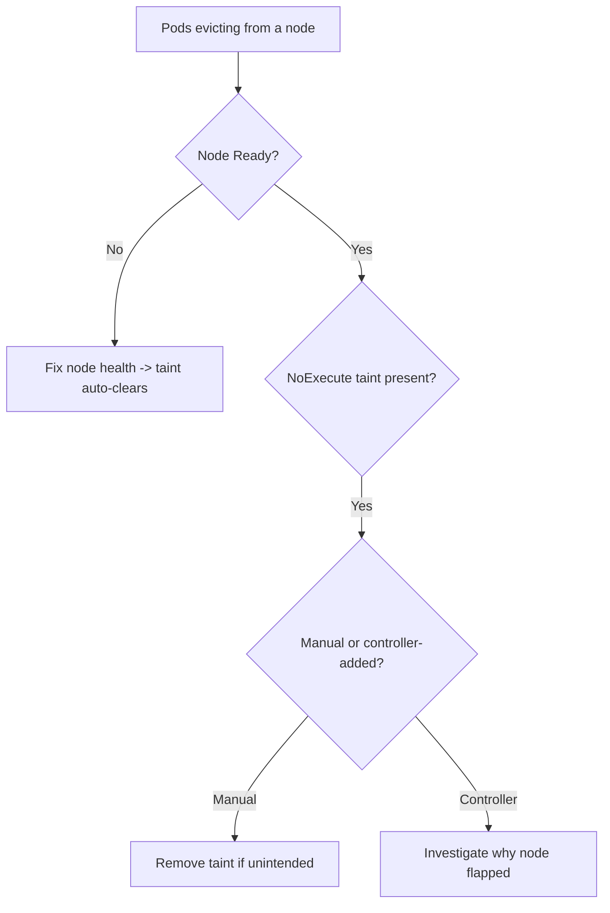

# NoExecute Taint Evicting Pods

> **Severity:** High · **Typical recovery time:** 5–30 min · **Affected versions:** 1.20+

## Description

A `NoExecute` taint not only blocks new pods from scheduling onto a node — it
evicts pods already running there that do not tolerate the taint. The taint
manager logs that it is marking pods for deletion and, after each pod's
`tolerationSeconds` elapses, deletes them. Kubernetes adds `NoExecute` taints
automatically when a node goes `NotReady` or `unreachable`
(`node.kubernetes.io/not-ready`, `node.kubernetes.io/unreachable`), and
operators add them manually for maintenance.

During an incident this shows up as mass pod terminations on one node. Whether
that is correct depends on why the taint exists: a genuinely failed node should
shed pods, but an accidental or premature taint can needlessly disrupt
healthy workloads.

## Error Message

```text
taint_manager: Marking for deletion Pod default/web-7c... (NoExecute taint)
node.kubernetes.io/unreachable:NoExecute
```

## Affected Kubernetes Versions

Applies to 1.20+. Taint-based eviction has been the default since 1.18. Default
`tolerationSeconds` for the not-ready/unreachable taints is 300 seconds unless
overridden per pod or by the API server's admission defaults.

## Likely Root Causes

- Node became `NotReady`/`unreachable`, so the controller added a `NoExecute` taint
- An operator manually applied a `NoExecute` taint for maintenance
- Workloads lack tolerations (or have too-short `tolerationSeconds`)
- A flapping node repeatedly tainted/un-tainted, churning pods

## Diagnostic Flow



## Verification Steps

Identify which taint is causing eviction and whether the node is actually
unhealthy.

## kubectl Commands

```bash
kubectl get nodes
kubectl describe node <node> | grep -A3 Taints
kubectl get node <node> -o jsonpath='{.spec.taints}'
kubectl get events -A --sort-by=.lastTimestamp | grep -iE 'taint|evict'
kubectl get pods -A -o wide --field-selector spec.nodeName=<node>

# On the node host (read-only) if NotReady:
sudo systemctl status kubelet --no-pager
sudo journalctl -u kubelet --no-pager | tail -50
```

## Expected Output

```text
$ kubectl describe node node-2 | grep -A2 Taints
Taints:  node.kubernetes.io/unreachable:NoExecute
         node.kubernetes.io/unreachable:NoSchedule

$ kubectl get events -A | grep taint
default  ...  TaintManagerEviction  Marking for deletion Pod default/web-7c... (NoExecute taint)
```

## Common Fixes

1. If the node is genuinely unhealthy, fix node health (kubelet/network); the
   controller removes the taint automatically when it returns `Ready`.
2. If the taint was applied by mistake, remove it:
   `kubectl taint nodes <node> <key>:NoExecute-`.
3. Add appropriate `tolerations` (with sensible `tolerationSeconds`) to
   workloads that must ride out brief node blips.

## Recovery Procedures

1. Determine root cause: node failure vs accidental taint.
2. For a failed node, restore the kubelet/network so the taint clears. If
   unrecoverable, let eviction proceed — blast radius: that node's pods
   reschedule; ensure cluster capacity.
3. For maintenance, **cordon then drain explicitly** rather than relying on
   eviction so you control timing — blast radius: all pods on the node move;
   confirm PodDisruptionBudgets and capacity first.
4. Verify rescheduled pods are healthy before proceeding.

## Validation

Evicted pods are `Running` elsewhere, the node is either `Ready` (taint gone)
or intentionally cordoned, and no unexpected workloads were disrupted.

## Prevention

- Add tolerations with tuned `tolerationSeconds` to latency-sensitive apps.
- Use PodDisruptionBudgets to bound voluntary disruption.
- Fix node flapping (resource pressure, network) so auto-taints stop recurring.

## Related Errors

- [Node Allocatable Exhausted](node-allocatable-exhausted.md)
- [Node Max Volume Count Exceeded](node-max-volume-count.md)
- [Node Kernel Hung / Panic](node-kernel-hung.md)

## References

- [Taints and Tolerations](https://kubernetes.io/docs/concepts/scheduling-eviction/taint-and-toleration/)
- [API-initiated and taint-based eviction](https://kubernetes.io/docs/concepts/scheduling-eviction/node-pressure-eviction/)

## Further Reading

- [DevOps AI ToolKit — Kubernetes guides](https://devopsaitoolkit.com/blog/)
