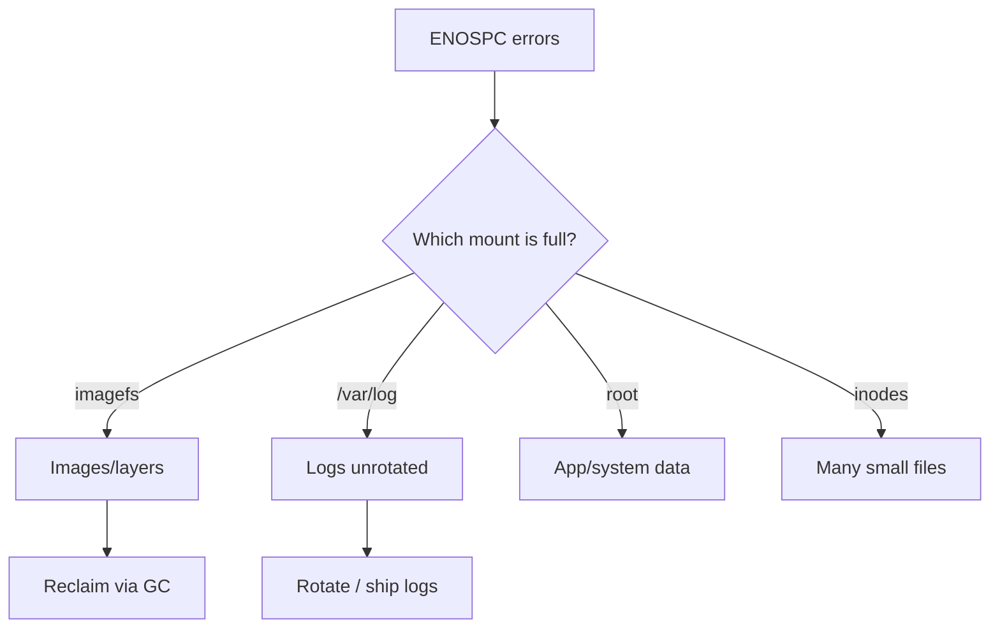

# Node Out Of Disk

> **Severity:** Critical · **Typical recovery time:** 10–45 min · **Affected versions:** 1.20+

## Error Message

```text
write /var/lib/containerd/.../layer.tar: no space left on device

# kubelet
failed to write to log: write ...: no space left on device
Failed to start container: mkdir ...: no space left on device
```

## Description

`no space left on device` (ENOSPC) means a node filesystem is completely full —
either out of free bytes or out of inodes. This is more severe than
`DiskPressure`: instead of the kubelet proactively evicting to stay above a
threshold, the disk is already at 100%, so writes fail hard. The kubelet may be
unable to write logs, pull images, create container layers, or even update its
own state, which can drag the node to `NotReady`.

During an incident this often cascades: full `/var/lib/containerd` blocks new
containers, full `/var/log` blocks logging, and a full root partition can wedge
the kubelet entirely. Etcd nodes hitting ENOSPC is especially dangerous.

## Affected Kubernetes Versions

Applies to 1.20+. The legacy `OutOfDisk` node condition was removed long ago;
modern Kubernetes surfaces disk exhaustion via `DiskPressure` plus raw ENOSPC
errors in kubelet/runtime logs. The remedy is host-level and version-independent.

## Likely Root Causes

- Container image/layer accumulation filling imagefs
- Unrotated or runaway pod/system logs filling `/var/log`
- Large emptyDir / ephemeral writes or core dumps
- Inode exhaustion (millions of small files) with bytes free
- Orphaned volumes, snapshots, or a separate partition (etcd) filling

## Diagnostic Flow



## Verification Steps

Confirm which mount point is at 100% and whether it is bytes or inodes; the kubelet
may already report `DiskPressure=True` alongside the raw ENOSPC errors.

## kubectl Commands

```bash
kubectl get nodes -o wide
kubectl describe node worker-2 | sed -n '/Conditions/,/Events/p'
kubectl get events --field-selector involvedObject.name=worker-2 --sort-by=.lastTimestamp
kubectl get pods -A -o wide --field-selector spec.nodeName=worker-2
# Host-level read-only checks (run on the node):
df -h
df -i
journalctl -u kubelet --since "20 min ago" --no-pager | grep -i "no space"
```

## Expected Output

```text
Filesystem      Size  Used Avail Use% Mounted on
/dev/nvme0n1p1   80G   80G     0 100% /
/dev/nvme0n1p1                  100% inodes /

# kubelet
write /var/lib/containerd/io.containerd...: no space left on device
```

## Common Fixes

1. Reclaim image/container space (kubelet GC; remove dangling images).
2. Rotate/truncate runaway logs and configure log rotation.
3. Grow the volume (cloud disk resize + filesystem grow) if chronically tight.

## Recovery Procedures

1. Identify the full mount and largest consumers before deleting anything.
2. Reclaim space on the host (remove unused images, rotate logs) — **blast
   radius: node only**; deleting in-use data risks workload errors, so target
   GC-managed and log directories first.
3. If the kubelet is wedged and the node must be serviced (disk resize),
   **cordon then drain**. Drain evicts all pods and may breach PDBs. Safer
   alternative: cordon, bring up a replacement node, then drain.
4. Reboot only if the filesystem is corrupt/locked — full node blast radius and
   it does **not** by itself free space.

## Validation

`df -h`/`df -i` show free capacity, ENOSPC errors stop, `DiskPressure` clears,
the kubelet returns to `Ready`, and new pods/containers start successfully.

## Prevention

- Configure container/kubelet log rotation and ship logs off-node.
- Set ephemeral-storage requests/limits on pods.
- Right-size disks; separate partitions for etcd/containerd/logs.
- Alert on bytes **and** inode utilization before they hit 100%.

## Related Errors

- [Node DiskPressure](./node-diskpressure.md)
- [NodeNotReady](./nodenotready.md)
- [Kubelet Stopped Posting Status](./kubelet-stopped-posting-status.md)

## References

- [Node-pressure eviction](https://kubernetes.io/docs/concepts/scheduling-eviction/node-pressure-eviction/)
- [Logging architecture](https://kubernetes.io/docs/concepts/cluster-administration/logging/)

## Further Reading

- [Free Kubernetes config validators](https://devopsaitoolkit.com/validators/)
