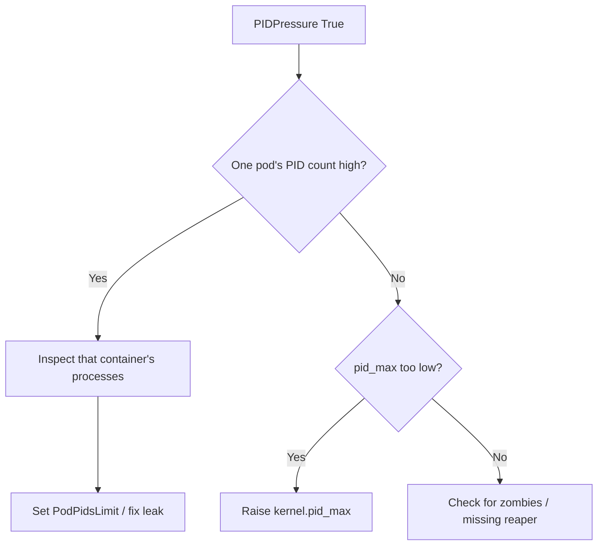

# Node PIDPressure

> **Severity:** High · **Typical recovery time:** 5–30 min · **Affected versions:** 1.20+

## Error Message

```text
Conditions:
  Type          Status   Reason                    Message
  PIDPressure   True     KubeletHasInsufficientPID   kubelet has insufficient PID available

Taints: node.kubernetes.io/pid-pressure:NoSchedule
Warning  EvictionThresholdMet  Attempting to reclaim pids
```

## Description

`PIDPressure=True` means the number of available process IDs on the node has
dropped below the kubelet's `pid.available` eviction threshold. PIDs are a
finite kernel resource; a process or thread leak in one pod can exhaust the
node-wide pool, starving the kubelet, runtime, and every other pod of the
ability to fork.

During an incident the node is tainted `NoSchedule` and the kubelet evicts pods
to reclaim PIDs. Because PID exhaustion can also block the kubelet itself from
spawning helpers, the node may slide toward `NotReady` if not addressed quickly.

## Affected Kubernetes Versions

Applies to 1.20+. Node-level `pid.available` eviction and pod-level
`PodPidsLimit` (`--pod-max-pids`) are stable. SupportNodePidsLimit /
SupportPodPidsLimit graduated to GA in earlier releases and are on by default.

## Likely Root Causes

- A container fork-bombing or leaking threads/zombies
- Application spawning unbounded worker processes
- `kernel.pid_max` set low relative to workload density
- Missing `PodPidsLimit`, letting one pod consume the node pool
- Zombie processes from a misbehaving PID 1 (no reaper)

## Diagnostic Flow



## Verification Steps

Confirm `PIDPressure` is `True`, then identify whether one pod dominates PID
usage or the node-wide `pid_max` is simply too small for the pod density.

## kubectl Commands

```bash
kubectl describe node worker-2 | sed -n '/Conditions/,/Events/p'
kubectl get events --field-selector involvedObject.name=worker-2 --sort-by=.lastTimestamp
kubectl get pods -A --field-selector spec.nodeName=worker-2 -o wide
kubectl top pods -A --sort-by=cpu | head
# Host-level read-only checks:
systemctl status kubelet
journalctl -u kubelet --since "15 min ago" --no-pager | grep -i pid
```

## Expected Output

```text
Conditions:
  PIDPressure   True   KubeletHasInsufficientPID   kubelet has insufficient PID available

Warning  Evicted  pod/worker-batch-3   The node was low on resource: pids.
$ cat /proc/sys/kernel/pid_max   ->  32768   (nearly exhausted)
```

## Common Fixes

1. Set a `PodPidsLimit` (kubelet `--pod-max-pids`) to contain runaway pods.
2. Fix the leaking app (reap zombies, bound worker pools).
3. Raise `kernel.pid_max` on the host where density legitimately needs it.

## Recovery Procedures

1. Identify the pod consuming the most processes.
2. Delete/restart the offending pod — **blast radius: that workload only**; its
   controller recreates it once a PID limit is in place.
3. If the kubelet itself is starved, **cordon then drain** the node to relieve
   pressure. Drain evicts all pods and can violate PDBs. Safer alternative:
   cordon and remove only the offending pod first; drain fully only if needed.
4. Reboot as last resort if processes cannot be reaped — full node blast radius.

## Validation

`PIDPressure` returns to `False`, the `pid-pressure` taint clears, available
PIDs recover, and the kubelet posts a healthy `Ready` status again.

## Prevention

- Set `PodPidsLimit` cluster-wide via kubelet config.
- Use a proper init/reaper as PID 1 (`tini`, `--init`) to avoid zombies.
- Alert on per-node PID utilization.
- Bound application worker/thread pools in config.

## Related Errors

- [Node MemoryPressure](./node-memorypressure.md)
- [Node DiskPressure](./node-diskpressure.md)
- [NodeNotReady](./nodenotready.md)

## References

- [Process ID limits and reservations](https://kubernetes.io/docs/concepts/policy/pid-limiting/)
- [Node-pressure eviction](https://kubernetes.io/docs/concepts/scheduling-eviction/node-pressure-eviction/)

## Further Reading

- [Free Kubernetes config validators](https://devopsaitoolkit.com/validators/)
