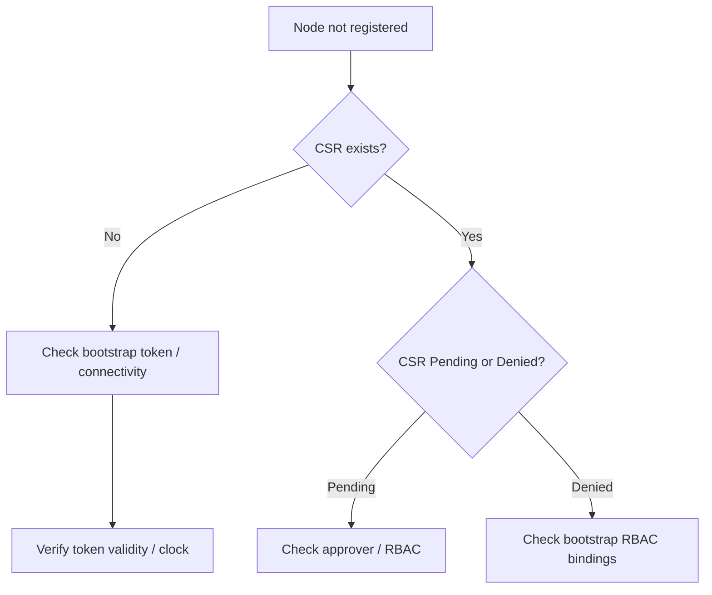

# Node Registration / CSR Pending

> **Severity:** High · **Typical recovery time:** 10–40 min · **Affected versions:** 1.20+

## Error Message

```text
$ kubectl get csr
NAME        AGE   SIGNERNAME                                    REQUESTOR                 CONDITION
csr-abc12   6m    kubernetes.io/kube-apiserver-client-kubelet   system:bootstrap:xyz123   Pending

# kubelet log
"Failed while requesting a signed certificate from the control plane"
node "worker-3" not found
```

## Description

A new node joins by having its kubelet submit a CertificateSigningRequest (CSR)
using bootstrap credentials; once approved and signed, the kubelet gets a client
cert and registers a Node object. If the CSR stays `Pending` (no approver) or is
denied, the kubelet never obtains credentials and the node never appears as
`Ready` — or never appears at all.

During an incident this blocks cluster scale-out: autoscaled or newly provisioned
nodes sit idle with workloads stuck `Pending` for capacity. The cause is usually
a missing/disabled CSR approver, an expired bootstrap token, or RBAC that stops
the bootstrap identity from creating CSRs.

## Affected Kubernetes Versions

Applies to 1.20+. TLS bootstrapping uses the
`kubernetes.io/kube-apiserver-client-kubelet` signer. The `kube-controller-manager`
auto-approves CSRs from valid bootstrap tokens when the `csrapproving` controller
and proper `system:node-bootstrapper` RBAC are present. Serving-cert CSRs
(`kubelet-serving`) are **not** auto-approved by default.

## Likely Root Causes

- CSR approver (controller-manager `csrapproving`) disabled or unhealthy
- Bootstrap token expired or RBAC bindings missing
- Clock skew breaking token/cert validity windows
- Node→apiserver connectivity blocked during bootstrap
- Duplicate/old node object with the same name blocking registration

## Diagnostic Flow



## Verification Steps

Confirm whether a CSR exists and its condition (`Pending`/`Denied`/`Approved`),
and whether a Node object was ever created for the joining host.

## kubectl Commands

```bash
kubectl get csr
kubectl describe csr csr-abc12
kubectl get nodes
kubectl get events -A --sort-by=.lastTimestamp | grep -i csr
kubectl -n kube-system get pods -l component=kube-controller-manager -o wide
# Host-level read-only checks on the joining node:
systemctl status kubelet
journalctl -u kubelet --since "20 min ago" --no-pager
```

## Expected Output

```text
NAME        SIGNERNAME                                    CONDITION
csr-abc12   kubernetes.io/kube-apiserver-client-kubelet   Pending

# describe csr
Requesting User: system:bootstrap:xyz123
Conditions:      <none>     # no Approved condition -> not signed
```

## Common Fixes

1. Ensure the controller-manager CSR approver is running and RBAC is correct.
2. Regenerate a valid bootstrap token (`kubeadm token create`) and rejoin.
3. Manually approve a legitimate pending CSR: `kubectl certificate approve <name>`.

## Recovery Procedures

1. Verify the CSR requestor is a legitimate bootstrap identity before approving.
2. `kubectl certificate approve <csr>` for genuine nodes — **blast radius:
   issues a client cert to that node only**. Never approve unknown requestors
   (security risk). Safer alternative: fix auto-approval RBAC instead of manual
   approval at scale.
3. If a stale Node object with the same name blocks registration, **delete the
   old node object** — disruptive only if it points at a still-running host;
   confirm the host is gone first.

## Validation

The CSR shows `Approved,Issued`, the Node appears and goes `Ready`, and pending
workloads schedule onto the new capacity.

## Prevention

- Keep the `csrapproving` controller enabled and RBAC intact.
- Use short-lived but automatically rotated bootstrap tokens.
- Sync clocks (NTP) on all nodes to keep cert/token windows valid.
- Alert on long-lived `Pending` CSRs.

## Related Errors

- [NodeNotReady](./nodenotready.md)
- [Node Clock Skew](./node-clock-skew.md)
- [Node NetworkUnavailable](./node-networkunavailable.md)

## References

- [TLS bootstrapping](https://kubernetes.io/docs/reference/access-authn-authz/kubelet-tls-bootstrapping/)
- [Manage certificates / CSR API](https://kubernetes.io/docs/reference/access-authn-authz/certificate-signing-requests/)

## Further Reading

- [DevOps AI ToolKit — Kubernetes guides](https://devopsaitoolkit.com/blog/)
