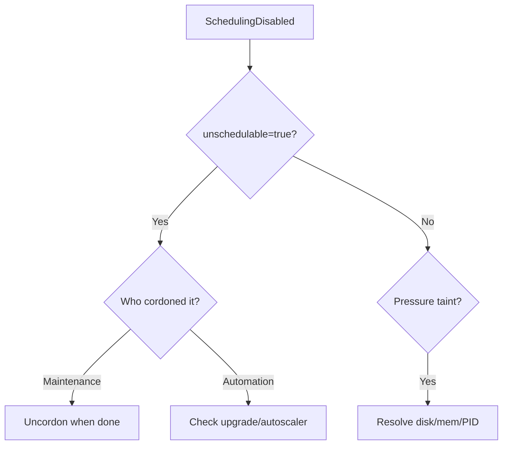

# Node SchedulingDisabled

> **Severity:** Medium · **Typical recovery time:** 1–10 min · **Affected versions:** 1.20+

## Error Message

```text
NAME       STATUS                     ROLES    AGE   VERSION
worker-2   Ready,SchedulingDisabled   <none>   91d   v1.29.4

spec:
  unschedulable: true
Taints: node.kubernetes.io/unschedulable:NoSchedule
```

## Description

`Ready,SchedulingDisabled` means the node is healthy but cordoned: its
`spec.unschedulable` field is `true` and it carries the
`node.kubernetes.io/unschedulable:NoSchedule` taint. The scheduler will not
place new pods here, though existing pods keep running. This is normally an
intentional state set by `kubectl cordon` (often as the first step of `drain`)
for maintenance.

During an incident this matters when capacity is unexpectedly low: a node left
cordoned after maintenance, or cordoned automatically by a pressure condition,
silently removes scheduling capacity and can cause `FailedScheduling` /
`Unschedulable` pods elsewhere.

## Affected Kubernetes Versions

Applies to 1.20+. Cordon sets `spec.unschedulable` and adds the
`node.kubernetes.io/unschedulable` taint (the taint-based behaviour is GA). The
`kubectl uncordon` command reverses both. Behaviour is stable across releases.

## Likely Root Causes

- A node was cordoned for maintenance and never uncordoned
- An automated drain/upgrade left the node cordoned after failure
- A controller (autoscaler, upgrade operator) cordoned it intentionally
- A pressure condition (disk/memory/PID) added a `NoSchedule` taint
- Manual `kubectl cordon` run during debugging

## Diagnostic Flow



## Verification Steps

Confirm `spec.unschedulable: true` and check whether the cordon is intentional
(maintenance/automation) or a side effect of a pressure taint.

## kubectl Commands

```bash
kubectl get nodes
kubectl get node worker-2 -o jsonpath='{.spec.unschedulable}{"\n"}'
kubectl describe node worker-2 | sed -n '/Taints/,/Conditions/p'
kubectl get events --field-selector involvedObject.name=worker-2 --sort-by=.lastTimestamp
kubectl get pods -A -o wide --field-selector spec.nodeName=worker-2
```

## Expected Output

```text
NAME       STATUS                     ROLES    AGE   VERSION
worker-2   Ready,SchedulingDisabled   <none>   91d   v1.29.4

unschedulable: true
Taints: node.kubernetes.io/unschedulable:NoSchedule
```

## Common Fixes

1. Uncordon the node once maintenance is complete: `kubectl uncordon worker-2`.
2. Resolve the underlying pressure condition if a taint cordoned it.
3. Fix the automation (upgrade operator/autoscaler) that left it cordoned.

## Recovery Procedures

1. Verify the node is actually healthy (`Ready`) and the cordon is stale.
2. Run `kubectl uncordon worker-2` to restore scheduling — **blast radius:
   minimal**; it only allows new pods to schedule, it does not move existing
   ones. There is no safer alternative needed for uncordon.
3. If the node was mid-drain and is being decommissioned, do **not** uncordon;
   complete the planned replacement instead.

## Validation

`kubectl get node worker-2` no longer shows `SchedulingDisabled`,
`spec.unschedulable` is absent/false, and new pods schedule onto the node.

## Prevention

- Track cordoned nodes with an alert (`unschedulable=true` for too long).
- Ensure upgrade/drain automation always uncordons or replaces nodes.
- Use PodDisruptionBudgets so drains complete predictably.
- Document maintenance runbooks that include the uncordon step.

## Related Errors

- [NodeNotReady](./nodenotready.md)
- [Node DiskPressure](./node-diskpressure.md)
- [Node Unreachable](./node-unreachable.md)

## References

- [Safely drain a node](https://kubernetes.io/docs/tasks/administer-cluster/safely-drain-node/)
- [Taints and tolerations](https://kubernetes.io/docs/concepts/scheduling-eviction/taint-and-toleration/)

## Further Reading

- [Free Kubernetes config validators](https://devopsaitoolkit.com/validators/)
