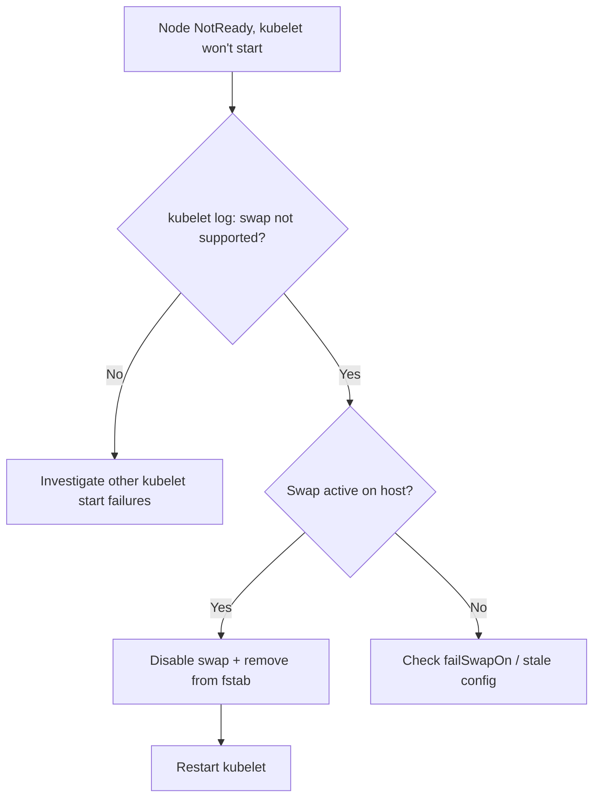

# Node Swap Unsupported

> **Severity:** High · **Typical recovery time:** 10–30 min · **Affected versions:** 1.20+

## Description

By default the kubelet refuses to start when swap is enabled on the host,
because swap undermines the memory accounting and OOM behaviour Kubernetes
relies on for limits and eviction. The kubelet exits with
`running with swap on is not supported, please disable swap` and the node never
becomes `Ready`.

This appears most often on freshly provisioned nodes, on distros that enable a
swap file by default, or after an image change re-enabled swap. Unless you have
deliberately configured the beta swap feature, the fix is to disable swap and
keep it off across reboots.

## Error Message

```text
failed to run Kubelet: running with swap on is not supported, please disable
swap! or set --fail-swap-on flag to false.
```

## Affected Kubernetes Versions

Applies to 1.20+. The `failSwapOn: true` default has been in place for years.
Swap support is a beta feature (`NodeSwap`, with `memorySwap` in
`KubeletConfiguration`, GA progressing in recent releases) and only works in
cgroup v2 with explicit configuration; without that, swap must be off.

## Likely Root Causes

- Swap enabled by the OS image / installer (swap file or partition)
- `failSwapOn` left at its default `true` while swap is present
- Swap re-enabled after a reboot because it was never removed from `/etc/fstab`
- Cloud or VM template that ships swap on

## Diagnostic Flow



## Verification Steps

Confirm swap is active and that the kubelet is failing specifically on it.

## kubectl Commands

```bash
kubectl get nodes
kubectl describe node <node> | grep -A4 Conditions

# On the node host (read-only):
sudo journalctl -u kubelet --no-pager | grep -i swap
sudo swapon --show
free -h
cat /proc/swaps
grep -i swap /etc/fstab
grep -i failSwapOn /var/lib/kubelet/config.yaml
```

## Expected Output

```text
$ journalctl -u kubelet | grep swap
kubelet: failed to run Kubelet: running with swap on is not supported,
please disable swap!

$ swapon --show
NAME      TYPE      SIZE   USED PRIO
/swap.img file        2G     0B   -2
```

## Common Fixes

1. Disable swap now: `sudo swapoff -a`.
2. Make it permanent: comment out the swap entry in `/etc/fstab` (and remove
   any swap unit / cloud-init swap config).
3. Only if you intend to use swap: enable cgroup v2 and set
   `failSwapOn: false` with a `memorySwap` policy in `KubeletConfiguration`.

## Recovery Procedures

1. Run `swapoff -a` and remove swap from `/etc/fstab` on the node.
2. **Restart the kubelet** (`systemctl restart kubelet`) — blast radius:
   node-local; the node was already `NotReady`, so impact is minimal.
3. Reboot once to confirm swap stays off across restarts.
4. Apply the same change to all affected nodes via config management / new image.

## Validation

`swapon --show` returns nothing, the kubelet starts cleanly, the node is
`Ready`, and pods schedule. A reboot leaves swap disabled.

## Prevention

- Build node images with swap disabled (or correctly configured for `NodeSwap`).
- Add a node-bootstrap check that fails if swap is on and unsupported.
- Document swap policy in your node provisioning runbook.

## Related Errors

- [Node cgroup Driver Mismatch](node-cgroup-driver-mismatch.md)
- [Node Allocatable Exhausted](node-allocatable-exhausted.md)
- [Node Kernel Hung / Panic](node-kernel-hung.md)

## References

- [Swap memory management](https://kubernetes.io/docs/concepts/cluster-administration/swap-memory-management/)
- [kubeadm installation prerequisites](https://kubernetes.io/docs/setup/production-environment/tools/kubeadm/install-kubeadm/)

## Further Reading

- [DevOps AI ToolKit — Kubernetes guides](https://devopsaitoolkit.com/blog/)
