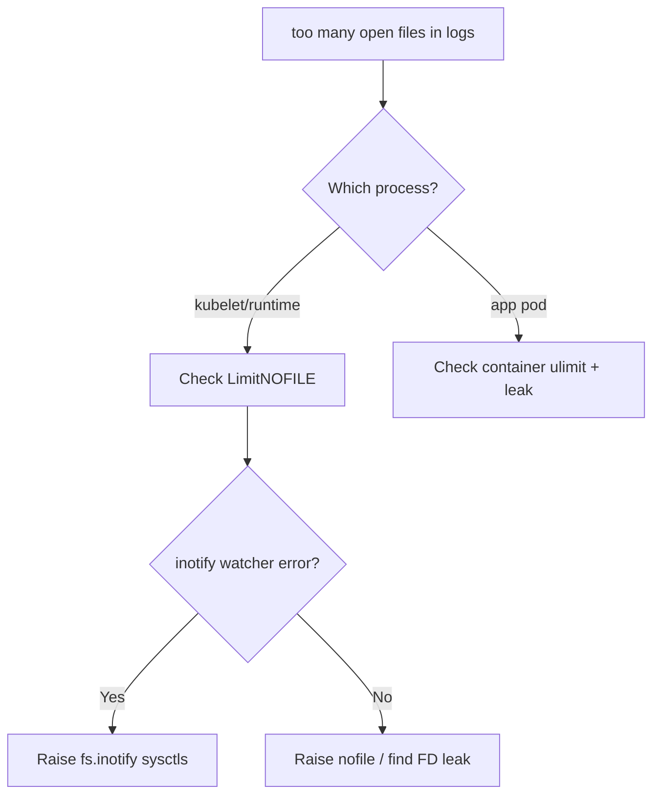

# Node Too Many Open Files

> **Severity:** High · **Typical recovery time:** 10–30 min · **Affected versions:** 1.20+

## Error Message

```text
too many open files
failed to create fsnotify watcher: too many open files
0/3 nodes are available: ... Failed to watch *v1.ConfigMap: too many open files
```

## Description

Linux caps how many file descriptors and inotify watches a process or the
whole host can hold. On a busy node the kubelet, container runtime, and
applications open thousands of files and inotify watchers (for ConfigMap and
Secret mounts, log tailing, and file watching). When the limit is hit, new
opens fail, the kubelet can no longer watch API objects, pods stall, and the
node may flap `NotReady`.

The two usual offenders are `fs.inotify.max_user_instances` /
`max_user_watches` (kernel-wide inotify limits) and the per-process file
descriptor `ulimit -n`. Symptoms are widespread: image pulls fail, log
collection breaks, and controllers crash-loop.

## Affected Kubernetes Versions

Applies broadly to 1.20+. It is a host-level kernel/limits issue, not version
specific, but high pod density (common on modern clusters) and operators that
heavily watch resources make it more likely.

## Likely Root Causes

- `fs.inotify.max_user_instances` / `max_user_watches` set too low for pod density
- Per-process `LimitNOFILE` for kubelet/containerd too small
- A leaking application or sidecar holding file descriptors open
- Many ConfigMap/Secret projected volumes, each consuming inotify watches

## Diagnostic Flow



## Verification Steps

Identify whether the limit hit is file descriptors or inotify watches, and
which process is exhausting them.

## kubectl Commands

```bash
kubectl get nodes
kubectl describe node <node>
kubectl get events -A --sort-by=.lastTimestamp | grep -i "too many open files"

# On the node host (read-only):
sysctl fs.inotify.max_user_instances fs.inotify.max_user_watches
sysctl fs.file-nr
cat /proc/$(pgrep -o kubelet)/limits | grep -i "open files"
sudo journalctl -u kubelet --no-pager | grep -i "too many open files"
```

## Expected Output

```text
$ sysctl fs.inotify.max_user_instances
fs.inotify.max_user_instances = 128

$ cat /proc/<pid>/limits | grep "open files"
Max open files            1024                 1024                 files

$ journalctl -u kubelet | grep "too many open files"
kubelet: failed to create fsnotify watcher: too many open files
```

## Common Fixes

1. Raise inotify limits: `sysctl -w fs.inotify.max_user_instances=512`
   and `fs.inotify.max_user_watches=524288`, then persist in
   `/etc/sysctl.d/`.
2. Raise `LimitNOFILE` for kubelet/containerd via systemd drop-in
   (e.g. `LimitNOFILE=1048576`).
3. Fix the leaking workload — patch the app or restart the offending pod.

## Recovery Procedures

1. Apply the sysctl/ulimit changes on the affected node.
2. **Restart the container runtime and kubelet** to pick up new
   `LimitNOFILE` — blast radius: node-local pod restarts; drain if workloads
   are sensitive.
3. For a leaking app, **restart the pod** — blast radius limited to that
   workload's replicas.
4. Roll out the host limit change to all nodes via your config-management tool.

## Validation

`sysctl fs.file-nr` shows headroom, the kubelet log is clean, and watchers
re-establish. Confirm pods schedule and ConfigMap updates propagate.

## Prevention

- Set generous inotify and `LimitNOFILE` defaults in the base node image.
- Alert on `fs.file-nr` and inotify instance usage approaching limits.
- Audit operators/agents that create many watches per pod.

## Related Errors

- [Node conntrack Table Full](node-conntrack-table-full.md)
- [Node Kernel Hung / Panic](node-kernel-hung.md)
- [Node Allocatable Exhausted](node-allocatable-exhausted.md)

## References

- [Reserve Compute Resources for System Daemons](https://kubernetes.io/docs/tasks/administer-cluster/reserve-compute-resources/)
- [Configure kubelet via systemd](https://kubernetes.io/docs/setup/production-environment/tools/kubeadm/kubelet-integration/)

## Further Reading

- [DevOps AI ToolKit — Kubernetes guides](https://devopsaitoolkit.com/blog/)
