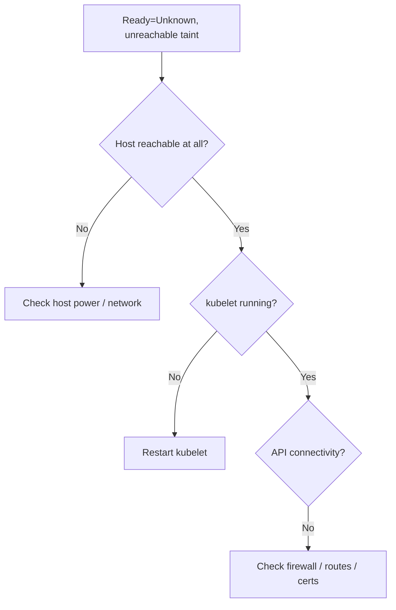

# Node Unreachable

> **Severity:** Critical · **Typical recovery time:** 5–30 min · **Affected versions:** 1.20+

## Error Message

```text
NAME       STATUS     ROLES    AGE   VERSION
worker-2   NotReady   <none>   91d   v1.29.4

Taints: node.kubernetes.io/unreachable:NoExecute
        node.kubernetes.io/unreachable:NoSchedule
Ready condition: Unknown   (LastHeartbeatTime stale)
```

## Description

The node controller marks a node `unreachable` when it stops receiving the
node's heartbeat (lease) and the `Ready` condition becomes `Unknown` rather than
`False`. Unlike a kubelet self-reporting `NotReady`, "unreachable" means the
control plane genuinely cannot tell the node's state — typically a network
partition, a crashed/powered-off host, or a dead kubelet.

This is critical because Kubernetes applies the `node.kubernetes.io/unreachable`
`NoExecute` taint. Pods without a matching toleration are evicted after
`tolerationSeconds` (default 300s). For stateful or singleton workloads this can
cause split-brain or data risk if the node is actually still alive but isolated.

## Affected Kubernetes Versions

Applies to 1.20+. Taint-based eviction (`TaintBasedEvictions`) is GA; the
default `not-ready` and `unreachable` tolerations with `tolerationSeconds: 300`
are auto-added to pods by the admission controller. The legacy
`--pod-eviction-timeout` flag is deprecated.

## Likely Root Causes

- Network partition between node and API server
- Host powered off, kernel panic, or hung
- kubelet crashed and is not restarting
- Cloud/firewall change blocking node→apiserver traffic
- Severe clock skew breaking TLS to the API server

## Diagnostic Flow



## Verification Steps

Confirm the `Ready` condition is `Unknown` (not `False`) and the `unreachable`
taint is present — that distinguishes a partition from a self-reported failure.

## kubectl Commands

```bash
kubectl get nodes -o wide
kubectl describe node worker-2 | sed -n '/Conditions/,/Events/p'
kubectl get node worker-2 -o jsonpath='{.spec.taints}{"\n"}'
kubectl get events --field-selector involvedObject.name=worker-2 --sort-by=.lastTimestamp
kubectl get pods -A -o wide --field-selector spec.nodeName=worker-2
# Host-level read-only checks (if you can reach the node):
systemctl status kubelet
journalctl -u kubelet --since "15 min ago" --no-pager
```

## Expected Output

```text
Conditions:
  Ready   Unknown   NodeStatusUnknown   Kubelet stopped posting node status.
Taints:   node.kubernetes.io/unreachable:NoExecute

Normal  TaintManagerEviction  pod/db-0  Marking for deletion Pod default/db-0
```

## Common Fixes

1. Restore network connectivity between node and control plane.
2. Restart the kubelet (or power on / recover the host).
3. Fix firewall/security-group or routing changes that broke connectivity.

## Recovery Procedures

1. Determine whether the host is dead or merely partitioned — **do not** assume
   it is down; an isolated-but-running node risks split-brain for stateful apps.
2. If recoverable, restore connectivity / restart kubelet — **blast radius:
   node only**.
3. If the host is confirmed dead, **delete the node object** so its pods
   reschedule. Deleting a live-but-partitioned node is disruptive and can cause
   duplicate stateful pods. Safer alternative: fence the host (power off via
   cloud API) before deleting the node object.
4. Avoid blanket reboots of partitioned hosts until fencing is confirmed.

## Validation

The node returns to `Ready`, the `unreachable` taint clears, evicted pods are
`Running` elsewhere, and no duplicate stateful instances exist.

## Prevention

- Make node→apiserver connectivity highly available and monitored.
- Tune `tolerationSeconds` for critical stateful pods deliberately.
- Use STONITH/fencing for stateful workloads before deleting node objects.
- Alert on node lease staleness before the eviction timeout fires.

## Related Errors

- [NodeNotReady](./nodenotready.md)
- [Kubelet Stopped Posting Status](./kubelet-stopped-posting-status.md)
- [Node NetworkUnavailable](./node-networkunavailable.md)

## References

- [Taint-based evictions](https://kubernetes.io/docs/concepts/scheduling-eviction/taint-and-toleration/#taint-based-evictions)
- [Node controller and heartbeats](https://kubernetes.io/docs/concepts/architecture/nodes/#node-controller)

## Further Reading

- [DevOps AI ToolKit — Kubernetes guides](https://devopsaitoolkit.com/blog/)
