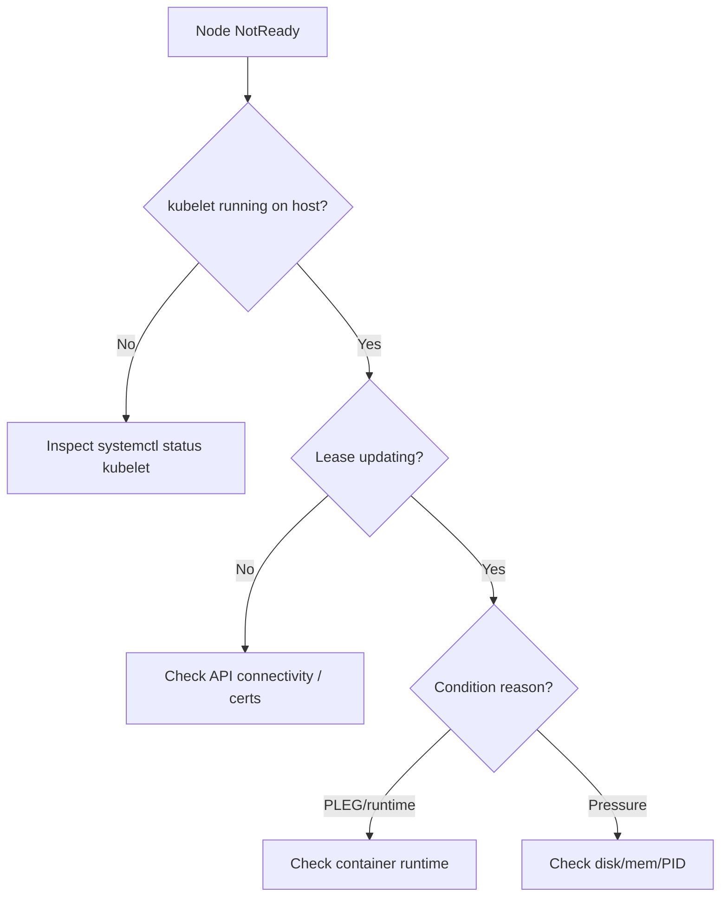

# NodeNotReady

> **Severity:** High · **Typical recovery time:** 5–30 min · **Affected versions:** 1.20+

## Error Message

```text
NAME       STATUS     ROLES    AGE   VERSION
worker-2   NotReady   <none>   91d   v1.29.4

Warning  NodeNotReady  node/worker-2  Node worker-2 status is now: NodeNotReady
```

## Description

A node moves to `NotReady` when the control plane no longer receives a healthy
`Ready=True` condition from that node's kubelet. The kubelet posts a heartbeat
(node lease, by default every 10s) and a full node status; if the lease stops
updating or the kubelet reports an unhealthy condition, the node controller
flips the node to `NotReady` after the grace period.

During an incident this is high-impact: the scheduler stops placing new pods on
the node, and after the eviction timeout (default 5 min) pods are marked for
eviction and rescheduled elsewhere. If many nodes go NotReady at once you can
cascade load onto remaining capacity and trigger further failures.

## Affected Kubernetes Versions

Applies to 1.20+. Node lease–based heartbeats (`coordination.k8s.io` Lease in
`kube-node-lease`) are the default mechanism. `--pod-eviction-timeout` on the
controller-manager was deprecated in favour of taint-based eviction
(`node.kubernetes.io/not-ready:NoExecute` with `tolerationSeconds`).

## Likely Root Causes

- Kubelet process stopped, crashed, or cannot reach the API server
- Container runtime (containerd/CRI-O) down, so kubelet PLEG goes unhealthy
- Resource pressure (disk, memory, PID) or full root filesystem
- Network partition between node and control plane
- Expired or invalid kubelet client certificate

## Diagnostic Flow



## Verification Steps

Confirm the node truly reports `NotReady` (not `Unknown`) and read the node
conditions for the precise reason and last heartbeat time before acting.

## kubectl Commands

```bash
kubectl get nodes -o wide
kubectl describe node worker-2
kubectl get node worker-2 -o jsonpath='{.status.conditions}'
kubectl get events --field-selector involvedObject.name=worker-2 --sort-by=.lastTimestamp
# Host-level read-only checks (run on the node):
systemctl status kubelet
journalctl -u kubelet --since "15 min ago" --no-pager
```

## Expected Output

```text
Conditions:
  Type             Status    Reason                       Message
  Ready            False     KubeletNotReady              container runtime is down
  MemoryPressure   False     KubeletHasSufficientMemory   kubelet has sufficient memory
LastHeartbeatTime: 2026-06-29T14:02:11Z   (stale by 4m)
```

## Common Fixes

1. Restart the failed component: `systemctl restart kubelet` (and the runtime).
2. Free resources if a pressure condition is set (clear disk, kill leaks).
3. Renew the kubelet certificate if it expired and approve the CSR.

## Recovery Procedures

1. Diagnose the reason from node conditions before touching workloads.
2. Restart kubelet/runtime on the affected node — **blast radius: that node
   only**; pods may briefly lose their kubelet manager but keep running.
3. If the host is unrecoverable, **cordon then drain** the node. Drain is
   disruptive: it evicts every pod on the node and can breach PodDisruption
   Budgets. Safer alternative: drain with `--pod-selector` in waves and respect
   PDBs, or scale up replacements first.
4. Reboot only as a last resort — full blast radius for all pods on the host.

## Validation

`kubectl get node worker-2` shows `Ready`, `LastHeartbeatTime` is current, and
rescheduled pods are `Running` with passing probes.

## Prevention

- Monitor node lease freshness and `Ready` condition with alerts.
- Set eviction thresholds and resource reserves (`--system-reserved`).
- Keep kubelet and runtime on supported versions; automate cert rotation.
- Spread workloads with topology constraints so one node loss is absorbed.

## Related Errors

- [Kubelet Stopped Posting Status](./kubelet-stopped-posting-status.md)
- [Node Unreachable](./node-unreachable.md)
- [Node MemoryPressure](./node-memorypressure.md)

## References

- [Node status and conditions](https://kubernetes.io/docs/concepts/architecture/nodes/#condition)
- [Heartbeats and node leases](https://kubernetes.io/docs/concepts/architecture/nodes/#heartbeats)

## Further Reading

- [DevOps AI ToolKit — Kubernetes guides](https://devopsaitoolkit.com/blog/)
