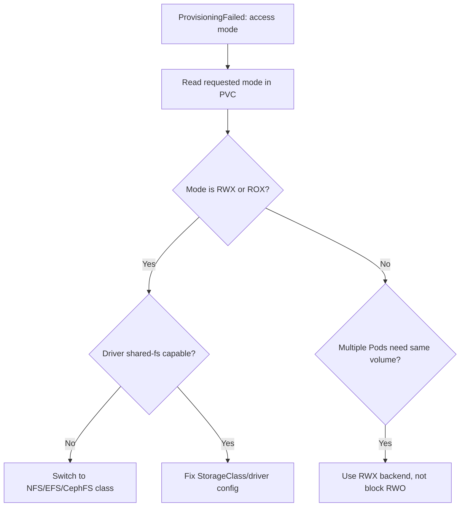

# PVC AccessMode Unsupported

> **Severity:** High · **Typical recovery time:** 15–45 min · **Affected versions:** 1.20+

## Error Message

```text
Warning  ProvisioningFailed  persistentvolumeclaim/shared
failed to provision volume with StorageClass "gp3":
rpc error: code = InvalidArgument desc = Volume capabilities not supported:
requested access mode ReadWriteMany not supported by provisioner ebs.csi.aws.com
```

## Description

Each PVC requests one or more access modes — `ReadWriteOnce` (RWO),
`ReadOnlyMany` (ROX), `ReadWriteMany` (RWX), or `ReadWriteOncePod` (RWOP). Block
storage drivers (EBS, GCE PD, Azure Disk) support only single-node modes (RWO /
RWOP), because a raw block device can be attached to one node at a time.
Requesting `ReadWriteMany` from such a driver fails: the provisioner cannot create
a volume mountable read-write by many Pods across nodes. RWX requires a shared
filesystem backend (NFS, EFS, Azure Files, CephFS, Filestore). The mismatch
surfaces as a `ProvisioningFailed` event and the PVC never binds.

## Affected Kubernetes Versions

All releases 1.20+. `ReadWriteOncePod` is GA from 1.29 (beta 1.27). The other
three access modes have existed since early Kubernetes. Whether a mode is honored
is entirely a property of the CSI driver, not the Kubernetes version.

## Likely Root Causes

- PVC requests `ReadWriteMany` against a block-storage driver that only supports RWO
- The StorageClass points at a driver without a shared-filesystem backend
- Multiple Pods on different nodes expect to share one RWO volume
- Confusion between RWO (one node) and `ReadWriteOncePod` (one Pod)

## Diagnostic Flow



## Verification Steps

Compare the PVC's requested `accessModes` with the access modes the chosen
driver actually supports.

## kubectl Commands

```bash
kubectl get pvc <pvc> -n <namespace> -o jsonpath='{.spec.accessModes}'
kubectl describe pvc <pvc> -n <namespace>
kubectl get storageclass <class> -o jsonpath='{.provisioner}'
kubectl get csidrivers
```

## Expected Output

```text
$ kubectl get pvc shared -n app -o jsonpath='{.spec.accessModes}'
["ReadWriteMany"]

$ kubectl get storageclass gp3 -o jsonpath='{.provisioner}'
ebs.csi.aws.com
```

## Common Fixes

1. Use a shared-filesystem StorageClass (EFS, Azure Files, NFS, CephFS) for RWX
2. If only single-node access is needed, change the PVC to `ReadWriteOnce`
3. Re-architect so each Pod has its own RWO PVC instead of sharing one
4. Use `ReadWriteOncePod` when you must guarantee a single Pod writer

## Recovery Procedures

1. Read the requested mode and the driver's capability (read-only, safe).
2. For genuine shared access, install/point at an RWX-capable driver and class.
   Installing a driver is non-disruptive to running workloads.
3. `accessModes` is immutable on an existing PVC, so changing it requires
   recreating the claim. **Deleting a PVC is disruptive** (blast radius = mounting
   Pods, and data if `reclaimPolicy: Delete`); for an unbound `Pending` claim no
   data exists, so it is safe.
4. Re-apply the corrected PVC and confirm it binds against the right class.

## Validation

`kubectl get pvc` shows `Bound`, the `ACCESS MODES` column matches the request,
and Pods across nodes mount it successfully when RWX was the goal.

## Prevention

- Document which classes support RWX vs RWO and default apps to RWO
- Lint manifests so RWX PVCs only reference RWX-capable classes
- Prefer per-Pod RWO volumes over shared RWX where the design allows it

## Related Errors

- [PVC ProvisioningFailed](./pvc-provisioning-failed.md)
- [PVC Bound But Pod Pending](./pvc-bound-pod-still-pending.md)
- [PVC StorageClass Not Found](./pvc-storageclass-not-found.md)

## References

- [Access Modes](https://kubernetes.io/docs/concepts/storage/persistent-volumes/#access-modes)
- [CSI Driver Capabilities](https://kubernetes.io/docs/concepts/storage/volumes/#csi)

## Further Reading

- [DevOps AI ToolKit — Kubernetes guides](https://devopsaitoolkit.com/blog/)
