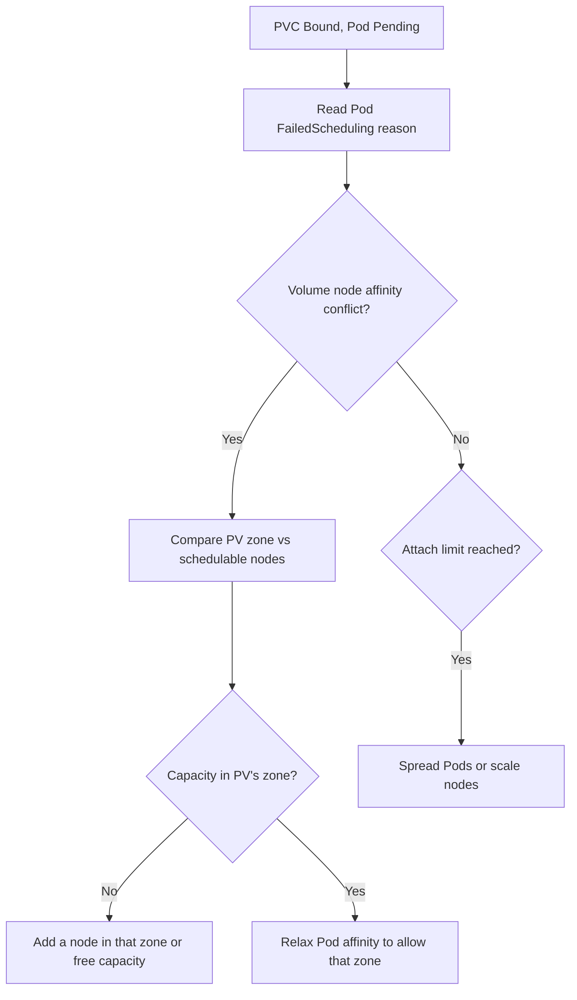

# PVC Bound But Pod Pending

> **Severity:** High · **Typical recovery time:** 15–45 min · **Affected versions:** 1.20+

## Error Message

```text
Warning  FailedScheduling  pod/web-0
0/3 nodes are available: 3 node(s) had volume node affinity conflict.

# PVC itself is healthy:
NAME    STATUS   VOLUME                                     CAPACITY   STORAGECLASS
data    Bound    pvc-2f1a...                                20Gi       gp3
```

## Description

The PVC is `Bound` to a PV, so storage provisioning succeeded — yet the Pod that
mounts it cannot be scheduled. The most common reason is a **volume node affinity
conflict**: the PV was provisioned in one zone (or attached to a specific node)
and the scheduler can find no node in that topology that also satisfies the Pod's
other constraints. Other causes are attach limits, a zone with no schedulable
capacity, or an `Immediate`-binding class that placed the volume before the Pod's
placement was known. This is a scheduling problem dressed as a storage problem.

## Affected Kubernetes Versions

All releases 1.20+. The `volume node affinity conflict` message comes from the
VolumeBinding scheduler plugin, stable across modern versions. The class's
`volumeBindingMode` (`Immediate` vs `WaitForFirstConsumer`) strongly affects how
often this occurs.

## Likely Root Causes

- PV is pinned to a zone/node where the Pod cannot be scheduled (topology conflict)
- StorageClass uses `Immediate` binding, so the volume's zone was fixed too early
- Node attach limit reached — the node cannot attach more volumes
- The target zone has no nodes with free CPU/memory or matching affinity
- A single-zone PV (e.g. `ReadWriteOnce` EBS) blocks cross-zone rescheduling

## Diagnostic Flow



## Verification Steps

Match the PV's topology label against the zones of currently schedulable nodes.

## kubectl Commands

```bash
kubectl describe pod <pod> -n <namespace>
kubectl get pvc <pvc> -n <namespace>
kubectl get pv <pv> -o jsonpath='{.spec.nodeAffinity}'
kubectl get nodes -L topology.kubernetes.io/zone
```

## Expected Output

```text
$ kubectl get pv pvc-2f1a... -o jsonpath='{.spec.nodeAffinity}'
{"required":{"nodeSelectorTerms":[{"matchExpressions":
[{"key":"topology.kubernetes.io/zone","operator":"In","values":["us-east-1a"]}]}]}}

$ kubectl get nodes -L topology.kubernetes.io/zone
NAME         STATUS   ZONE
node-1       Ready    us-east-1b
node-2       Ready    us-east-1b
```

## Common Fixes

1. Add or uncordon a schedulable node in the PV's zone (`us-east-1a` above)
2. Switch the StorageClass to `WaitForFirstConsumer` for future volumes
3. Relax the Pod's nodeSelector/affinity so it can land in the PV's zone
4. Reduce per-node volume pressure if an attach limit is the blocker

## Recovery Procedures

1. Read the exact `FailedScheduling` reason and the PV's zone (read-only, safe).
2. If capacity is missing, scale the node group / autoscaler in the PV's zone.
   Adding nodes is non-disruptive.
3. If a Pod affinity rule is wrong, edit the workload template — this triggers a
   **rollout (mildly disruptive: that workload's Pods restart)**, acceptable since
   the Pod is not yet running.
4. For an `Immediate`-class volume stuck in the wrong zone, recreate the PVC under
   a `WaitForFirstConsumer` class. **Deleting the PVC is disruptive** (blast radius =
   the PV and its data if `reclaimPolicy: Delete`); snapshot or migrate data first.

## Validation

`kubectl get pod` shows `Running`, the `FailedScheduling` events stop, and the
volume mounts successfully (`Mounted volume` event).

## Prevention

- Prefer `WaitForFirstConsumer` so volumes follow Pod placement
- Run multi-zone node pools and a cluster autoscaler that scales each zone
- Use `topologySpreadConstraints` to avoid over-packing a single zone

## Related Errors

- [PVC WaitForFirstConsumer Stuck](./pvc-waitforfirstconsumer-stuck.md)
- [PVC AccessMode Unsupported](./pvc-accessmode-unsupported.md)
- [Pod Pending](../pods/pending.md)

## References

- [Storage Capacity & Topology](https://kubernetes.io/docs/concepts/storage/storage-capacity/)
- [Volume Binding Mode](https://kubernetes.io/docs/concepts/storage/storage-classes/#volume-binding-mode)

## Further Reading

- [DevOps AI ToolKit — Kubernetes guides](https://devopsaitoolkit.com/blog/)
