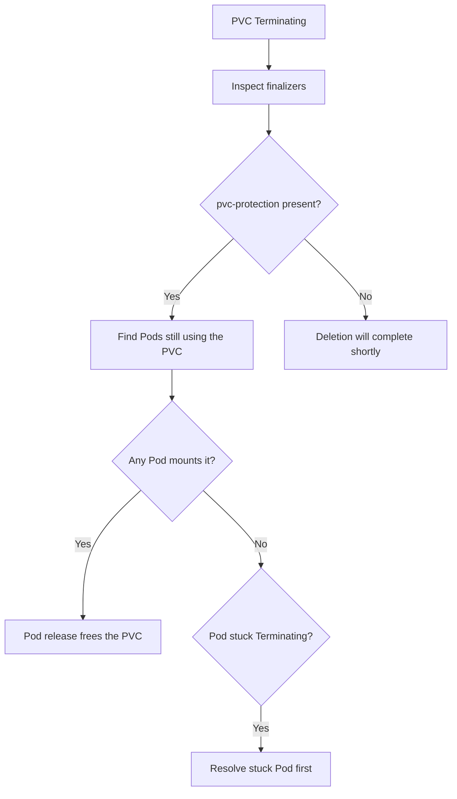

# PVC Deleted While In Use

> **Severity:** High · **Typical recovery time:** 10–30 min · **Affected versions:** 1.20+

## Error Message

```text
$ kubectl get pvc data -n app
NAME   STATUS        VOLUME        CAPACITY   ACCESS MODES   STORAGECLASS   AGE
data   Terminating   pvc-9c2b...   20Gi       RWO            gp3            12d

# finalizer holding it:
finalizers:
- kubernetes.io/pvc-protection
```

## Description

When you delete a PVC that a running Pod still mounts, Kubernetes does **not**
immediately remove it. The Storage Object in Use Protection feature adds the
`kubernetes.io/pvc-protection` finalizer, which keeps the PVC in `Terminating`
until every consuming Pod is gone. This is a safety mechanism that prevents a Pod
from losing its volume mid-write. The PVC appears "stuck," but it is doing its job:
it is waiting for the last user to release it. The danger is that once the last
Pod exits, deletion completes — and if the PV `reclaimPolicy` is `Delete`, the
underlying data is destroyed.

## Affected Kubernetes Versions

All releases 1.20+. Storage Object in Use Protection has been GA since 1.11. The
finalizer name and behaviour are unchanged across modern versions.

## Likely Root Causes

- A Pod (often part of a StatefulSet/Deployment) still mounts the PVC
- A `Terminating` Pod is itself stuck (finalizer, ungraceful node, stuck unmount)
- An accidental `kubectl delete pvc` against a claim that backs live data
- GitOps pruned the PVC while the workload was still running

## Diagnostic Flow



## Verification Steps

Find which Pods reference the PVC before doing anything — this tells you whether
deletion was intended and what will break.

## kubectl Commands

```bash
kubectl describe pvc <pvc> -n <namespace>
kubectl get pvc <pvc> -n <namespace> -o jsonpath='{.metadata.finalizers}'
kubectl get pods -n <namespace> -o json | jq -r '.items[] | select(.spec.volumes[]?.persistentVolumeClaim.claimName=="<pvc>") | .metadata.name'
kubectl get pv <pv> -o jsonpath='{.spec.persistentVolumeReclaimPolicy}'
```

## Expected Output

```text
$ kubectl get pvc data -n app -o jsonpath='{.metadata.finalizers}'
["kubernetes.io/pvc-protection"]

$ kubectl get pods -n app ... # pod still mounting the claim
web-0
```

## Common Fixes

1. If deletion was accidental, recreate the workload — the protection finalizer
   bought you time and the PVC stays bound to its data
2. If deletion is intended, stop the consuming Pods; the PVC then finalizes
3. If a consuming Pod is itself stuck `Terminating`, resolve that Pod first

## Recovery Procedures

1. List consuming Pods and the PV `reclaimPolicy` (read-only, safe — do this before
   anything else).
2. **If the delete was a mistake:** do NOT remove the finalizer. As long as a Pod
   keeps mounting the PVC it stays `Terminating` but usable. Restore the
   declarative source (Git) so the PVC object is no longer marked for deletion.
   If it has already finalized, recreate the PVC and rebind the retained PV.
3. **If the delete is intended:** scale the workload to zero — **this is disruptive
   (blast radius = the workload's availability)**. Once the last Pod is gone the
   PVC finalizes; with `reclaimPolicy: Delete` the backend volume and its data are
   destroyed permanently, so snapshot first.
4. Avoid force-removing the `pvc-protection` finalizer; it bypasses the safety
   guarantee and can detach a volume from a live Pod.

## Validation

Either the PVC is `Bound` and serving its Pod again (recovery), or it is fully
deleted and the intended cleanup is complete with no orphaned PV.

## Prevention

- Protect data PVCs from GitOps pruning (e.g. `Prune=false` / ignore annotations)
- Set `reclaimPolicy: Retain` for stateful data so accidental deletes are recoverable
- Require review/approval for `kubectl delete pvc` in production runbooks

## Related Errors

- [PVC Bound But Pod Pending](./pvc-bound-pod-still-pending.md)
- [Pod Stuck Terminating](../pods/pod-stuck-terminating.md)
- [StatefulSet PVC Retained](../statefulsets/statefulset-pvc-retained.md)

## References

- [Storage Object in Use Protection](https://kubernetes.io/docs/concepts/storage/persistent-volumes/#storage-object-in-use-protection)
- [Reclaiming Persistent Volumes](https://kubernetes.io/docs/concepts/storage/persistent-volumes/#reclaiming)

## Further Reading

- [DevOps AI ToolKit — Kubernetes guides](https://devopsaitoolkit.com/blog/)
