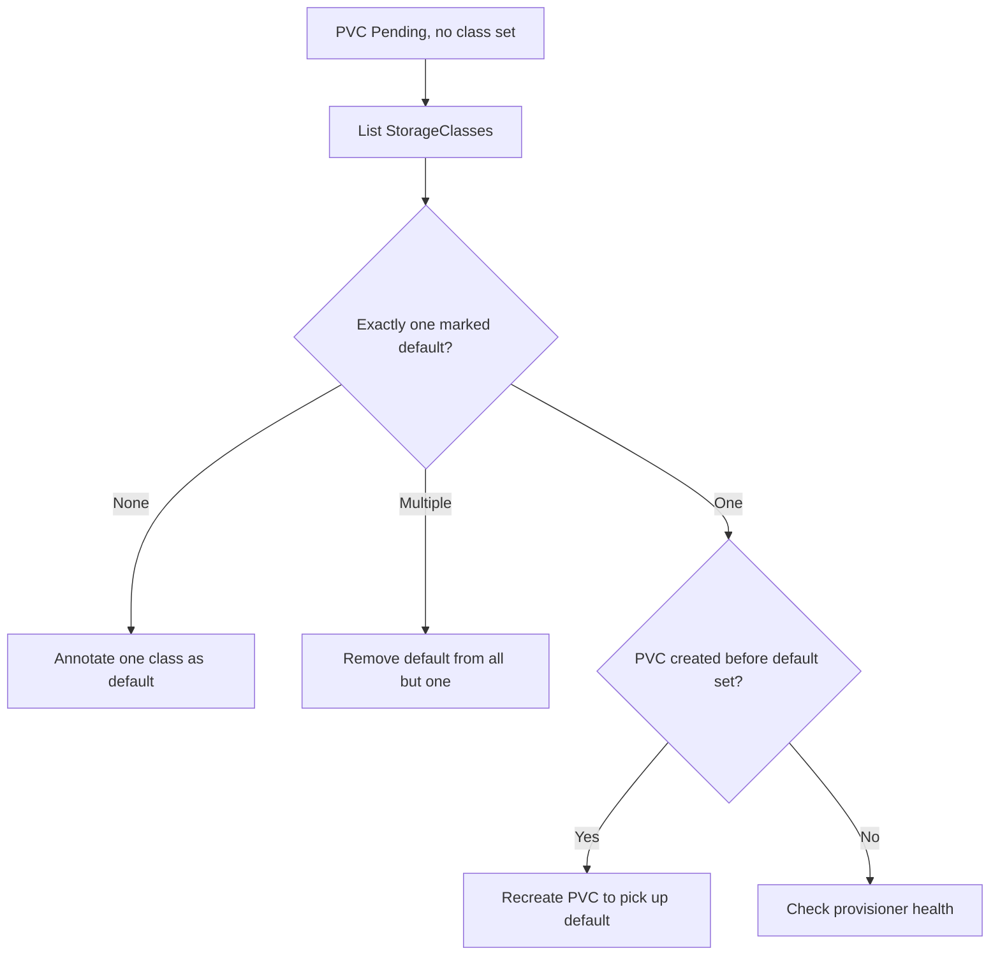

# No Default StorageClass

> **Severity:** High · **Typical recovery time:** 5–20 min · **Affected versions:** 1.20+

## Error Message

```text
Warning  ProvisioningFailed  persistentvolumeclaim/data
no persistent volumes available for this claim and no storage class is set

$ kubectl get storageclass
NAME   PROVISIONER       RECLAIMPOLICY   VOLUMEBINDINGMODE   AGE
gp3    ebs.csi.aws.com   Delete          Immediate           40d
# note: none marked "(default)"
```

## Description

When a PVC omits `storageClassName` entirely, Kubernetes substitutes the cluster's
**default** StorageClass — the one annotated
`storageclass.kubernetes.io/is-default-class: "true"`. If no class carries that
annotation, the field stays empty and the claim has no provisioner, so it sits
`Pending`. This differs from a typo'd class name: classes *exist*, but none is
marked default. It typically happens after a cluster upgrade or migration removes
or clears the default annotation, or when more than one class is (incorrectly)
marked default and the admission plugin refuses to choose.

## Affected Kubernetes Versions

All releases 1.20+. The `DefaultStorageClass` admission plugin and the
`is-default-class` annotation have been stable for many releases. The older
`storageclass.beta.kubernetes.io/is-default-class` annotation is deprecated but
may still linger on legacy clusters — prefer the GA annotation.

## Likely Root Causes

- No StorageClass has the default annotation set
- The default annotation was removed during an upgrade/migration
- Two or more classes are marked default, so none is applied deterministically
- A legacy beta annotation is set but the GA one is not

## Diagnostic Flow



## Verification Steps

Confirm whether any class is marked default and whether the PVC truly leaves
`storageClassName` empty (empty string `""` disables defaulting and is different
from unset).

## kubectl Commands

```bash
kubectl get storageclass
kubectl get storageclass -o jsonpath='{range .items[*]}{.metadata.name}{"\t"}{.metadata.annotations.storageclass\.kubernetes\.io/is-default-class}{"\n"}{end}'
kubectl get pvc <pvc> -n <namespace> -o jsonpath='{.spec.storageClassName}'
kubectl describe pvc <pvc> -n <namespace>
```

## Expected Output

```text
$ kubectl get storageclass
NAME   PROVISIONER       RECLAIMPOLICY   VOLUMEBINDINGMODE   AGE
gp3    ebs.csi.aws.com   Delete          Immediate           40d

$ kubectl get pvc data -n app -o jsonpath='{.spec.storageClassName}'
# (empty — no default was applied)
```

## Common Fixes

1. Mark exactly one StorageClass as default via the `is-default-class` annotation
2. If multiple are marked default, remove the annotation from all but one
3. Set an explicit `storageClassName` on the PVC instead of relying on a default

## Recovery Procedures

1. List classes and check the default annotation (read-only, safe).
2. Set a default:
   `kubectl patch storageclass gp3 -p '{"metadata":{"annotations":{"storageclass.kubernetes.io/is-default-class":"true"}}}'`.
   Annotating a class is non-disruptive and affects only future defaulting.
3. A PVC already created with an empty class will **not** retroactively pick up the
   new default — its `storageClassName` is set (to empty) and is immutable. Recreate
   it. **Deleting a PVC is disruptive** (blast radius = mounting Pods); a `Pending`
   claim holds no data, so recreation is safe.
4. Re-apply the PVC and confirm it binds via the default class.

## Validation

`kubectl get storageclass` shows one entry tagged `(default)`, and new PVCs
without an explicit class bind through it.

## Prevention

- Always keep exactly one default StorageClass and verify it after upgrades
- Make `storageClassName` explicit in production manifests to avoid default drift
- Add a cluster conformance check that asserts a single default class exists

## Related Errors

- [PVC Pending No Provisioner](./pvc-pending-no-provisioner.md)
- [PVC StorageClass Not Found](./pvc-storageclass-not-found.md)
- [PVC ProvisioningFailed](./pvc-provisioning-failed.md)

## References

- [Default StorageClass](https://kubernetes.io/docs/tasks/administer-cluster/change-default-storage-class/)
- [Storage Classes](https://kubernetes.io/docs/concepts/storage/storage-classes/)

## Further Reading

- [Free Kubernetes config validators](https://devopsaitoolkit.com/validators/)
