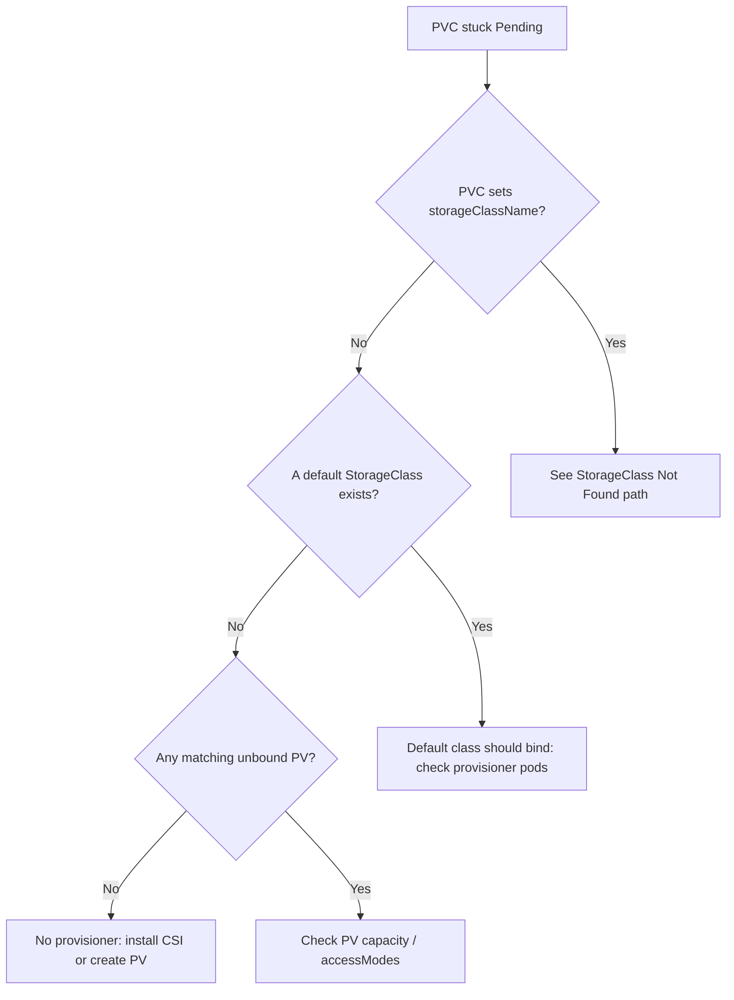

# PVC Pending No Provisioner

> **Severity:** High · **Typical recovery time:** 10–30 min · **Affected versions:** 1.20+

## Error Message

```text
Warning  ProvisioningFailed  persistentvolumeclaim/data-0
no persistent volumes available for this claim and no storage class is set
```

## Description

A PersistentVolumeClaim that does not name a `storageClassName` and matches no
pre-created PersistentVolume sits in `Pending` forever. Kubernetes has two ways
to satisfy a claim: bind it to an existing static PV, or hand it to a dynamic
provisioner selected by a StorageClass. When the claim omits a class, no default
class exists, and no manually created PV fits, the control loop has nothing to
do and emits this message. Any Pod referencing the claim stays `Pending`, so
this commonly takes down a fresh StatefulSet rollout or a first deploy on a new
cluster.

## Affected Kubernetes Versions

Applies to all supported releases (1.20+). The dynamic-provisioning and
default-class behaviour has been stable since the `storage.k8s.io/v1` GA. On
bare-metal or kubeadm clusters there is no provisioner out of the box, so this
is the expected default state until you install a CSI driver.

## Likely Root Causes

- No CSI driver / provisioner is installed in the cluster (bare-metal, kubeadm, kind)
- The PVC omits `storageClassName` and no StorageClass is marked default
- A static-PV workflow was intended but no matching PV was pre-created
- The only available PVs are already `Bound` or have non-matching size/access mode

## Diagnostic Flow



## Verification Steps

Confirm the claim truly has no class and that the cluster offers no provisioner
before assuming a driver-install is needed.

## kubectl Commands

```bash
kubectl get pvc -n <namespace>
kubectl describe pvc <pvc> -n <namespace>
kubectl get storageclass
kubectl get pv
kubectl get pods -n kube-system -l app.kubernetes.io/component=csi-driver
```

## Expected Output

```text
$ kubectl get pvc -n app
NAME     STATUS    VOLUME   CAPACITY   ACCESS MODES   STORAGECLASS   AGE
data-0   Pending                                                     6m

$ kubectl get storageclass
No resources found
```

## Common Fixes

1. Install a CSI driver / dynamic provisioner for your platform (EBS, PD, Cinder, local-path)
2. Add `storageClassName` to the PVC pointing at an installed class
3. For static provisioning, create a PV that matches the claim's size and access mode

## Recovery Procedures

1. Inspect the PVC and confirm no class and no matching PV (read-only, safe).
2. Install a provisioner, e.g. `kubectl apply -f <csi-driver-manifest>`. Adding a
   driver is non-disruptive to running workloads.
3. If the PVC was created with the wrong (empty) class, you must recreate it:
   **deleting a PVC is disruptive** — blast radius is any Pod mounting it and,
   if the StorageClass `reclaimPolicy` is `Delete`, the underlying data once a PV
   is bound. For an unbound `Pending` PVC there is no data yet, so deletion is safe.
4. Re-apply the corrected PVC and let the new provisioner bind it.

## Validation

`kubectl get pvc` shows `Bound` with a `VOLUME` and `STORAGECLASS` populated, and
the consuming Pod transitions out of `Pending`.

## Prevention

- Mark exactly one StorageClass as default (`storageclass.kubernetes.io/is-default-class: "true"`)
- Make `storageClassName` explicit in manifests and Helm values
- Add a CI policy check that every PVC names a class that exists in the target cluster

## Related Errors

- [No Default StorageClass](./pvc-no-default-storageclass.md)
- [PVC StorageClass Not Found](./pvc-storageclass-not-found.md)
- [PVC Bound But Pod Pending](./pvc-bound-pod-still-pending.md)

## References

- [Persistent Volumes](https://kubernetes.io/docs/concepts/storage/persistent-volumes/)
- [Dynamic Volume Provisioning](https://kubernetes.io/docs/concepts/storage/dynamic-provisioning/)

## Further Reading

- [DevOps AI ToolKit — Kubernetes guides](https://devopsaitoolkit.com/blog/)
