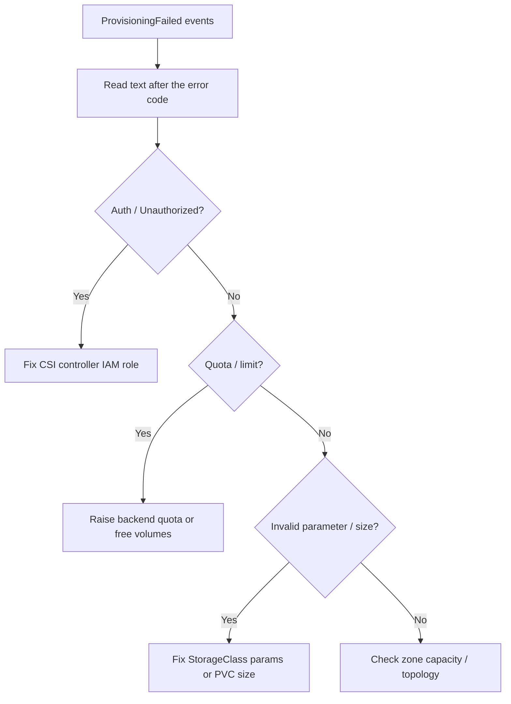

# PVC ProvisioningFailed

> **Severity:** High · **Typical recovery time:** 15–45 min · **Affected versions:** 1.20+

## Error Message

```text
Warning  ProvisioningFailed  persistentvolumeclaim/data
failed to provision volume with StorageClass "gp3":
rpc error: code = Internal desc = could not create volume:
UnauthorizedOperation: You are not authorized to perform this operation
```

## Description

`ProvisioningFailed` means the StorageClass and its provisioner were found, but
the actual backend call to create a volume failed. The external CSI provisioner
asks the storage backend (EBS, GCE PD, Cinder, vSphere, Ceph, etc.) to carve out
a disk and the backend refuses. The reason after the colon is the real signal:
IAM/permission denials, quota limits, invalid parameters, unsupported size, or a
zone with no capacity. The provisioner retries with backoff, so the PVC oscillates
in `Pending` while repeated `ProvisioningFailed` events accumulate.

## Affected Kubernetes Versions

All releases 1.20+ using external CSI provisioners. Older in-tree provisioners
(removed in 1.26–1.31 depending on driver) produced the same event from
kube-controller-manager instead of the CSI sidecar. The message body is
provisioner-specific, so always read the text after `failed to provision volume`.

## Likely Root Causes

- IAM / cloud credentials lack create-volume permission for the CSI controller
- Backend quota exhausted (volume count, total GiB, IOPS) in the account/region
- Invalid StorageClass `parameters` (bad `type`, `fsType`, `iops`, encryption key)
- Requested size below the backend minimum or above its maximum
- No capacity in the target availability zone / topology

## Diagnostic Flow



## Verification Steps

Read the provisioner controller logs, not just the PVC event, to get the full
backend error including request IDs.

## kubectl Commands

```bash
kubectl describe pvc <pvc> -n <namespace>
kubectl get events -n <namespace> --field-selector reason=ProvisioningFailed
kubectl get storageclass <class> -o yaml
kubectl -n kube-system logs deploy/ebs-csi-controller -c csi-provisioner --tail=100
```

## Expected Output

```text
$ kubectl get events -n app --field-selector reason=ProvisioningFailed
LAST SEEN   TYPE      REASON              OBJECT                MESSAGE
30s         Warning   ProvisioningFailed  persistentvolumeclaim/data
failed to provision volume with StorageClass "gp3": UnauthorizedOperation
```

## Common Fixes

1. Grant the CSI controller's IAM role / service account the create-volume permission
2. Increase backend quota or delete unused volumes to free headroom
3. Correct invalid StorageClass `parameters` and recreate dependent PVCs
4. Adjust the requested size to fall within backend min/max bounds

## Recovery Procedures

1. Capture the exact backend error from controller logs (read-only, safe).
2. For IAM fixes, update the cloud role/policy out of band; the provisioner retries
   automatically — no workload restart needed.
3. For a bad StorageClass parameter, classes are immutable, so create a corrected
   class and repoint PVCs. Repointing requires recreating the PVC: **deleting a PVC
   is disruptive** (blast radius = mounting Pods); a `Pending` claim has no data.
4. Optionally `kubectl delete pvc <pvc>` and re-apply to force an immediate retry
   instead of waiting for backoff — only safe while the claim is unbound.

## Validation

`kubectl get pvc` shows `Bound`; `ProvisioningFailed` events stop and a
`ProvisioningSucceeded` event appears.

## Prevention

- Provision CSI IAM via IRSA/Workload Identity and test in a canary namespace
- Monitor cloud volume quotas and alert before exhaustion
- Validate StorageClass `parameters` against the driver's documented options in CI

## Related Errors

- [PVC StorageClass Not Found](./pvc-storageclass-not-found.md)
- [PVC Storage Quota Exceeded](./pvc-storage-quota-exceeded.md)
- [PVC AccessMode Unsupported](./pvc-accessmode-unsupported.md)

## References

- [Dynamic Volume Provisioning](https://kubernetes.io/docs/concepts/storage/dynamic-provisioning/)
- [Storage Classes](https://kubernetes.io/docs/concepts/storage/storage-classes/)

## Further Reading

- [DevOps AI ToolKit — Kubernetes guides](https://devopsaitoolkit.com/blog/)
