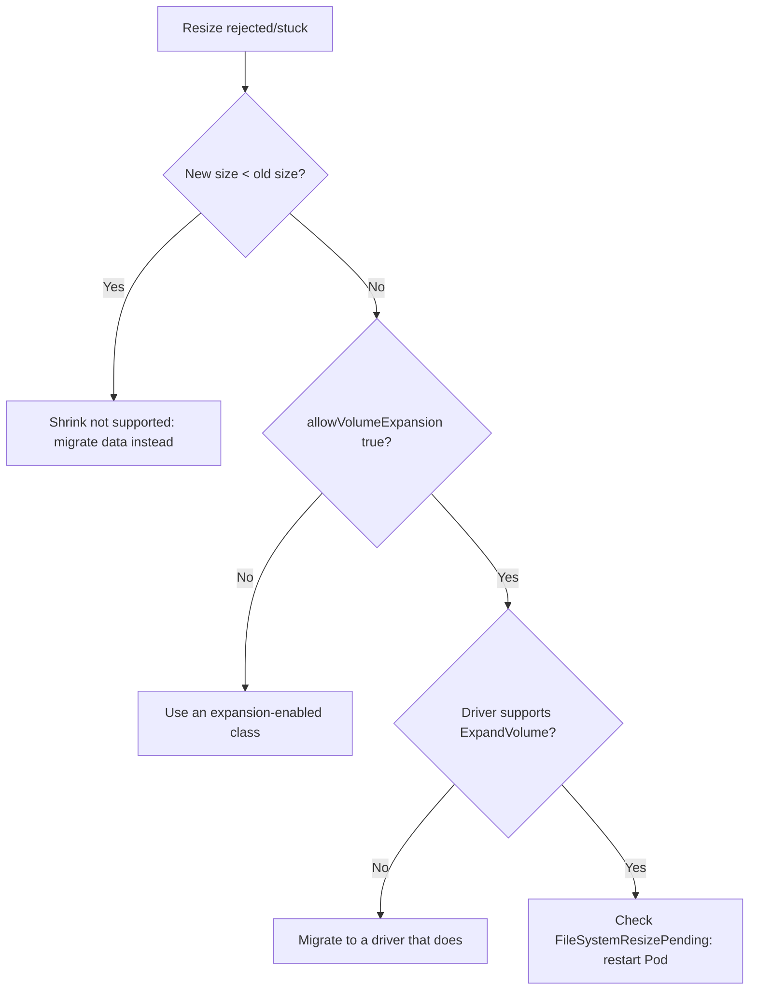

# PVC Resize Not Allowed

> **Severity:** Medium · **Typical recovery time:** 10–40 min · **Affected versions:** 1.24+

## Error Message

```text
The PersistentVolumeClaim "data" is invalid:
spec.resources.requests.storage: Forbidden: field can not be less than previous value

# or, when expansion is disabled on the class:
Forbidden: only dynamically provisioned pvc with allowVolumeExpansion=true can be resized
```

## Description

Kubernetes lets you grow a PVC by editing `spec.resources.requests.storage`, but
only under strict rules. You can never **shrink** a PVC — requesting a smaller
size is rejected with "can not be less than previous value." And you can only
**grow** a PVC when its StorageClass sets `allowVolumeExpansion: true`; otherwise
the API server (or the resize controller) refuses. Misunderstanding these two
constraints is the usual cause of a stuck or rejected resize during a capacity
incident.

## Affected Kubernetes Versions

Online volume expansion is GA from 1.24+. The `allowVolumeExpansion` field and
the offline-expand path existed earlier (beta from 1.16), but 1.24+ is the modern
baseline. Some CSI drivers also require a Pod restart to complete filesystem
expansion even after the volume grows.

## Likely Root Causes

- StorageClass has `allowVolumeExpansion: false` (or the field is absent)
- The requested size is smaller than the current size (shrink attempt)
- The CSI driver does not support `ExpandVolume`
- Backend quota would be exceeded by the larger request
- Filesystem resize is pending a Pod restart (FileSystemResizePending)

## Diagnostic Flow



## Verification Steps

Check the class's expansion flag and compare the requested size against the
PVC's current `status.capacity`.

## kubectl Commands

```bash
kubectl get storageclass <class> -o jsonpath='{.allowVolumeExpansion}'
kubectl get pvc <pvc> -n <namespace> -o jsonpath='{.status.capacity.storage}'
kubectl describe pvc <pvc> -n <namespace>
kubectl get events -n <namespace> --field-selector reason=VolumeResizeFailed
```

## Expected Output

```text
$ kubectl get storageclass gp3 -o jsonpath='{.allowVolumeExpansion}'
false

$ kubectl describe pvc data -n app | grep -i condition -A3
Conditions:
  Type                      Status
  FileSystemResizePending   True
```

## Common Fixes

1. Set `allowVolumeExpansion: true` on the StorageClass (applies to future resizes)
2. Request a size equal to or larger than the current capacity — never smaller
3. Restart the consuming Pod to finish a `FileSystemResizePending` expansion
4. To shrink, create a new smaller PVC and copy data; in-place shrink is unsupported

## Recovery Procedures

1. Read the class flag and current capacity (read-only, safe).
2. Enable expansion: `kubectl patch storageclass <class>` to add
   `allowVolumeExpansion: true`. This is non-disruptive and affects only new resizes.
3. Re-issue the grow with a valid (larger) size.
4. If the condition is `FileSystemResizePending`, restart the Pod to let the CSI
   node plugin grow the filesystem. **Restarting/deleting the Pod is disruptive** —
   blast radius is that single Pod's availability; data on the PV is preserved.

## Validation

`kubectl get pvc` shows the new larger size in both `CAPACITY` and
`status.capacity`, and the `FileSystemResizePending` condition clears.

## Prevention

- Provision expansion-enabled StorageClasses from day one
- Size volumes with headroom and alert on usage before they fill
- Document that PVCs grow only — design data layout so shrinking is never required

## Related Errors

- [PVC ProvisioningFailed](./pvc-provisioning-failed.md)
- [PVC Storage Quota Exceeded](./pvc-storage-quota-exceeded.md)
- [StatefulSet PVC Resize Pending](../statefulsets/statefulset-pvc-resize-pending.md)

## References

- [Expanding Persistent Volumes Claims](https://kubernetes.io/docs/concepts/storage/persistent-volumes/#expanding-persistent-volumes-claims)
- [Storage Classes — Allow Volume Expansion](https://kubernetes.io/docs/concepts/storage/storage-classes/#allow-volume-expansion)

## Further Reading

- [Free Kubernetes config validators](https://devopsaitoolkit.com/validators/)
