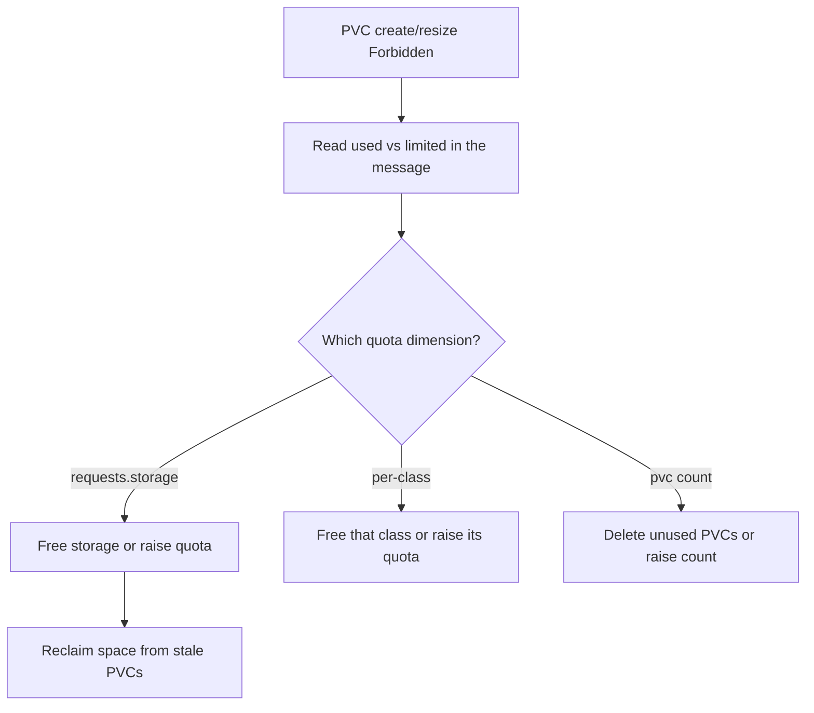

# PVC Storage Quota Exceeded

> **Severity:** Medium · **Typical recovery time:** 5–20 min · **Affected versions:** 1.20+

## Error Message

```text
Error from server (Forbidden): error when creating "pvc.yaml":
persistentvolumeclaims "data" is forbidden:
exceeded quota: storage-quota, requested: requests.storage=50Gi,
used: requests.storage=180Gi, limited: requests.storage=200Gi
```

## Description

A namespace `ResourceQuota` caps the total storage that PVCs may request (and
optionally the count of PVCs, or per-StorageClass requests). When a new or
expanded PVC would push the namespace over that cap, the quota admission
controller rejects the request synchronously at create time. Unlike provisioning
errors, this fails *before* a PVC object is even stored — `kubectl apply` returns
`Forbidden` immediately and the message states requested, used, and limited
amounts so you can see exactly how much headroom is missing.

## Affected Kubernetes Versions

All releases 1.20+. `ResourceQuota` for `requests.storage`,
`persistentvolumeclaims`, and per-class quotas
(`<class>.storageclass.storage.k8s.io/requests.storage`) has been stable for many
releases; behaviour is consistent across modern versions.

## Likely Root Causes

- Namespace `requests.storage` quota is fully consumed by existing PVCs
- A per-StorageClass storage quota is exhausted for that specific class
- The PVC count quota (`persistentvolumeclaims`) is reached
- A resize pushes total requested storage past the cap
- Old, unused PVCs are still counting against the quota

## Diagnostic Flow



## Verification Steps

Inspect the namespace quota object to see which dimension is saturated, then find
the PVCs consuming it.

## kubectl Commands

```bash
kubectl get resourcequota -n <namespace>
kubectl describe resourcequota -n <namespace>
kubectl get pvc -n <namespace> -o custom-columns=NAME:.metadata.name,SIZE:.spec.resources.requests.storage,CLASS:.spec.storageClassName
kubectl get events -n <namespace> --sort-by=.lastTimestamp
```

## Expected Output

```text
$ kubectl describe resourcequota -n app
Name:             storage-quota
Resource          Used    Hard
--------          ----    ----
requests.storage  180Gi   200Gi
persistentvolumeclaims  9   10
```

## Common Fixes

1. Raise the namespace `ResourceQuota` `requests.storage` (or count) limit
2. Delete unused/orphaned PVCs to reclaim quota headroom
3. Reduce the requested size of the new PVC to fit remaining headroom
4. If quota is per-class, target a different class or raise that class's quota

## Recovery Procedures

1. Read the quota usage and identify stale PVCs (read-only, safe).
2. If the request is legitimate, raise the quota:
   `kubectl edit resourcequota <name> -n <namespace>`. Increasing a limit is
   non-disruptive and takes effect immediately.
3. To reclaim space instead, delete confirmed-unused PVCs. **Deleting a PVC is
   disruptive** — blast radius is any Pod that mounts it and, with
   `reclaimPolicy: Delete`, the underlying data. Verify nothing references it first.
4. Re-apply the PVC; it admits once usage is below the cap.

## Validation

`kubectl apply` succeeds, the PVC appears, and `kubectl describe resourcequota`
shows `Used` below `Hard` for the relevant dimension.

## Prevention

- Size namespace storage quotas with growth headroom and alert near the cap
- Run periodic cleanup of orphaned PVCs from deleted workloads
- Set per-class quotas so cheap and expensive storage are budgeted separately

## Related Errors

- [PVC ProvisioningFailed](./pvc-provisioning-failed.md)
- [PVC Resize Not Allowed](./pvc-resize-not-allowed.md)
- [PVC Pending No Provisioner](./pvc-pending-no-provisioner.md)

## References

- [Resource Quotas](https://kubernetes.io/docs/concepts/policy/resource-quotas/)
- [Storage Resource Quota](https://kubernetes.io/docs/concepts/policy/resource-quotas/#storage-resource-quota)

## Further Reading

- [Free Kubernetes config validators](https://devopsaitoolkit.com/validators/)
