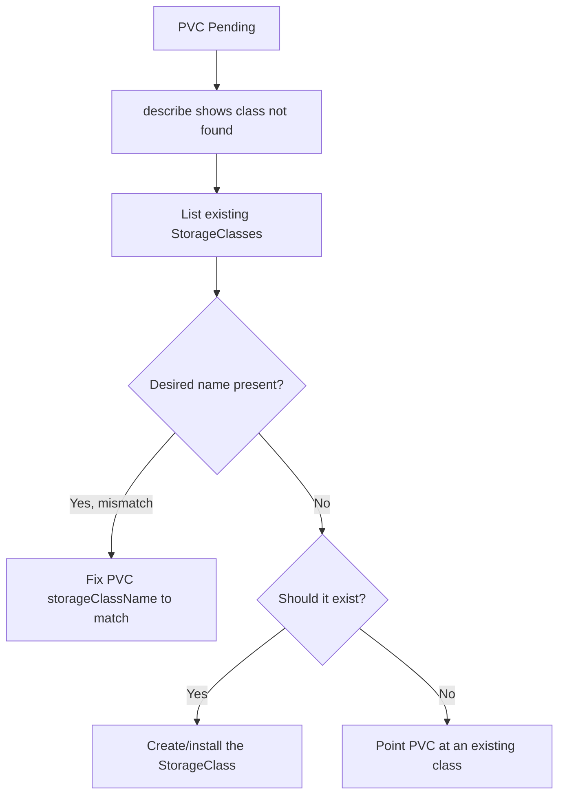

# PVC StorageClass Not Found

> **Severity:** High · **Typical recovery time:** 5–20 min · **Affected versions:** 1.20+

## Error Message

```text
Warning  ProvisioningFailed  persistentvolumeclaim/data
storageclass.storage.k8s.io "fast-ssd" not found
```

## Description

The PVC explicitly references a `storageClassName` that does not exist in the
cluster. The persistent-volume controller looks up the named class to find the
provisioner and its parameters; when the lookup fails it cannot provision and
the claim stays `Pending`. This is almost always a naming or environment-drift
problem: the manifest was written for a cluster where the class exists (often a
managed cloud cluster) and then applied to one where it does not, or the class
name was simply mistyped.

## Affected Kubernetes Versions

All releases 1.20+. StorageClass has been in `storage.k8s.io/v1` since 1.6, so
behaviour is identical across modern versions. Note that managed-platform class
names differ (`gp2`/`gp3` on EKS, `standard`/`premium-rwo` on GKE, `managed-csi`
on AKS), which is the usual source of cross-cluster drift.

## Likely Root Causes

- Typo or case mismatch in `storageClassName`
- Manifest targets a class that exists on another cluster/provider but not this one
- The StorageClass was deleted or renamed after the PVC was authored
- GitOps applied an app before its StorageClass dependency was installed

## Diagnostic Flow



## Verification Steps

Compare the exact string in the PVC spec against the list of installed classes —
watch for trailing whitespace and capitalisation.

## kubectl Commands

```bash
kubectl get pvc <pvc> -n <namespace> -o jsonpath='{.spec.storageClassName}'
kubectl describe pvc <pvc> -n <namespace>
kubectl get storageclass
kubectl get events -n <namespace> --sort-by=.lastTimestamp
```

## Expected Output

```text
$ kubectl get pvc data -n app -o jsonpath='{.spec.storageClassName}'
fast-ssd

$ kubectl get storageclass
NAME             PROVISIONER             RECLAIMPOLICY   VOLUMEBINDINGMODE      AGE
gp3 (default)    ebs.csi.aws.com         Delete          WaitForFirstConsumer   40d
```

## Common Fixes

1. Correct the `storageClassName` in the PVC to an existing class name
2. Create the missing StorageClass with the right provisioner and parameters
3. In GitOps, add a sync wave / dependency so the class is created before the PVC

## Recovery Procedures

1. List classes and confirm the mismatch (read-only, safe).
2. If the class should exist, apply it: `kubectl apply -f storageclass.yaml`
   (non-disruptive; adding a class affects nothing already running).
3. `storageClassName` is immutable on an existing PVC, so to retarget you must
   delete and recreate the claim. **Deleting a PVC is disruptive** — blast radius
   is every Pod that mounts it; for a still-`Pending` claim no data exists yet, so
   recreation is safe.
4. Re-apply the corrected PVC and confirm binding.

## Validation

`kubectl get pvc` reports `Bound` and the `STORAGECLASS` column matches an entry
in `kubectl get storageclass`.

## Prevention

- Use a single canonical class name across environments, or template it per cluster
- Add an admission/policy check that PVC `storageClassName` references an existing class
- Order GitOps dependencies so StorageClasses reconcile before workloads

## Related Errors

- [PVC Pending No Provisioner](./pvc-pending-no-provisioner.md)
- [No Default StorageClass](./pvc-no-default-storageclass.md)
- [PVC ProvisioningFailed](./pvc-provisioning-failed.md)

## References

- [Storage Classes](https://kubernetes.io/docs/concepts/storage/storage-classes/)
- [Persistent Volumes](https://kubernetes.io/docs/concepts/storage/persistent-volumes/)

## Further Reading

- [Free Kubernetes config validators](https://devopsaitoolkit.com/validators/)
