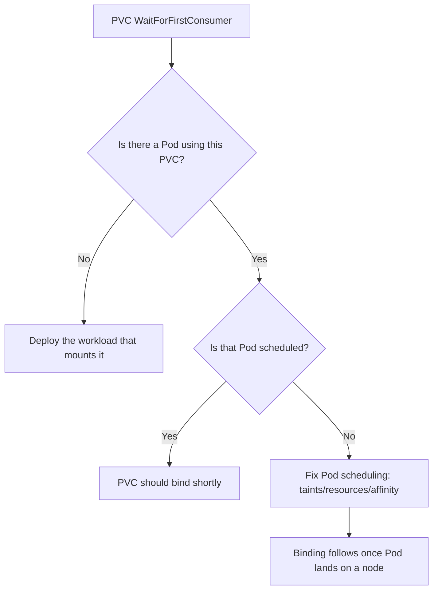

# PVC WaitForFirstConsumer Stuck

> **Severity:** Medium · **Typical recovery time:** 10–30 min · **Affected versions:** 1.20+

## Error Message

```text
Normal  WaitForFirstConsumer  persistentvolumeclaim/data
waiting for first consumer to be created before binding
```

## Description

This is a *normal* event for any StorageClass with
`volumeBindingMode: WaitForFirstConsumer`. Binding is deliberately delayed until
a Pod that mounts the PVC is scheduled, so the volume is provisioned in the same
zone/node as the Pod (topology-aware provisioning). It only becomes a *problem*
when no Pod ever consumes the claim, or the consuming Pod itself cannot be
scheduled — then the PVC sits in `Pending` indefinitely and operators
mis-diagnose it as a storage failure when the real fault is scheduling.

## Affected Kubernetes Versions

All releases 1.20+. `WaitForFirstConsumer` has been GA since 1.12 and is the
default mode for most cloud CSI classes (EBS `gp3`, GCE PD, Azure Disk). The
event text is unchanged across versions.

## Likely Root Causes

- No Pod references the PVC yet (PVC created standalone or workload not deployed)
- The consuming Pod is unschedulable (taints, insufficient resources, affinity)
- Pod's nodeSelector/affinity targets a zone where the class cannot provision
- The Pod template mounts a different PVC name than the one created

## Diagnostic Flow



## Verification Steps

Confirm the mode is `WaitForFirstConsumer`, then check whether a Pod actually
references and can schedule against the claim.

## kubectl Commands

```bash
kubectl get storageclass <class> -o jsonpath='{.volumeBindingMode}'
kubectl describe pvc <pvc> -n <namespace>
kubectl get pods -n <namespace> -o wide
kubectl describe pod <pod> -n <namespace>
```

## Expected Output

```text
$ kubectl get storageclass gp3 -o jsonpath='{.volumeBindingMode}'
WaitForFirstConsumer

$ kubectl describe pod web-0 -n app | grep -A2 Events
Warning  FailedScheduling  0/3 nodes are available:
3 node(s) had untolerated taint {dedicated: gpu}.
```

## Common Fixes

1. Deploy or scale up the workload so a Pod actually references the PVC
2. Resolve the Pod's `FailedScheduling` cause (taints, CPU/memory, affinity)
3. Align Pod topology constraints with zones the StorageClass can provision into

## Recovery Procedures

1. Confirm the binding mode and that the event is expected behaviour (read-only).
2. Identify the consuming Pod and its scheduling status (read-only).
3. Fix the scheduling blocker — e.g. add a toleration, free capacity, or relax
   affinity. Editing a Deployment/StatefulSet Pod template triggers a rollout:
   **rolling a workload is mildly disruptive** (blast radius = that workload's
   Pods restart). For a never-scheduled Pod there is no running traffic to lose.
4. Once the Pod schedules, the provisioner binds the PVC automatically.

## Validation

`kubectl get pvc` flips to `Bound`, the Pod moves to `Running`, and a
`ProvisioningSucceeded` event is recorded.

## Prevention

- Create PVCs together with the workloads that consume them
- Catch scheduling constraints in staging before production rollout
- If topology-aware placement is unneeded, use an `Immediate` binding-mode class

## Related Errors

- [PVC Bound But Pod Pending](./pvc-bound-pod-still-pending.md)
- [PVC Pending No Provisioner](./pvc-pending-no-provisioner.md)
- [StatefulSet Pod Pending on PVC](../statefulsets/statefulset-pod-pending-pvc.md)

## References

- [Volume Binding Mode](https://kubernetes.io/docs/concepts/storage/storage-classes/#volume-binding-mode)
- [Topology-Aware Volume Provisioning](https://kubernetes.io/docs/concepts/storage/storage-classes/#allowed-topologies)

## Further Reading

- [DevOps AI ToolKit — Kubernetes guides](https://devopsaitoolkit.com/blog/)
