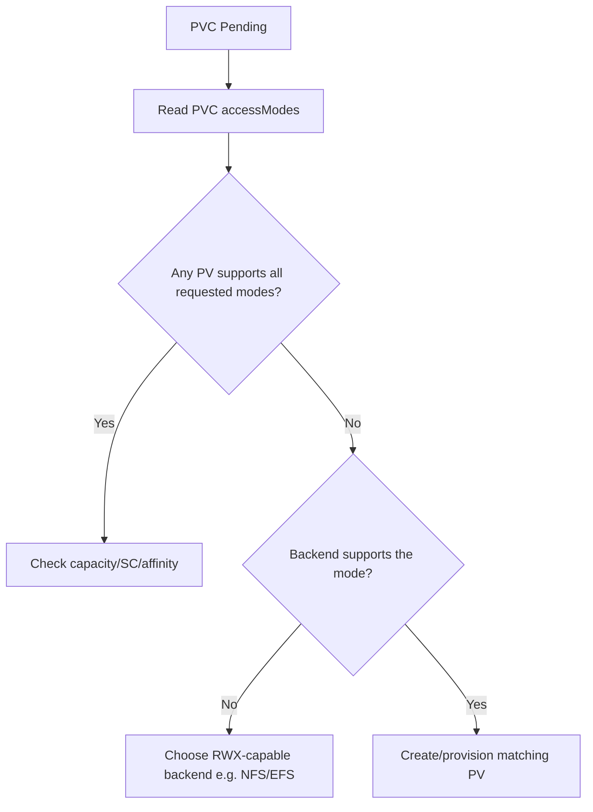

# PV AccessMode Mismatch

> **Severity:** Medium · **Typical recovery time:** 5–20 min · **Affected versions:** 1.20+

## Error Message

```text
Events:
  Warning  FailedBinding   persistentvolume-controller
  no persistent volumes available for this claim and no storage class is set
```

The PVC requests an access mode (e.g. `ReadWriteMany`) that no available PV
offers, so it stays `Pending`.

## Description

A PVC binds to a PV only if the PV supports every access mode the PVC requests.
The standard modes are `ReadWriteOnce` (RWO, one node), `ReadOnlyMany` (ROX),
`ReadWriteMany` (RWX, many nodes), and `ReadWriteOncePod` (single pod). A PVC
asking for `ReadWriteMany` cannot bind to an RWO-only PV — and most block storage
(EBS, GCE PD, Azure Disk) is RWO/RWOP only; RWX generally needs a file backend
like NFS, EFS, or CephFS.

During an incident this looks identical to a capacity or StorageClass mismatch:
the PVC is `Pending` with no binding event. The distinguishing detail is the
`accessModes` field. A common trap is requesting RWX on a block-storage class
that physically cannot provide shared multi-node write.

## Affected Kubernetes Versions

All supported versions (1.20+). `ReadWriteOncePod` became stable in 1.29; if you
request it on an older cluster the field is ignored or rejected depending on
version.

## Likely Root Causes

- PVC requests RWX but only RWO PVs/StorageClass exist
- PVC requests RWO but the available PV is ROX-only
- Backend driver does not support the requested mode (block storage + RWX)
- Typo or copy-paste of `accessModes` between unlike volumes

## Diagnostic Flow



## Verification Steps

Read the PVC `accessModes`, then compare against the `accessModes` of available
PVs and the capability of the backend driver.

## kubectl Commands

```bash
kubectl get pvc <pvc> -n <namespace> -o jsonpath='{.spec.accessModes}{"\n"}'
kubectl get pv -o custom-columns=NAME:.metadata.name,MODES:.spec.accessModes,STATUS:.status.phase
kubectl describe pvc <pvc> -n <namespace>
kubectl get sc <storageclass> -o yaml
```

## Expected Output

```text
$ kubectl get pvc shared-pvc -n app -o jsonpath='{.spec.accessModes}'
["ReadWriteMany"]

$ kubectl get pv -o custom-columns=NAME:.metadata.name,MODES:.spec.accessModes
NAME    MODES
pv-a    [ReadWriteOnce]
pv-b    [ReadWriteOnce]
```

## Common Fixes

1. Provision a PV with the requested access mode from a capable backend
2. Change the PVC to a mode the backend supports (e.g. RWO if a single node is
   fine)
3. Switch the StorageClass to an RWX-capable provisioner (NFS/EFS/CephFS) when
   sharing is genuinely required

## Recovery Procedures

1. Confirm the mismatch is access-mode (not capacity/SC) via the commands above.
2. If a single writer suffices, **non-disruptive (new claim):** recreate the PVC
   with `ReadWriteOnce`. Blast radius: none if previously unbound.
3. If shared write is required, deploy an RWX backend and a matching StorageClass,
   then create the PVC against it. **Non-disruptive** — adds capability.
4. Re-point the workload at the corrected PVC and roll it. **Disruptive:** the
   rollout restarts pods.

> PVC/StorageClass creation and rollouts mutate state; the diagnostics are
> read-only.

## Validation

The PVC binds (`Bound`) to a PV whose `accessModes` include all requested modes,
and pods mount it with the expected read/write/sharing behaviour.

## Prevention

- Document which StorageClasses support which access modes
- Reserve RWX for file-backed classes; default block storage to RWO
- Add a policy check rejecting RWX requests on block-only classes
- Validate manifests before apply

## Related Errors

- [PV Capacity Smaller Than Claim](pv-capacity-smaller-than-claim.md)
- [PV StorageClass Mismatch](pv-storageclass-mismatch.md)
- [Static PV Binding Failed](pv-static-binding-failed.md)

## References

- [Access Modes](https://kubernetes.io/docs/concepts/storage/persistent-volumes/#access-modes)
- [ReadWriteOncePod](https://kubernetes.io/docs/concepts/storage/persistent-volumes/#access-modes)

## Further Reading

- [Free Kubernetes config validators](https://devopsaitoolkit.com/validators/)
