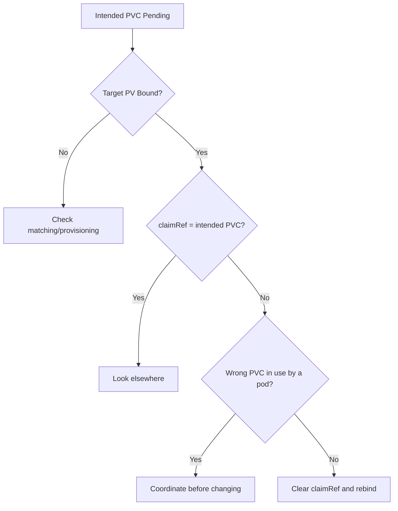

# PV Bound To Wrong PVC

> **Severity:** High · **Typical recovery time:** 10–30 min · **Affected versions:** 1.20+

## Error Message

```text
NAME      CAPACITY   STATUS   CLAIM                      STORAGECLASS
pv-shared 200Gi      Bound    other-team/scratch-pvc     manual
```

The PV you intended for `prod/db-pvc` is `Bound` to a different, unexpected PVC,
and the intended PVC remains `Pending`.

## Description

Every PersistentVolume can carry a `claimRef` — a binding reference to a specific
PVC (namespace, name, and optionally UID). When you pre-create a PV with an
explicit `claimRef`, or when the controller binds it to the first matching claim,
the volume becomes the exclusive property of that PVC. If the `claimRef` names the
wrong PVC, or a race let an unintended PVC grab a static PV first, your real
workload cannot bind and may serve another tenant's data.

This is a higher-severity situation than a simple `Pending` claim because it can
cross tenant or environment boundaries — a production database pointing at a
scratch volume, or two namespaces fighting over one disk. Treat any cross-tenant
`claimRef` as a potential data-exposure incident.

## Affected Kubernetes Versions

All supported versions (1.20+). Pre-binding via `claimRef` and the `volumeName`
field on PVCs behave consistently across releases.

## Likely Root Causes

- A PV manifest shipped with a hard-coded `claimRef` to the wrong PVC
- Two PVCs matched the same static PV and the wrong one bound first
- Copy-paste error in `namespace`/`name` within `claimRef`
- A reused PV whose old `claimRef` was never cleared

## Diagnostic Flow



## Verification Steps

Read the PV `claimRef` and compare its namespace/name to the PVC you expected.
Check whether any pod currently mounts the wrongly-bound PVC.

## kubectl Commands

```bash
kubectl get pv pv-shared -o jsonpath='{.spec.claimRef.namespace}/{.spec.claimRef.name}{"\n"}'
kubectl get pv pv-shared -o yaml
kubectl get pvc -A
kubectl describe pvc db-pvc -n prod
kubectl get pods -A -o wide | grep -i scratch
```

## Expected Output

```text
$ kubectl get pv pv-shared -o jsonpath='{.spec.claimRef.namespace}/{.spec.claimRef.name}'
other-team/scratch-pvc

$ kubectl describe pvc db-pvc -n prod
Status:  Pending
Events:  ... no persistent volumes available for this claim ...
```

## Common Fixes

1. Correct the `claimRef` in the PV manifest to the intended PVC and reapply
2. Delete the unintended PVC if it was created in error (confirm no pod uses it)
3. Use `volumeName` on the correct PVC plus a matching `claimRef` for safe
   pre-binding

## Recovery Procedures

1. Identify whether a live pod uses the wrongly-bound PVC — if so, coordinate a
   maintenance window first.
2. Back up the PV: `kubectl get pv pv-shared -o yaml > pv-shared.yaml`.
3. **Disruptive (detaches the volume from current owner):** clear or correct the
   `claimRef`, e.g. `kubectl patch pv pv-shared --type merge -p
   '{"spec":{"claimRef":{"namespace":"prod","name":"db-pvc"}}}'`. Blast radius:
   any pod using the previous PVC loses its volume on restart.
4. If the unintended PVC must go, **data-loss for that claim:** delete it.

> Patch/delete are the only mutating steps; all diagnostics above are read-only.

## Validation

Confirm `kubectl get pv pv-shared` shows `Bound` to `prod/db-pvc`, the intended
PVC is `Bound`, and the production pod mounts the expected data.

## Prevention

- Always set `claimRef` UID-less pre-binds carefully and review in code review
- Use distinct StorageClasses per tenant to limit cross-binding
- Enforce namespaced naming conventions for static PVs
- Audit `claimRef` namespaces with a policy check

## Related Errors

- [PV Released Not Reused](pv-released-not-reused.md)
- [Static PV Binding Failed](pv-static-binding-failed.md)
- [PV StorageClass Mismatch](pv-storageclass-mismatch.md)

## References

- [Binding](https://kubernetes.io/docs/concepts/storage/persistent-volumes/#binding)
- [Reserving a PersistentVolume](https://kubernetes.io/docs/concepts/storage/persistent-volumes/#reserving-a-persistentvolume)

## Further Reading

- [DevOps AI ToolKit — Kubernetes guides](https://devopsaitoolkit.com/blog/)
