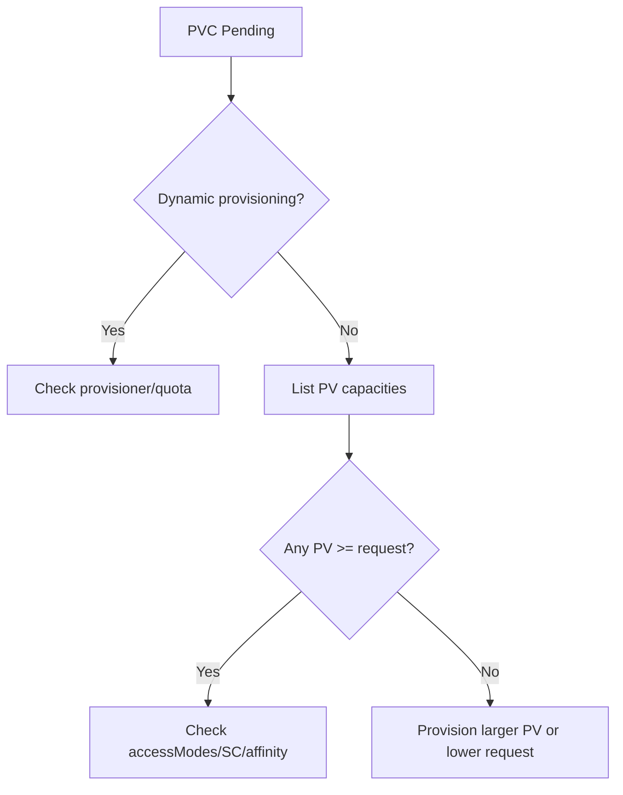

# PV Capacity Smaller Than Claim

> **Severity:** Medium · **Typical recovery time:** 5–20 min · **Affected versions:** 1.20+

## Error Message

```text
Events:
  Warning  FailedBinding   persistentvolume-controller
  no persistent volumes available for this claim and no storage class is set
```

The PVC stays `Pending` because every candidate PV offers less capacity than the
request.

## Description

Binding is one-directional on capacity: a PVC binds only to a PV whose
`spec.capacity.storage` is **greater than or equal to** the PVC's
`spec.resources.requests.storage`. A 50Gi PV can satisfy a 20Gi request (the PVC
simply gets the whole 50Gi), but a 20Gi PV can never satisfy a 50Gi request. When
all available static PVs are too small, the controller finds no match and the PVC
remains `Pending` with no binding event.

In production this surfaces when someone bumps a PVC request expecting expansion,
or when static PVs were sized for an earlier, smaller workload. Note that
editing the PVC request does not shrink the requirement — once a PVC asks for
50Gi it needs a >=50Gi volume.

## Affected Kubernetes Versions

All supported versions (1.20+). The "capacity must be >= request" rule is
unchanged. Dynamic provisioning sidesteps this by creating a right-sized volume;
the problem is specific to static PVs or exhausted pools.

## Likely Root Causes

- Static PVs are all smaller than the PVC request
- PVC request was increased above available PV sizes
- StorageClass with no provisioner (static-only) and no large-enough PV
- Expectation that a smaller PV would auto-expand to meet the request

## Diagnostic Flow



## Verification Steps

Compare the PVC request to the capacity of every `Available` PV in the matching
StorageClass.

## kubectl Commands

```bash
kubectl get pvc <pvc> -n <namespace> -o jsonpath='{.spec.resources.requests.storage}{"\n"}'
kubectl get pv -o custom-columns=NAME:.metadata.name,CAP:.spec.capacity.storage,STATUS:.status.phase,SC:.spec.storageClassName
kubectl describe pvc <pvc> -n <namespace>
kubectl get events -n <namespace> --sort-by=.lastTimestamp
```

## Expected Output

```text
$ kubectl get pvc data-pvc -n app -o jsonpath='{.spec.resources.requests.storage}'
50Gi

$ kubectl get pv -o custom-columns=NAME:.metadata.name,CAP:.spec.capacity.storage,STATUS:.status.phase
NAME    CAP    STATUS
pv-a    20Gi   Available
pv-b    30Gi   Available
```

## Common Fixes

1. Create (or dynamically provision) a PV with capacity >= the request
2. Lower the PVC request to fit an existing PV (new PVC; requests can't shrink)
3. Switch to a StorageClass with a dynamic provisioner so size is matched
   automatically

## Recovery Procedures

1. Confirm no `Available` PV meets the request.
2. If the workload can use less, **non-disruptive (new claim):** create a smaller
   PVC and point the pod at it. Blast radius: none if the old PVC was unbound.
3. To keep the larger request, create a correctly sized PV (static) or fix the
   provisioner/quota. **Non-disruptive** — adds capacity, removes nothing.
4. If a bound PVC genuinely needs more space, use volume expansion
   (`allowVolumeExpansion: true`) rather than rebinding. **Mutating** but online
   for most CSI drivers.

> Creating PVs/PVCs and editing requests are mutating actions; all listing and
> describe commands above are read-only.

## Validation

`kubectl get pvc` shows `Bound`, the bound PV capacity is >= the request, and the
consuming pod reaches `Running`.

## Prevention

- Prefer dynamic provisioning so capacity always matches the claim
- Standardise static PV sizes against your largest expected request
- Enable `allowVolumeExpansion` for growth instead of rebinding
- Add a quota/policy check on PVC request sizes

## Related Errors

- [PV AccessMode Mismatch](pv-accessmode-mismatch.md)
- [PV StorageClass Mismatch](pv-storageclass-mismatch.md)
- [Static PV Binding Failed](pv-static-binding-failed.md)

## References

- [Capacity](https://kubernetes.io/docs/concepts/storage/persistent-volumes/#capacity)
- [Expanding Persistent Volumes Claims](https://kubernetes.io/docs/concepts/storage/persistent-volumes/#expanding-persistent-volumes-claims)

## Further Reading

- [Free Kubernetes config validators](https://devopsaitoolkit.com/validators/)
