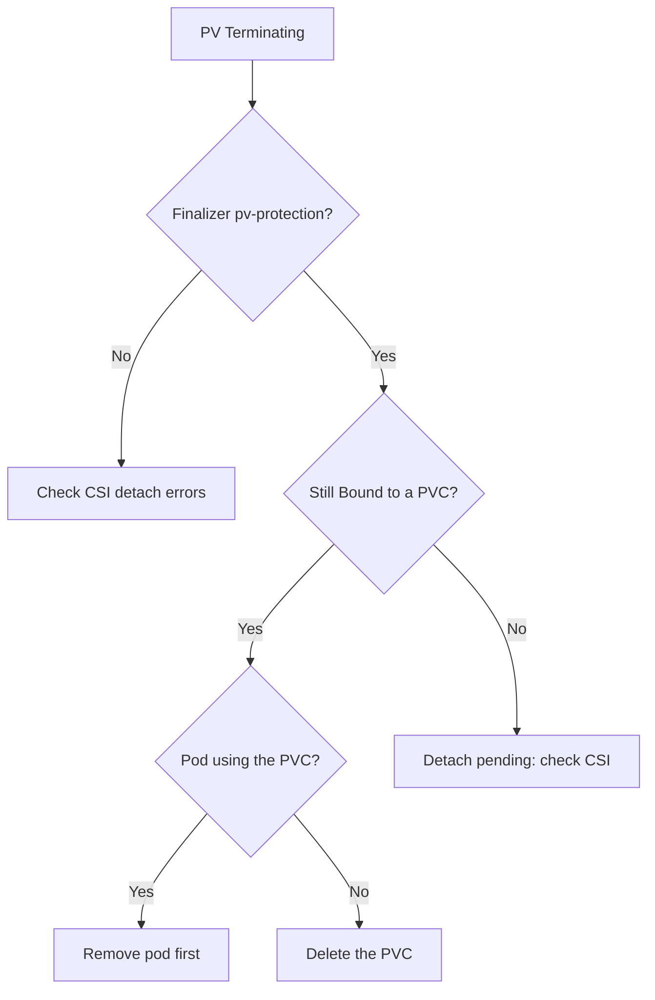

# PV Stuck Terminating (finalizer)

> **Severity:** Medium · **Typical recovery time:** 5–25 min · **Affected versions:** 1.20+

## Error Message

```text
NAME      CAPACITY   STATUS        CLAIM            STORAGECLASS   AGE
pv-data   50Gi       Terminating   app/data-pvc     gp3            30d

$ kubectl get pv pv-data -o jsonpath='{.metadata.finalizers}'
["kubernetes.io/pv-protection"]
```

The PV has a deletion timestamp but never disappears.

## Description

The `kubernetes.io/pv-protection` finalizer prevents a PersistentVolume from being
removed while it is still bound to or in use by a PVC. When you delete a PV that
is `Bound`, the API server records a `deletionTimestamp` but the
pv-protection controller refuses to drop the finalizer until the volume is no
longer in use. The PV therefore sits in `Terminating` indefinitely. This is a
safety feature: it stops you from yanking storage out from under a running pod.

In an incident this usually means the PVC (and possibly a pod) still references
the volume. The correct fix is to remove the consumer, not to force-delete the
finalizer — force-removal can leak the backing disk and orphan data.

## Affected Kubernetes Versions

All supported versions (1.20+). Storage object protection (PV and PVC) has been
default-enabled for years via the `StorageObjectInUseProtection` admission
controller.

## Likely Root Causes

- The PV is still `Bound` to an existing PVC
- A pod still mounts the PVC that binds this PV
- The PVC was deleted but the volume's reclaim/detach has not completed
- A CSI controller is stuck and cannot finish detach/delete

## Diagnostic Flow



## Verification Steps

Confirm the PV shows `Terminating`, holds the `kubernetes.io/pv-protection`
finalizer, and identify the PVC/pod still referencing it.

## kubectl Commands

```bash
kubectl get pv pv-data -o yaml
kubectl get pv pv-data -o jsonpath='{.metadata.finalizers}{"\n"}'
kubectl get pvc -A | grep data-pvc
kubectl get pods -A -o jsonpath='{range .items[*]}{.metadata.namespace}/{.metadata.name}{"\t"}{.spec.volumes[*].persistentVolumeClaim.claimName}{"\n"}{end}'
kubectl describe pv pv-data
```

## Expected Output

```text
$ kubectl get pv pv-data -o jsonpath='{.status.phase} {.metadata.finalizers}'
Terminating ["kubernetes.io/pv-protection"]

$ kubectl get pvc data-pvc -n app
NAME       STATUS   VOLUME    CAPACITY   ACCESS MODES   AGE
data-pvc   Bound    pv-data   50Gi       RWO            30d
```

## Common Fixes

1. Delete the pod(s) using the PVC, then delete the PVC — the finalizer clears
   itself
2. Resolve a stuck CSI controller so detach/delete completes
3. Only as a last resort, manually remove the finalizer (risks orphaning the disk)

## Recovery Procedures

1. Find every pod that mounts the PVC.
2. **Disruptive:** delete or scale down those pods (`kubectl delete pod ...` or
   scale the controller to 0). Blast radius: the affected workload restarts.
3. **Data-affecting:** delete the PVC if it is no longer needed. With `Delete`
   reclaim this also removes the disk; with `Retain` data is preserved.
4. The pv-protection finalizer then clears and the PV is removed automatically.
5. **Last resort, dangerous:** `kubectl patch pv pv-data -p
   '{"metadata":{"finalizers":null}}'`. Blast radius: the PV object disappears
   while the cloud disk may remain — see
   [PV Orphaned In Backend](pv-orphaned-in-backend.md).

> Steps 2–5 mutate state; only the diagnostics are read-only.

## Validation

`kubectl get pv pv-data` returns `NotFound`, no pod references the old PVC, and
the backing disk is either intentionally deleted or accounted for.

## Prevention

- Always remove consumers (pods, then PVCs) before deleting PVs
- Monitor CSI controller health so detaches do not stall
- Avoid scripted finalizer stripping in automation
- Reconcile cloud disks against PVs periodically

## Related Errors

- [PV Released Not Reused](pv-released-not-reused.md)
- [PV Orphaned In Backend](pv-orphaned-in-backend.md)
- [PV Retain Stuck Released](pv-retain-stuck-released.md)

## References

- [Storage Object in Use Protection](https://kubernetes.io/docs/concepts/storage/persistent-volumes/#storage-object-in-use-protection)
- [Using Finalizers](https://kubernetes.io/docs/concepts/overview/working-with-objects/finalizers/)

## Further Reading

- [DevOps AI ToolKit — Kubernetes guides](https://devopsaitoolkit.com/blog/)
