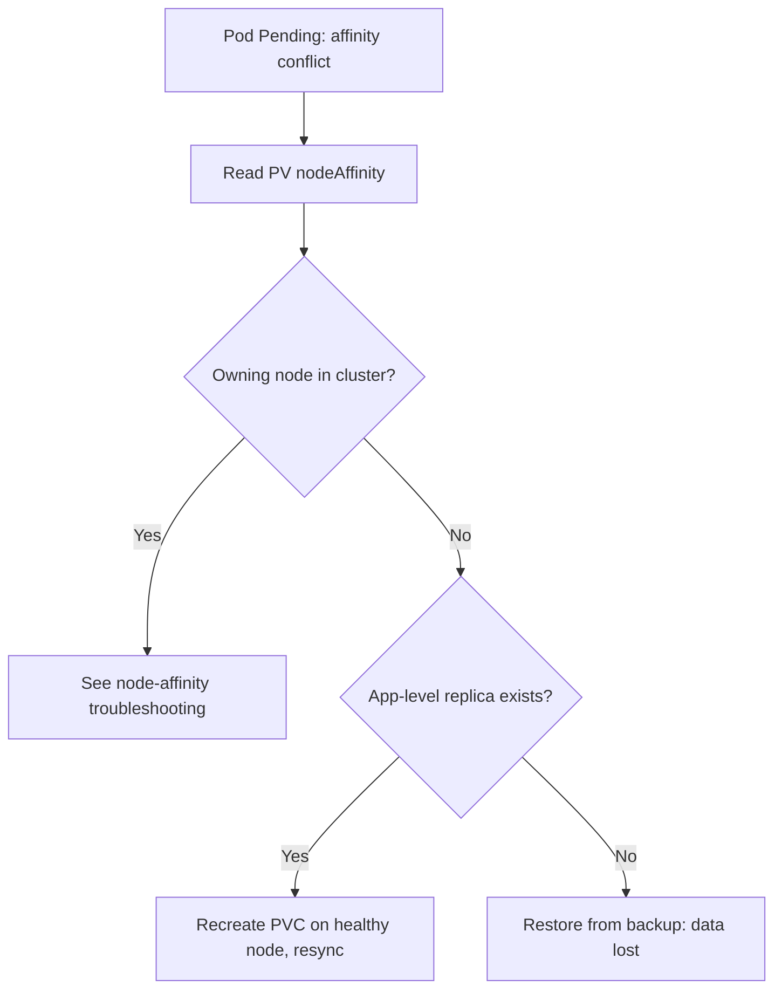

# Local PV Node Removed

> **Severity:** High · **Typical recovery time:** 15–60 min · **Affected versions:** 1.20+

## Error Message

```text
0/5 nodes are available: 5 node(s) had volume node affinity conflict.

$ kubectl get pv local-pv-3
NAME         CAPACITY   STATUS   CLAIM            STORAGECLASS    REASON
local-pv-3   100Gi      Bound    db/data-pvc-2    local-storage
```

The owning node no longer exists, so the pod cannot schedule and the data is
unreachable.

## Description

A local PersistentVolume stores data on a single node's physical disk and is
pinned there via `nodeAffinity`. If that node is removed from the cluster —
scaled down, terminated, hardware-failed, or replaced — the PV still points at a
node name that no longer resolves. The bound PVC and pod cannot be scheduled
anywhere because no node satisfies the affinity, and unless the data was
replicated at the application layer, **the data on that disk is gone with the
node**.

This is one of the most painful storage incidents because local volumes trade
durability for performance. There is no controller that migrates local data. The
recovery path depends entirely on whether the workload (e.g. a database with
replicas, or a StatefulSet with multiple members) kept copies elsewhere.

## Affected Kubernetes Versions

All supported versions (1.20+). Behaviour is identical regardless of
`volumeBindingMode`; once bound, the affinity is fixed to the original node.

## Likely Root Causes

- Cluster autoscaler or operator removed/replaced the node
- Spot/preemptible instance reclaimed by the cloud provider
- Hardware/disk failure on the node
- Manual `kubectl delete node` without first draining local-volume workloads

## Diagnostic Flow



## Verification Steps

Confirm the PV's required node is absent from `kubectl get nodes`, and determine
whether the workload has surviving replicas or backups.

## kubectl Commands

```bash
kubectl describe pod <pod> -n <namespace>
kubectl get pv <pv> -o yaml | grep -A15 nodeAffinity
kubectl get nodes
kubectl get pvc <pvc> -n <namespace>
kubectl get pv -o custom-columns=NAME:.metadata.name,STATUS:.status.phase,CLAIM:.spec.claimRef.name
```

## Expected Output

```text
$ kubectl get pv local-pv-3 -o jsonpath='{.spec.nodeAffinity.required.nodeSelectorTerms[0].matchExpressions[0].values[0]}'
worker-7

$ kubectl get node worker-7
Error from server (NotFound): nodes "worker-7" not found
```

## Common Fixes

1. Recreate the PVC on a healthy node and let the application resync from a
   surviving replica
2. Restore the data from backup onto a new local volume
3. Migrate the workload to replicated/networked storage to avoid recurrence

## Recovery Procedures

1. Confirm the owning node is permanently gone.
2. If the workload has healthy replicas, **disruptive + data-loss for one member:**
   delete the stranded PVC and PV so a new member provisions on a live node, then
   let the application rebuild. Blast radius: one replica re-syncs; reduced
   redundancy during catch-up.
3. **Manual cleanup:** delete the orphaned PV
   (`kubectl delete pv local-pv-3`) — the local data is already unrecoverable.
4. If no replica exists, **data-loss:** restore from backup onto a fresh volume.

> Delete operations and PVC recreation mutate state; diagnostics are read-only.

## Validation

The new pod schedules and reaches `Running` on a live node, the application
reports its data set as healthy/in-sync, and no PV references the removed node.

## Prevention

- Run stateful workloads with replication so a single node loss is survivable
- Drain and migrate local-volume pods before removing a node
- Take regular backups of local-volume data
- Prefer replicated/CSI storage for data that must survive node loss
- Protect spot-node workloads with PodDisruptionBudgets and replicas

## Related Errors

- [PV Node Affinity Prevents Scheduling](pv-node-affinity-prevents-scheduling.md)
- [PV Released Not Reused](pv-released-not-reused.md)
- [PV Orphaned In Backend](pv-orphaned-in-backend.md)

## References

- [Local volumes](https://kubernetes.io/docs/concepts/storage/volumes/#local)
- [Persistent Volumes — node affinity](https://kubernetes.io/docs/concepts/storage/persistent-volumes/#node-affinity)

## Further Reading

- [DevOps AI ToolKit — Kubernetes guides](https://devopsaitoolkit.com/blog/)
