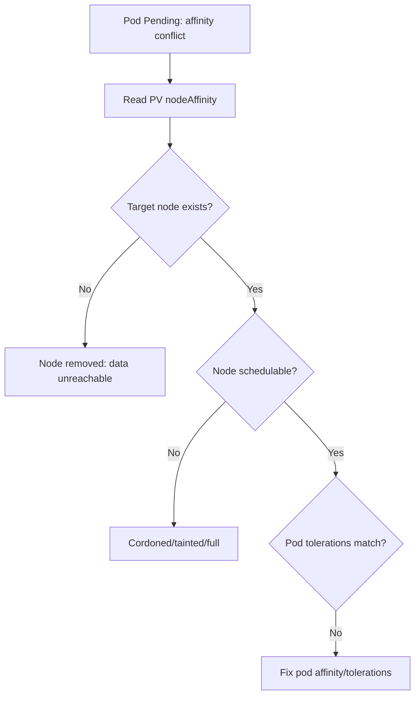

# PV Node Affinity Prevents Scheduling

> **Severity:** High · **Typical recovery time:** 10–40 min · **Affected versions:** 1.20+

## Error Message

```text
0/6 nodes are available: 6 node(s) had volume node affinity conflict.
preemption: 0/6 nodes are available: 6 Preemption is not helpful for scheduling.
```

The pod stays `Pending` with `FailedScheduling` and cannot land on any node.

## Description

Local PersistentVolumes (and other topology-constrained volumes) carry a
`nodeAffinity` block that pins them to a specific node or topology domain. The
scheduler must place the consuming pod on a node that satisfies that affinity. If
no schedulable node matches — the pinned node is cordoned, gone, full, or tainted
— the scheduler reports `volume node affinity conflict` and the pod never starts.

Because local volumes live on a single node's disk, this is a hard constraint:
the data physically cannot move. During an incident this typically means the node
that owns the volume is unavailable, or the pod has anti-affinity/taint rules
that conflict with the only node where the volume exists.

## Affected Kubernetes Versions

All supported versions (1.20+). `volumeBindingMode: WaitForFirstConsumer` (the
recommended mode for local volumes) defers binding until a pod is scheduled,
which avoids many conflicts but does not help when the pinned node is gone.

## Likely Root Causes

- The node referenced in the PV `nodeAffinity` is cordoned, drained, or deleted
- The target node is full, tainted, or otherwise unschedulable
- Pod tolerations/affinity conflict with the node hosting the volume
- StorageClass uses `Immediate` binding, pinning the PV before the pod's
  constraints are known

## Diagnostic Flow



## Verification Steps

Read the PV `nodeAffinity`, identify the required node, then check that node's
status, taints, and capacity.

## kubectl Commands

```bash
kubectl describe pod <pod> -n <namespace>
kubectl get pvc <pvc> -n <namespace>
kubectl get pv <pv> -o yaml | grep -A15 nodeAffinity
kubectl get nodes -o wide
kubectl describe node <target-node>
```

## Expected Output

```text
$ kubectl get pv local-pv-1 -o jsonpath='{.spec.nodeAffinity.required.nodeSelectorTerms[0].matchExpressions[0].values[0]}'
worker-3

$ kubectl describe node worker-3
Taints: node.kubernetes.io/unschedulable:NoSchedule
```

## Common Fixes

1. Uncordon or fix the target node so the pod can schedule there
2. Remove the conflicting taint or add a matching toleration to the pod
3. Free capacity on the target node (evict lower-priority pods)
4. If the data is replaceable, recreate the PVC on a healthy node

## Recovery Procedures

1. Read the PV `nodeAffinity` to find the required node.
2. If the node is merely cordoned, **mildly disruptive:** uncordon it with
   `kubectl uncordon worker-3`. Blast radius: that node accepts new pods again.
3. If a taint blocks scheduling, add the matching toleration to the pod spec and
   roll the workload. **Disruptive:** the rollout restarts pods.
4. If the node is permanently gone, the local data is unreachable — see
   [Local PV Node Removed](pv-local-node-removed.md). **Data-loss** if no replica
   exists.

> `uncordon` and the spec/rollout changes mutate state; diagnostics are read-only.

## Validation

The pod transitions from `Pending` to `Running`, `kubectl get events` no longer
shows affinity conflicts, and the volume mounts on the expected node.

## Prevention

- Use `volumeBindingMode: WaitForFirstConsumer` for local StorageClasses
- Replicate stateful data across nodes (operator/StatefulSet) so loss of one node
  is survivable
- Avoid cordoning nodes that host irreplaceable local volumes without migration
- Add scheduling alerts for `volume node affinity conflict`

## Related Errors

- [Local PV Node Removed](pv-local-node-removed.md)
- [PV AccessMode Mismatch](pv-accessmode-mismatch.md)
- [PV Capacity Smaller Than Claim](pv-capacity-smaller-than-claim.md)

## References

- [Local volumes](https://kubernetes.io/docs/concepts/storage/volumes/#local)
- [Node affinity for volumes](https://kubernetes.io/docs/concepts/storage/persistent-volumes/#node-affinity)

## Further Reading

- [DevOps AI ToolKit — Kubernetes guides](https://devopsaitoolkit.com/blog/)
