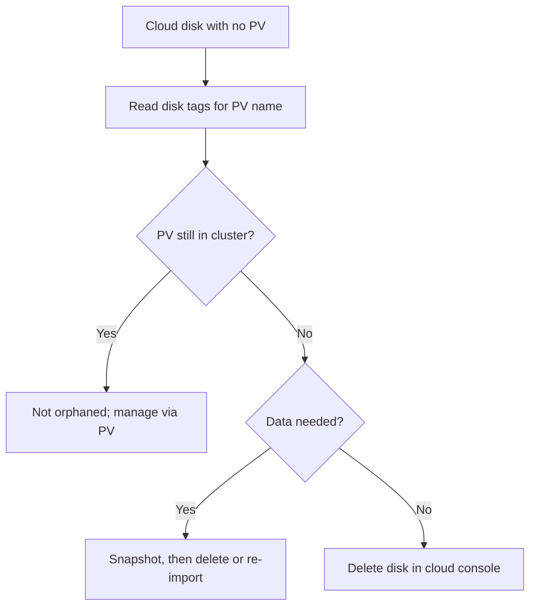

# PV Orphaned In Backend

> **Severity:** Medium · **Typical recovery time:** 10–40 min · **Affected versions:** 1.20+

## Error Message

```text
# Kubernetes shows no PV, but the cloud disk still exists and bills:
$ kubectl get pv | grep pvc-2f9c
# (no output)

$ aws ec2 describe-volumes --filters Name=tag:kubernetes.io/created-for/pv/name,Values=pvc-2f9c...
State: available   # detached, unattached, still billed
```

A PV was deleted from Kubernetes, but its backing disk was never removed from the
cloud provider.

## Description

When a PV uses `reclaimPolicy: Retain`, deleting the PV object removes only the
Kubernetes record — the underlying cloud disk (EBS volume, GCE PD, Azure Disk) is
left intact by design. The same orphaning happens if the pv-protection finalizer
is force-stripped, if a CSI controller fails mid-delete, or if disks were
provisioned out-of-band. The result is "ghost" disks: storage you are still paying
for that no cluster references. Over time these accumulate into real cost and
audit/compliance gaps.

This is rarely an outage and more often a cost and hygiene problem surfaced by a
billing review or a cloud-resource audit. The challenge is correlating the
orphaned disk back to the PV that owned it — CSI drivers tag disks with the PV
name, which makes reconciliation possible.

## Affected Kubernetes Versions

All supported versions (1.20+). Behaviour is driver-specific but consistent: CSI
drivers honor the PV reclaim policy and tag disks; in-tree plugins behaved
similarly before migration.

## Likely Root Causes

- `reclaimPolicy: Retain` PVs deleted without removing the backing disk
- pv-protection finalizer force-stripped, skipping CSI delete
- CSI controller error left the disk after the PV was removed
- Disks created out-of-band and never tracked by any PV

## Diagnostic Flow



## Verification Steps

Cross-reference cloud disks (by the `kubernetes.io/created-for/pv/name` tag)
against the live list of PVs to find disks with no owning PV.

## kubectl Commands

```bash
kubectl get pv -o custom-columns=NAME:.metadata.name,POLICY:.spec.persistentVolumeReclaimPolicy,HANDLE:.spec.csi.volumeHandle
kubectl get pv -o jsonpath='{range .items[*]}{.spec.csi.volumeHandle}{"\n"}{end}'
kubectl get pv -o custom-columns=NAME:.metadata.name,STATUS:.status.phase
kubectl get sc -o custom-columns=NAME:.metadata.name,POLICY:.reclaimPolicy
```

## Expected Output

```text
$ kubectl get pv -o jsonpath='{range .items[*]}{.spec.csi.volumeHandle}{"\n"}{end}'
vol-0a1b2c3d4e5f
vol-99887766554

# Cloud disk vol-2f9caaa... is NOT in this list -> orphaned
```

## Common Fixes

1. Delete confirmed-orphaned disks in the cloud provider after a snapshot
2. Re-import a still-needed disk by creating a PV with its `volumeHandle`
3. Switch future StorageClasses to `Delete` so disks are cleaned up automatically

## Recovery Procedures

1. Build the set of `volumeHandle`s referenced by live PVs (commands above).
2. In the cloud provider, list disks tagged for Kubernetes and subtract the
   referenced set to find orphans.
3. **Data-loss (irreversible):** delete confirmed orphan disks via the cloud CLI
   or console after taking a snapshot. Blast radius: the disk's data is gone; take
   a snapshot first if there is any doubt.
4. If a disk is still needed, **non-disruptive:** create a static PV referencing
   its `volumeHandle` to bring it back under management.

> Cloud-side disk deletion and PV creation mutate state; the kubectl reconciliation
> commands are read-only. Disk deletion happens in the cloud provider, not via
> kubectl.

## Validation

Every remaining cloud disk maps to a live PV (or an intentional snapshot/backup),
the orphan count is zero in the next audit, and storage spend drops accordingly.

## Prevention

- Default StorageClasses to `Delete` where retention is not required
- Never force-strip pv-protection finalizers in automation
- Run a scheduled reconciliation of cloud disks vs. PV `volumeHandle`s
- Tag and cost-allocate all manually created disks
- Alert on detached/unattached volumes in the cloud account

## Related Errors

- [PV Retain Stuck Released](pv-retain-stuck-released.md)
- [PV Stuck Terminating (finalizer)](pv-finalizer-stuck-terminating.md)
- [PV Recycle Reclaim Deprecated](pv-recycle-deprecated.md)

## References

- [Reclaiming — Delete](https://kubernetes.io/docs/concepts/storage/persistent-volumes/#delete)
- [Volume reclaim policy](https://kubernetes.io/docs/concepts/storage/persistent-volumes/#reclaiming)

## Further Reading

- [DevOps AI ToolKit — Kubernetes guides](https://devopsaitoolkit.com/blog/)
