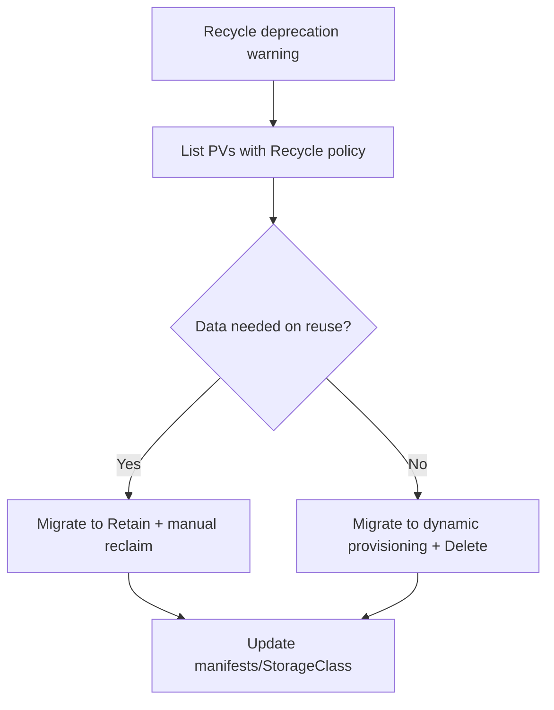

# PV Recycle Reclaim Deprecated

> **Severity:** Low · **Typical recovery time:** 5–20 min · **Affected versions:** 1.20+

## Error Message

```text
Warning  RecyclePolicyDeprecated   persistentvolume-controller
The Recycle reclaim policy is deprecated; use dynamic provisioning with the
Delete policy or the Retain policy instead.
```

PVs configured with `persistentVolumeReclaimPolicy: Recycle` no longer behave as
expected and emit deprecation warnings.

## Description

The `Recycle` reclaim policy used to run a scrub job (`rm -rf /thevolume/*`) when
a PVC was deleted, then return the PV to `Available` for reuse. It has been
deprecated for years and is effectively unsupported — most modern volume plugins
do not implement it, and the recommended replacements are dynamic provisioning
with `Delete`, or `Retain` for data you want to keep. A PV left on `Recycle` may
not be scrubbed or rebound, leaving it stranded in `Released`.

This is a low-severity, plan-and-migrate item rather than an outage, but it
matters because operators relying on `Recycle` for automatic reuse will find
volumes silently piling up in `Released`, mimicking the
[PV Released Not Reused](pv-released-not-reused.md) symptom.

## Affected Kubernetes Versions

Deprecated across all supported releases (1.20+). Only certain legacy in-tree
plugins (e.g. HostPath, NFS) ever implemented `Recycle`, and CSI drivers do not.
Treat any `Recycle` PV as if it were `Retain`.

## Likely Root Causes

- Legacy manifests still set `persistentVolumeReclaimPolicy: Recycle`
- An old StorageClass defaults to `Recycle`
- Migration from in-tree plugins to CSI left the policy untouched
- Expectation of automatic scrub-and-reuse that no longer happens

## Diagnostic Flow



## Verification Steps

List all PVs and StorageClasses whose reclaim policy is `Recycle` and confirm
whether any are stranded in `Released`.

## kubectl Commands

```bash
kubectl get pv -o custom-columns=NAME:.metadata.name,POLICY:.spec.persistentVolumeReclaimPolicy,STATUS:.status.phase
kubectl get pv -o json | grep -B2 '"Recycle"'
kubectl get sc -o custom-columns=NAME:.metadata.name,POLICY:.reclaimPolicy
kubectl describe pv <pv>
```

## Expected Output

```text
$ kubectl get pv -o custom-columns=NAME:.metadata.name,POLICY:.spec.persistentVolumeReclaimPolicy,STATUS:.status.phase
NAME      POLICY    STATUS
pv-old    Recycle   Released
pv-new    Delete    Bound
```

## Common Fixes

1. Change new PVs/StorageClasses to `Delete` (with dynamic provisioning) or
   `Retain`
2. Migrate workloads to a CSI StorageClass that handles reclaim natively
3. Manually reclaim any `Released` Recycle PVs (treat like `Retain`)

## Recovery Procedures

1. Inventory `Recycle` PVs and StorageClasses.
2. For each, decide on `Delete` (replaceable data) or `Retain` (keep data).
3. **Mutating (low risk):** patch the live PV's policy, e.g.
   `kubectl patch pv pv-old -p
   '{"spec":{"persistentVolumeReclaimPolicy":"Retain"}}'`. Blast radius: changes
   future reclaim behaviour only; no data touched.
4. Update StorageClass manifests to drop `Recycle` and reapply. **Non-disruptive.**
5. For PVs already stranded in `Released`, follow the manual reuse steps in
   [PV Released Not Reused](pv-released-not-reused.md).

> Patches and manifest updates mutate state; inventory commands are read-only.

## Validation

No PV or StorageClass reports `Recycle`, the deprecation warning stops, and
reclaim behaves per the new `Delete`/`Retain` policy on the next PVC lifecycle.

## Prevention

- Standardise on dynamic provisioning with `Delete`, or `Retain` for stateful data
- Add a policy/CI check rejecting `persistentVolumeReclaimPolicy: Recycle`
- Review StorageClass defaults during cluster upgrades
- Migrate off legacy in-tree plugins to CSI

## Related Errors

- [PV Retain Stuck Released](pv-retain-stuck-released.md)
- [PV Released Not Reused](pv-released-not-reused.md)
- [PV Orphaned In Backend](pv-orphaned-in-backend.md)

## References

- [Reclaim policies (Retain/Delete/Recycle)](https://kubernetes.io/docs/concepts/storage/persistent-volumes/#reclaiming)
- [Storage Classes — reclaim policy](https://kubernetes.io/docs/concepts/storage/storage-classes/#reclaim-policy)

## Further Reading

- [DevOps AI ToolKit — Kubernetes guides](https://devopsaitoolkit.com/blog/)
