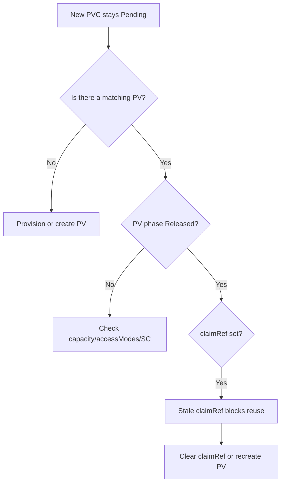

# PV Released Not Reused

> **Severity:** Medium · **Typical recovery time:** 5–20 min · **Affected versions:** 1.20+

## Error Message

```text
NAME    CAPACITY   ACCESS MODES   RECLAIM POLICY   STATUS     CLAIM            STORAGECLASS   AGE
pv-data 50Gi       RWO            Retain           Released   team-a/data-pvc  manual         12d
```

A new PVC stays `Pending` and the PV above is never selected for binding.

## Description

When a PVC is deleted, its bound PV moves to the `Released` phase. A `Released`
volume still carries a `claimRef` pointing at the now-deleted PVC, so the
controller will **not** bind it to any other claim, even one that matches
capacity, access mode, and StorageClass. This is by design: the volume may still
hold the previous owner's data, and Kubernetes refuses to silently hand it to a
new tenant. With `reclaimPolicy: Retain` this is permanent until an operator
intervenes; with `Delete` the volume (and backing disk) would be removed instead.

During an incident this usually shows up as a stuck rollout: the workload's new
PVC is `Pending` and events read `no persistent volumes available for this claim`
even though a perfectly sized `Released` PV is sitting idle.

## Affected Kubernetes Versions

Applies to all supported releases (1.20 through 1.30+). The `Released` semantics
have been stable for years. The `Recycle` policy that used to auto-scrub volumes
is deprecated, so manual reuse is now the expected path.

## Likely Root Causes

- The PVC was deleted/recreated and the PV retains a stale `claimRef`
- `reclaimPolicy: Retain` (or a StorageClass default of Retain)
- StatefulSet PVCs deleted then re-created with a different UID
- An operator expecting automatic rebinding that never happens for `Released`

## Diagnostic Flow



## Verification Steps

Confirm the PV is `Released`, that its `claimRef` references a PVC that no longer
exists, and that the pending PVC otherwise matches the volume.

## kubectl Commands

```bash
kubectl get pv
kubectl get pv pv-data -o yaml
kubectl get pvc -A
kubectl describe pvc <pvc> -n <namespace>
kubectl get events -n <namespace> --sort-by=.lastTimestamp
```

## Expected Output

```text
$ kubectl get pv pv-data -o jsonpath='{.status.phase} {.spec.claimRef.namespace}/{.spec.claimRef.name}'
Released team-a/data-pvc

$ kubectl get pvc data-pvc -n team-a
Error from server (NotFound): persistentvolumeclaims "data-pvc" not found
```

## Common Fixes

1. Remove the stale `claimRef` from the PV so it returns to `Available`
2. Delete and recreate the PV from a saved manifest (data preserved on `Retain`)
3. Point the new PVC directly at the PV via `volumeName` if it must reuse it

## Recovery Procedures

1. Back up the PV definition: `kubectl get pv pv-data -o yaml > pv-data.yaml`.
2. **Disruptive (clears ownership):** clear the `claimRef` with
   `kubectl patch pv pv-data -p '{"spec":{"claimRef":null}}'`. Blast radius: the
   single PV; once cleared it becomes `Available` and any matching PVC may grab
   it — confirm no other pending PVC could claim it first.
3. The volume moves to `Available` and binds to the intended PVC.

> Note: only the `claimRef`-clearing patch above is a mutating action; everything
> in the diagnostic section is read-only.

## Validation

Confirm `kubectl get pv pv-data` shows `Available` then `Bound`, the PVC reports
`Bound`, and the consuming pod mounts the volume and reaches `Running`.

## Prevention

- Avoid deleting PVCs casually for workloads on `Retain` volumes
- Use dynamic provisioning so each claim gets a fresh PV
- Add a CI/policy check that flags orphaned `Released` PVs
- Document a runbook for reusing retained volumes

## Related Errors

- [PV Retain Stuck Released](pv-retain-stuck-released.md)
- [PV Bound To Wrong PVC](pv-bound-wrong-pvc.md)
- [Static PV Binding Failed](pv-static-binding-failed.md)

## References

- [Reclaiming PersistentVolumes](https://kubernetes.io/docs/concepts/storage/persistent-volumes/#reclaiming)
- [PersistentVolume lifecycle](https://kubernetes.io/docs/concepts/storage/persistent-volumes/#lifecycle-of-a-volume-and-claim)

## Further Reading

- [DevOps AI ToolKit — Kubernetes guides](https://devopsaitoolkit.com/blog/)
