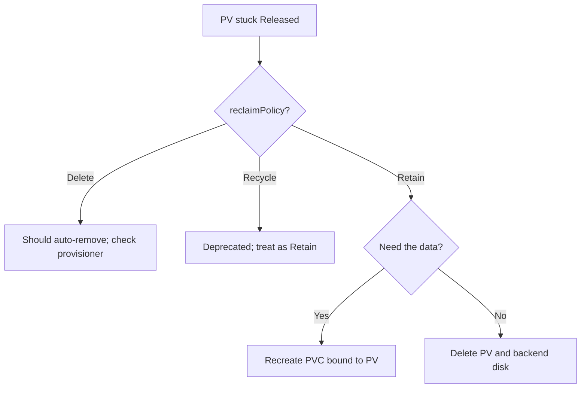

# PV Retain Stuck Released

> **Severity:** Medium · **Typical recovery time:** 5–20 min · **Affected versions:** 1.20+

## Error Message

```text
NAME       CAPACITY   RECLAIM POLICY   STATUS     CLAIM             STORAGECLASS
pv-orders  100Gi      Retain           Released   prod/orders-pvc   gp3-retain
```

The PV sits in `Released` indefinitely and is never automatically cleaned up or
made `Available` again.

## Description

`reclaimPolicy: Retain` is the safest reclaim mode: when the bound PVC is
deleted, Kubernetes deliberately leaves the PersistentVolume and its underlying
storage untouched. The volume transitions to `Released` and **stays there
forever** until an administrator manually reclaims it. Unlike `Delete`, nothing
is removed; unlike the deprecated `Recycle`, nothing is scrubbed. This is correct
and intentional behaviour — but operators new to it often report the PV as
"stuck" because it neither rebinds nor disappears.

In production, `Retain` is exactly what you want for stateful data (databases,
message queues) so an accidental PVC deletion does not destroy a disk. The cost
is a manual reclaim step before the volume can serve a new claim.

## Affected Kubernetes Versions

All supported versions (1.20+). `Retain` semantics are unchanged. Note that
dynamically provisioned volumes default to the StorageClass `reclaimPolicy`
(usually `Delete`), while statically created PVs commonly use `Retain`.

## Likely Root Causes

- `reclaimPolicy: Retain` set on the PV or its StorageClass (working as designed)
- PVC was deleted and an operator expected automatic cleanup
- No runbook exists for reclaiming retained volumes
- Confusion with the removed `Recycle` policy

## Diagnostic Flow



## Verification Steps

Confirm `spec.persistentVolumeReclaimPolicy` is `Retain` and that the
`claimRef` points to a PVC that has been deleted.

## kubectl Commands

```bash
kubectl get pv pv-orders -o yaml
kubectl get pv -o custom-columns=NAME:.metadata.name,POLICY:.spec.persistentVolumeReclaimPolicy,STATUS:.status.phase
kubectl get sc gp3-retain -o yaml
kubectl get pvc -A
```

## Expected Output

```text
$ kubectl get pv pv-orders -o jsonpath='{.spec.persistentVolumeReclaimPolicy} {.status.phase}'
Retain Released
```

## Common Fixes

1. If you want a new workload to reuse the data, recreate the PVC with
   `volumeName: pv-orders` after clearing the `claimRef`
2. If the data is no longer needed, delete the PV and reclaim the backend disk
3. Switch the StorageClass to `Delete` for future volumes where retention is
   unwanted

## Recovery Procedures

1. Decide whether the retained data is still needed.
2. To reuse: back up the manifest, then **disruptive (transfers ownership):**
   `kubectl patch pv pv-orders -p '{"spec":{"claimRef":null}}'`, then create a
   PVC with `volumeName: pv-orders`. Blast radius: the one PV.
3. To discard: **data-loss:** `kubectl delete pv pv-orders` and then manually
   delete the cloud disk. Blast radius: permanent loss of that volume's data.

> Only the `patch` and `delete` steps mutate state; diagnostics are read-only.

## Validation

After reuse, the PV shows `Bound` to the new PVC and the pod mounts existing
data. After deletion, `kubectl get pv pv-orders` returns `NotFound` and the
backend disk no longer exists.

## Prevention

- Maintain a documented reclaim runbook for `Retain` volumes
- Use `Delete` StorageClasses for ephemeral/replaceable data
- Tag retained PVs and backend disks for periodic audit
- Restrict PVC delete permissions on critical namespaces

## Related Errors

- [PV Released Not Reused](pv-released-not-reused.md)
- [PV Recycle Reclaim Deprecated](pv-recycle-deprecated.md)
- [PV Orphaned In Backend](pv-orphaned-in-backend.md)

## References

- [Reclaiming — Retain](https://kubernetes.io/docs/concepts/storage/persistent-volumes/#retain)
- [Reclaim policy](https://kubernetes.io/docs/concepts/storage/persistent-volumes/#reclaiming)

## Further Reading

- [DevOps AI ToolKit — Kubernetes guides](https://devopsaitoolkit.com/blog/)
