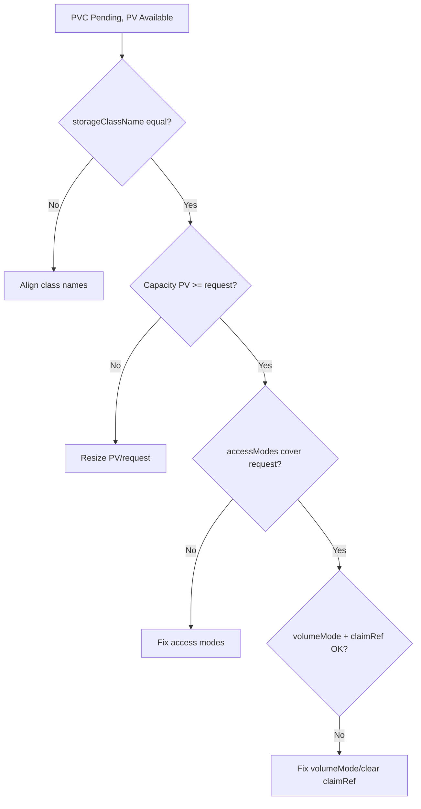

# Static PV Binding Failed

> **Severity:** Medium · **Typical recovery time:** 10–30 min · **Affected versions:** 1.20+

## Error Message

```text
Events:
  Warning  FailedBinding   persistentvolume-controller
  no persistent volumes available for this claim and no storage class is set
```

A hand-created PV exists and is `Available`, yet the matching PVC never binds to
it.

## Description

Static provisioning means you create the PersistentVolume yourself instead of
relying on a StorageClass provisioner. For the controller to bind a PVC to a
static PV, **all** of these must align: `storageClassName`, `accessModes`
(PV must cover all PVC modes), capacity (PV >= PVC request), volume mode
(`Filesystem` vs `Block`), any selector/`volumeName`, and `nodeAffinity` for
topology-bound volumes. A single mismatch leaves the PVC `Pending` even though an
otherwise-suitable PV is `Available`.

The most common silent culprit is `storageClassName`: an empty string on the PVC
will not match a PV that has a named class, and omitting the field entirely pulls
in the default class. Static binding is unforgiving — there is no provisioner to
adapt, so every field must match exactly.

## Affected Kubernetes Versions

All supported versions (1.20+). `volumeMode` defaults to `Filesystem`; mismatches
between `Block` and `Filesystem` block binding on every release.

## Likely Root Causes

- `storageClassName` differs (named vs. `""` vs. omitted/default)
- PV capacity smaller than the PVC request
- `accessModes` on the PV do not cover the PVC's requested modes
- `volumeMode` mismatch (`Block` vs `Filesystem`)
- PV carries a stale `claimRef` or `nodeAffinity` the PVC cannot satisfy

## Diagnostic Flow



## Verification Steps

Field-by-field, compare the PVC spec against the candidate PV: class, capacity,
access modes, volume mode, and any existing `claimRef`/`nodeAffinity`.

## kubectl Commands

```bash
kubectl get pv <pv> -o yaml
kubectl get pvc <pvc> -n <namespace> -o yaml
kubectl get pv -o custom-columns=NAME:.metadata.name,CAP:.spec.capacity.storage,MODES:.spec.accessModes,SC:.spec.storageClassName,VM:.spec.volumeMode,STATUS:.status.phase
kubectl describe pvc <pvc> -n <namespace>
kubectl get events -n <namespace> --sort-by=.lastTimestamp
```

## Expected Output

```text
$ kubectl get pv my-pv -o jsonpath='{.spec.storageClassName}={.spec.capacity.storage}={.spec.accessModes}{"\n"}'
manual=10Gi=[ReadWriteOnce]

$ kubectl get pvc my-pvc -n app -o jsonpath='{.spec.storageClassName}={.spec.resources.requests.storage}={.spec.accessModes}{"\n"}'
=20Gi=[ReadWriteMany]
```

(Here both class and capacity and modes differ — binding cannot occur.)

## Common Fixes

1. Match `storageClassName` exactly (set `""` on both for no-class binding)
2. Ensure PV capacity >= PVC request and access modes cover the request
3. Align `volumeMode` and clear any stale `claimRef` on the PV
4. Optionally pin the PVC with `volumeName: <pv>` once fields agree

## Recovery Procedures

1. Diff the PVC and PV field by field using the commands above.
2. Fix the PV where possible (capacity and class are largely immutable, so you may
   need to recreate it). **Non-disruptive** while unbound.
3. If the PVC is wrong, recreate it with matching fields — PVC specs are mostly
   immutable. **Non-disruptive** if previously unbound.
4. **Disruptive only if a workload is waiting:** roll the consuming pod once the
   PVC binds. Blast radius: that workload restarts.

> Recreating PVs/PVCs and rollouts mutate state; the diff/describe commands are
> read-only.

## Validation

The PVC moves to `Bound`, the PV shows `Bound` to that PVC, and the consuming pod
mounts the volume and reaches `Running`.

## Prevention

- Template static PV/PVC pairs together so fields stay in sync
- Validate manifests (class, capacity, modes, volumeMode) before apply
- Prefer dynamic provisioning where static binding is not strictly required
- Document the no-class (`""`) convention for your static volumes

## Related Errors

- [PV StorageClass Mismatch](pv-storageclass-mismatch.md)
- [PV AccessMode Mismatch](pv-accessmode-mismatch.md)
- [PV Capacity Smaller Than Claim](pv-capacity-smaller-than-claim.md)

## References

- [Static provisioning](https://kubernetes.io/docs/concepts/storage/persistent-volumes/#static)
- [Binding](https://kubernetes.io/docs/concepts/storage/persistent-volumes/#binding)

## Further Reading

- [Free Kubernetes config validators](https://devopsaitoolkit.com/validators/)
