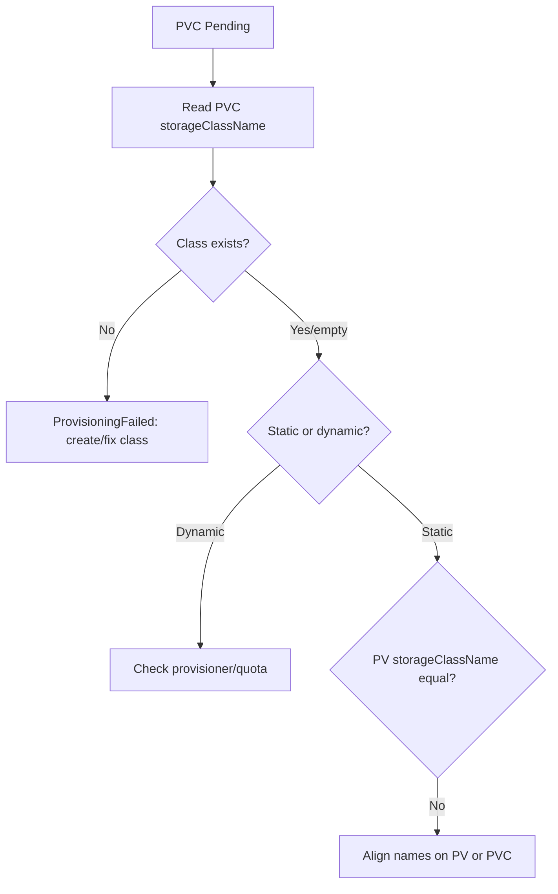

# PV StorageClass Mismatch

> **Severity:** Medium · **Typical recovery time:** 5–20 min · **Affected versions:** 1.20+

## Error Message

```text
Events:
  Warning  ProvisioningFailed   persistentvolume-controller
  storageclass.storage.k8s.io "fast-ssd" not found
```

Or, for static binding, the PVC stays `Pending` because no PV shares its
`storageClassName`.

## Description

`storageClassName` must match between a PVC and the PV it binds to. For dynamic
provisioning, a non-empty `storageClassName` tells the controller which
provisioner to call; if that class does not exist, provisioning fails. For static
binding, a PVC only binds to a PV with the **same** `storageClassName`. An empty
string (`""`) means "no class" and matches only PVs that also have no class —
which is different from omitting the field entirely (where the cluster default
StorageClass is applied).

This trips operators in two classic ways: requesting a StorageClass name that was
never created (typo or wrong cluster), and mixing static PVs that have a class
name with PVCs that use `""`, or vice versa. The PVC sits `Pending` with either a
`ProvisioningFailed` or a silent no-match.

## Affected Kubernetes Versions

All supported versions (1.20+). The empty-string vs. omitted-field distinction and
the default-StorageClass annotation behaviour are consistent across releases.

## Likely Root Causes

- PVC references a StorageClass that does not exist (typo/wrong cluster)
- Static PV and PVC use different `storageClassName` values
- PVC omits the field and gets an unexpected default class
- PVC uses `""` (no class) but the matching PV has a named class

## Diagnostic Flow



## Verification Steps

Compare the PVC `storageClassName` with the named PVs and the list of installed
StorageClasses; check for an unexpected default class.

## kubectl Commands

```bash
kubectl get pvc <pvc> -n <namespace> -o jsonpath='{.spec.storageClassName}{"\n"}'
kubectl get sc
kubectl get pv -o custom-columns=NAME:.metadata.name,SC:.spec.storageClassName,STATUS:.status.phase
kubectl describe pvc <pvc> -n <namespace>
```

## Expected Output

```text
$ kubectl get pvc data-pvc -n app -o jsonpath='{.spec.storageClassName}'
fast-ssd

$ kubectl get sc
NAME             PROVISIONER             RECLAIMPOLICY   DEFAULT
gp3 (default)    ebs.csi.aws.com         Delete          true
# fast-ssd is absent
```

## Common Fixes

1. Fix the typo so the PVC names an existing StorageClass
2. Create the missing StorageClass with the correct provisioner
3. Align `storageClassName` between the static PV and PVC (including `""` for
   no-class)

## Recovery Procedures

1. Determine whether the workflow is dynamic (class must exist) or static (names
   must match).
2. For dynamic: **non-disruptive (additive):** create the missing StorageClass,
   then recreate the PVC. Blast radius: new resources only.
3. For static name mismatch: recreate the PVC with the PV's exact
   `storageClassName` (PVC spec is largely immutable, so create a new one).
   **Non-disruptive** if the old PVC was unbound.
4. Re-point the workload and roll it. **Disruptive:** rollout restarts pods.

> Creating StorageClasses/PVCs and rollouts mutate state; diagnostics are
> read-only.

## Validation

The PVC reaches `Bound`, the bound PV's `storageClassName` matches, and dependent
pods reach `Running`.

## Prevention

- Pin StorageClass names in manifests and validate against the cluster in CI
- Be explicit: set `storageClassName: ""` deliberately for static binding
- Avoid relying on the default class for stateful workloads
- Keep a single source of truth for StorageClass definitions

## Related Errors

- [PV AccessMode Mismatch](pv-accessmode-mismatch.md)
- [PV Capacity Smaller Than Claim](pv-capacity-smaller-than-claim.md)
- [Static PV Binding Failed](pv-static-binding-failed.md)

## References

- [Class — matching PV and PVC](https://kubernetes.io/docs/concepts/storage/persistent-volumes/#class-1)
- [Storage Classes](https://kubernetes.io/docs/concepts/storage/storage-classes/)

## Further Reading

- [Free Kubernetes config validators](https://devopsaitoolkit.com/validators/)
