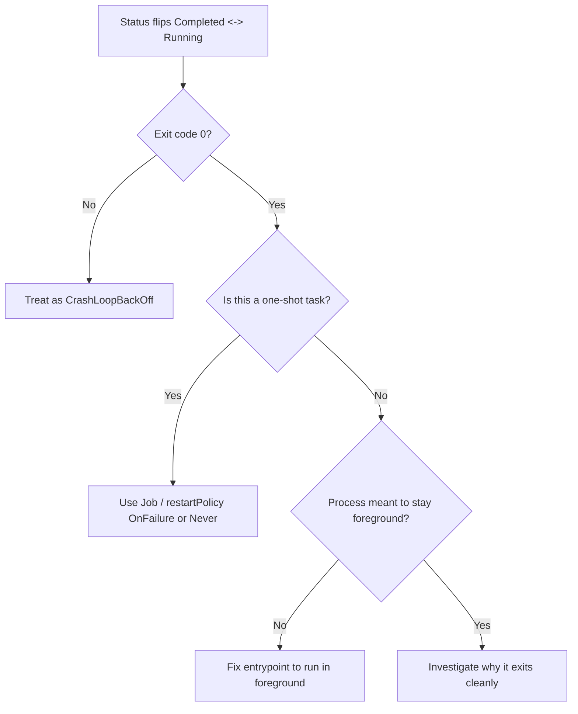

# Completed Pod Restart Loop

> **Severity:** Medium · **Typical recovery time:** 5–20 min · **Affected versions:** 1.20+

## Error Message

```text
NAME        READY   STATUS      RESTARTS      AGE
worker-0    0/1     Completed   8 (12s ago)   6m

Last State:  Terminated
  Reason:    Completed
  Exit Code: 0
```

## Description

The container exits cleanly (exit code 0, reason `Completed`) but the kubelet
keeps restarting it. This is a `restartPolicy` mismatch: a container that is
*meant* to run forever is exiting, or a one-shot task is running under a
controller that expects a long-lived process. With `restartPolicy: Always`
(the default for Deployments) any exit — even a successful one — triggers a
restart with `CrashLoopBackOff` backoff, so you see the status flicker between
`Completed` and `Running`.

During an incident this confuses responders because exit code 0 looks healthy;
nothing is "crashing". The real issue is that the workload's lifecycle model
doesn't match the controller running it.

## Affected Kubernetes Versions

Applies to 1.20+. Restart-policy semantics are long-standing. Note: container-
level `restartPolicy` for init/sidecar containers arrived with native sidecars
(beta 1.29, stable 1.33); for ordinary pods, restart policy remains pod-level
(`Always`/`OnFailure`/`Never`).

## Likely Root Causes

- A batch/one-shot workload deployed as a Deployment instead of a Job
- The container's main process backgrounds itself or exits after setup
- The entrypoint completes (e.g. a migration/seed task) but pod is long-lived
- Misconfigured command/args causing the process to return immediately
- A server that exits 0 on a config/no-work condition instead of staying up

## Diagnostic Flow



## Verification Steps

Confirm the terminated reason is `Completed` with exit code 0 (not `Error`), and
determine whether the workload is meant to be long-running or one-shot.

## kubectl Commands

```bash
kubectl get pod <pod> -n <namespace> -o wide
kubectl describe pod <pod> -n <namespace>
kubectl get pod <pod> -n <namespace> -o jsonpath='{.spec.restartPolicy}'
kubectl get pod <pod> -n <namespace> -o jsonpath='{.metadata.ownerReferences}'
kubectl logs <pod> -n <namespace> --previous
```

## Expected Output

```text
$ kubectl describe pod worker-0 -n batch
Last State:  Terminated
  Reason:    Completed
  Exit Code: 0
Restart Count: 8
Owner References: kind=ReplicaSet (Deployment "worker")

$ kubectl get pod worker-0 -n batch -o jsonpath='{.spec.restartPolicy}'
Always
```

## Common Fixes

1. Convert one-shot workloads to a `Job` (or `CronJob`) with `restartPolicy:
   OnFailure`/`Never`
2. Fix the entrypoint so a long-running server stays in the foreground
3. Correct `command`/`args` so the process doesn't exit immediately
4. If the process daemonizes, run it with a foreground/no-fork flag

## Recovery Procedures

Ordered, production-safe steps:

1. Identify the owner (Deployment vs Job) and the intended lifecycle
   (read-only).
2. For a misclassified one-shot task, create the correct `Job` and remove the
   Deployment. **Disruptive — blast radius: the workload being replaced;**
   ensure the task is idempotent before re-running as a Job.
3. For a long-running server exiting early, fix the entrypoint/args in the pod
   template and roll out. **Disruptive — blast radius: all replicas** of the
   Deployment during the rolling update.

## Validation

A long-running workload stays `Running`/`Ready` with a stable restart count; a
batch workload completes once and the `Job` reports `Succeeded` without
restarting.

## Prevention

- Match controller type to lifecycle: Jobs for tasks, Deployments for servers
- Run servers in the foreground (`exec` the process, no daemonizing)
- Add CI checks that flag `Completed` restarts on long-running workloads
- Use readiness probes so flapping pods don't receive traffic

## Related Errors

- [CrashLoopBackOff](../pods/crashloopbackoff.md)
- [FailedPostStartHook](../pods/failed-post-start-hook.md)

## References

- [Pod Lifecycle — Restart Policy](https://kubernetes.io/docs/concepts/workloads/pods/pod-lifecycle/#restart-policy)
- [Jobs](https://kubernetes.io/docs/concepts/workloads/controllers/job/)

## Further Reading

- [DevOps AI ToolKit — Kubernetes guides](https://devopsaitoolkit.com/blog/)
