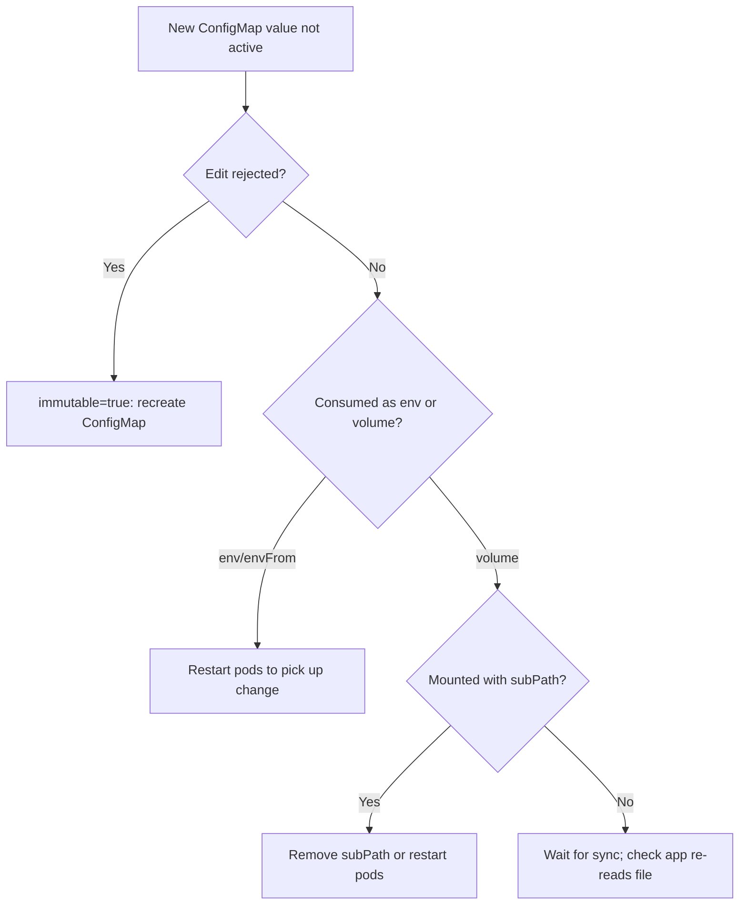

# ConfigMap Change Not Applied

> **Severity:** Medium · **Typical recovery time:** 5–15 min · **Affected versions:** 1.21+

## Error Message

```text
# When patching an immutable ConfigMap:
The ConfigMap "app-config" is invalid: data: Forbidden: field is immutable when `immutable` is set

# Or the silent symptom:
the application keeps reading the OLD config values even after the
ConfigMap was updated
```

## Description

Two distinct problems share this symptom. First, a ConfigMap marked
`immutable: true` cannot be edited at all — the API server rejects the change.
Second, and more common, a *mutable* ConfigMap is updated but the pod keeps
serving stale values. That happens because: (a) ConfigMaps consumed as `env`/
`envFrom` are injected only at container start and **never** update live;
(b) volume-mounted ConfigMaps *do* update, but with a propagation delay (kubelet
sync period plus cache TTL, up to ~1–2 minutes), and only if the mount isn't
`subPath` — `subPath` mounts never receive updates.

During an incident this causes confusion: the ConfigMap clearly shows the new
value, yet the application behaves on the old one. The fix depends entirely on
*how* the config is consumed.

## Affected Kubernetes Versions

Immutable ConfigMaps/Secrets are GA from 1.21. Volume update propagation and the
env-injection-at-start-only behavior apply to all supported versions. `subPath`
not receiving updates is long-standing and unchanged.

## Likely Root Causes

- Config consumed via `env`/`envFrom` — values frozen at container start
- ConfigMap mounted with `subPath` — updates never propagate
- ConfigMap marked `immutable: true` — edits are rejected outright
- Propagation delay not yet elapsed for a regular volume mount
- The app caches config in memory and doesn't re-read the file

## Diagnostic Flow



## Verification Steps

Determine how each container consumes the ConfigMap (env vs volume, subPath or
not) and whether the ConfigMap is marked immutable.

## kubectl Commands

```bash
kubectl get configmap <name> -n <namespace> -o yaml
kubectl get configmap <name> -n <namespace> -o jsonpath='{.immutable}'
kubectl get pod <pod> -n <namespace> -o jsonpath='{.spec.containers[*].envFrom}'
kubectl get pod <pod> -n <namespace> -o jsonpath='{.spec.volumes}'
kubectl describe pod <pod> -n <namespace>
```

## Expected Output

```text
$ kubectl get configmap app-config -n web -o jsonpath='{.immutable}'
true

$ kubectl get pod web-7c9 -n web -o jsonpath='{.spec.containers[*].envFrom}'
[{"configMapRef":{"name":"app-config"}}]
# -> consumed as env: requires a pod restart to pick up changes
```

## Common Fixes

1. For env-consumed config, roll the workload so containers restart with new
   values (a hash annotation on the template automates this)
2. For `subPath` mounts, switch to a full-directory mount to get live updates
3. For immutable ConfigMaps, create a new versioned ConfigMap and point the
   workload at it (immutable maps must be replaced, not edited)
4. Make the app watch/re-read the mounted file or expose a config-reload signal

## Recovery Procedures

Ordered, production-safe steps:

1. Confirm the consumption pattern (read-only) so you apply the right fix.
2. For env/subPath cases, trigger a rolling restart of the workload.
   **Disruptive — blast radius: all replicas** of the Deployment/StatefulSet are
   cycled; do it as a controlled rollout so a quorum stays serving.
3. For immutable ConfigMaps, create the replacement, update the pod template
   reference, and roll out. **Disruptive — blast radius: all replicas** during
   the rollout. The old immutable ConfigMap can be deleted afterward.

## Validation

The running container's environment or mounted file shows the new value (verify
in-pod), application behavior reflects the change, and pods are `Ready` after the
rollout.

## Prevention

- Add a config-hash annotation to pod templates so config changes auto-roll
- Avoid `subPath` when you need live config updates
- Use immutable ConfigMaps deliberately (with versioned names) for safety/perf
- Build apps to re-read mounted config or accept a reload signal

## Related Errors

- [Secret Not Found](../pods/secret-not-found.md)
- [Failed To Sync Secret Cache](../pods/failed-to-sync-secret-cache.md)

## References

- [ConfigMaps](https://kubernetes.io/docs/concepts/configuration/configmap/)
- [Immutable ConfigMaps and Secrets](https://kubernetes.io/docs/concepts/configuration/configmap/#configmap-immutable)

## Further Reading

- [Free Kubernetes config validators](https://devopsaitoolkit.com/validators/)
