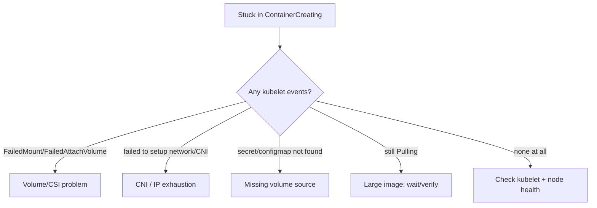

# Stuck in ContainerCreating

> **Severity:** High · **Typical recovery time:** 10–60 min · **Affected versions:** 1.20+

## Error Message

```text
NAME         READY   STATUS              RESTARTS   AGE
web-xxxx     0/1     ContainerCreating   0          6m

# describe shows no recent progress events, or e.g.:
Warning  FailedMount  3m  kubelet  Unable to attach or mount volumes: unmounted volumes=[data],
unattached volumes=[data kube-api-access-xxxxx]: timed out waiting for the condition
```

## Description

`ContainerCreating` is a normal *transient* state between scheduling and the
container starting — the kubelet is setting up the sandbox: pulling images,
attaching/mounting volumes, configuring the network (CNI), and projecting
secrets/ConfigMaps. It becomes a problem when the pod is **stuck** here for
minutes with no progress, which means one of those setup steps is blocked.

Unlike `Pending` (scheduler can't place the pod), a pod in stuck
`ContainerCreating` *has* a node — the failure is in node-side setup. The most
common offenders are volume attach/mount timeouts, CNI/IP allocation failures,
and missing secrets/ConfigMaps used as volumes. Read the kubelet events; if there
are none, the kubelet or a node component may itself be stalled.

## Affected Kubernetes Versions

All supported versions (1.20+). CSI is the standard storage path; CSI driver or
attach/detach controller issues are common causes. Network setup depends on the
CNI plugin. Behaviour is broadly consistent; specifics vary by CSI/CNI vendor.

## Likely Root Causes

- Volume attach/mount failure: CSI driver issue, multi-attach on RWO volume,
  cloud disk attach limits (`FailedMount`/`FailedAttachVolume`)
- CNI failure: IP exhaustion in the subnet, CNI plugin down, network setup error
- Missing Secret/ConfigMap referenced as a volume (`FailedMount` on the projected
  volume)
- Slow/large image pull still in progress (legitimately, not stuck)
- kubelet or container runtime on the node unhealthy / out of resources

## Diagnostic Flow



## Verification Steps

Confirm `STATUS` is `ContainerCreating` and the pod *is* assigned a node
(`-o wide`). Read `describe` events for `FailedMount`, `FailedAttachVolume`, or
CNI errors. If there are zero recent events and the age is large, suspect a
kubelet/node component stall and check node status and conditions.

## kubectl Commands

```bash
kubectl describe pod <pod> -n <namespace>
kubectl get pod <pod> -n <namespace> -o wide
kubectl get events -n <namespace> --sort-by=.lastTimestamp
kubectl describe node <node>
kubectl get pvc -n <namespace>
kubectl logs <pod> -n <namespace> --previous
```

## Expected Output

```text
NAME         READY   STATUS              NODE        AGE
web-xxxx     0/1     ContainerCreating   node-1      6m

Events:
  Warning  FailedMount       3m   kubelet  Unable to attach or mount volumes:
           unmounted volumes=[data] ... timed out waiting for the condition
  Warning  FailedAttachVolume 5m  attachdetach-controller  Multi-Attach error for
           volume "pvc-..." Volume is already exclusively attached to one node
```

## Common Fixes

1. Resolve volume issues: clear a Multi-Attach (RWO volume still attached to a
   previous node), fix the CSI driver, or check cloud disk attach limits.
2. Fix CNI: restore the CNI DaemonSet, free IPs in an exhausted subnet, or fix
   plugin configuration.
3. Create the missing Secret/ConfigMap used as a volume in the pod's namespace.
4. For genuinely large images, wait for the pull to finish; verify registry
   throughput.

## Recovery Procedures

1. Identify the blocked setup step from the kubelet/controller events.
2. For Multi-Attach on an RWO volume after a node failure, allow the
   attach/detach controller to detach from the old node; **force-deleting the old
   pod is disruptive and risks data corruption on RWX-unsafe volumes** — a safer
   alternative is to let detachment complete (or confirm the old node is truly
   gone) before the volume re-attaches.
3. Restarting a node's kubelet/CNI is **disruptive — it affects all pods on that
   node**; prefer restarting only the failing CNI/CSI pod (single-component blast
   radius) or rescheduling the workload to a healthy node.

## Validation

The pod advances to `Running`/`READY`, `FailedMount`/CNI events stop, and the
volume/network are present inside the container. `get pods -o wide` confirms it.

## Prevention

- Monitor CSI/CNI DaemonSet health and CNI IP pool utilisation.
- Use StatefulSets/PDBs and proper drain ordering to avoid Multi-Attach hangs.
- Co-deploy volume-source Secrets/ConfigMaps with their workloads.
- Right-size image sizes and use a registry mirror to keep pulls fast.

## Related Errors

- [Pending Pod](./pending.md)
- [CreateContainerError](./createcontainererror.md)
- [CreateContainerConfigError](./createcontainerconfigerror.md)
- [ImagePullBackOff](./imagepullbackoff.md)

## References

- [Pod Lifecycle](https://kubernetes.io/docs/concepts/workloads/pods/pod-lifecycle/)
- [Storage / Persistent Volumes](https://kubernetes.io/docs/concepts/storage/persistent-volumes/)
- [Cluster Networking](https://kubernetes.io/docs/concepts/cluster-administration/networking/)

## Further Reading

- [DevOps AI ToolKit — Kubernetes guides](https://devopsaitoolkit.com/blog/)
