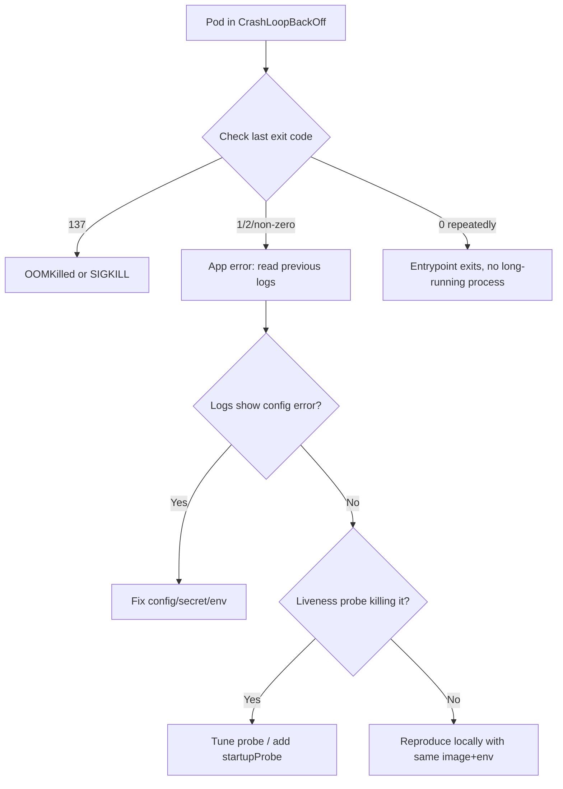

# CrashLoopBackOff

> **Severity:** High · **Typical recovery time:** 5–60 min · **Affected versions:** 1.20+

## Error Message

```text
Warning  BackOff  2m12s (x15 over 7m)  kubelet  Back-off restarting failed container app in pod web-7d9f8c6b54-q2xpz_default(...)
```

## Description

`CrashLoopBackOff` is not an error in itself — it is the kubelet telling you that
a container keeps starting, exiting, and being restarted, so the kubelet is now
delaying ("backing off") each restart attempt. The back-off is exponential,
capped at 5 minutes (10 seconds, 20s, 40s … up to 300s). The pod phase is usually
`Running` while the container `State` is `Waiting` with reason `CrashLoopBackOff`.

During an incident this means your application process is dying repeatedly. The
real failure is whatever exit code the container produced; `CrashLoopBackOff` is
just the symptom. The job is to find the underlying crash cause before the
back-off makes iteration painfully slow.

## Affected Kubernetes Versions

Applies to all supported versions (1.20+). The back-off cap of 300s is
long-standing. Note that 1.27+ introduced the `RestartPolicy` for init
containers (sidecar containers), which can also enter this state. In 1.30+ the
crash-loop back-off is more visible in `kubectl get pods` restart counts.

## Likely Root Causes

- Application bug or unhandled exception causing a non-zero exit (most common)
- Missing or wrong configuration / env vars / secrets the app needs at startup
- Failing liveness probe killing a container that is actually still starting
- OOM kill (exit code 137) — memory limit too low
- Bad command/entrypoint or a binary that exits immediately (exit 0 in a loop)
- Dependency unavailable at boot (DB, cache) and the app exits instead of retrying

## Diagnostic Flow



## Verification Steps

Confirm the container `State.Waiting.Reason` is `CrashLoopBackOff` and check
`Last State` for the terminated container's exit code and reason. A high,
steadily climbing `RESTARTS` count in `kubectl get pods` confirms the loop.

## kubectl Commands

```bash
kubectl get pods -n <namespace> -o wide
kubectl describe pod <pod> -n <namespace>
kubectl logs <pod> -n <namespace> --previous
kubectl logs <pod> -c <container> -n <namespace> --previous
kubectl get events -n <namespace> --sort-by=.lastTimestamp
kubectl top pod <pod> -n <namespace>
```

## Expected Output

```text
NAME                    READY   STATUS             RESTARTS      AGE
web-7d9f8c6b54-q2xpz    0/1     CrashLoopBackOff   8 (30s ago)   7m

# describe excerpt
    Last State:     Terminated
      Reason:       Error
      Exit Code:    1
      Started:      ...
      Finished:     ...
    State:          Waiting
      Reason:       CrashLoopBackOff
```

## Common Fixes

1. Read `--previous` logs, find the stack trace or fatal message, and fix the app
   bug or the missing configuration it complained about.
2. If exit code is 137, raise the memory limit or fix the leak (see OOMKilled).
3. If a liveness probe is killing a slow starter, add a `startupProbe` or
   increase `initialDelaySeconds`/`failureThreshold`.
4. Correct a bad `command`/`args` so a long-running process is actually launched.

## Recovery Procedures

1. Diagnose first using `logs --previous` — the back-off keeps the failed
   container around for inspection, so use it before forcing changes.
2. Apply the corrected manifest (config, limits, probes). A rolling update
   replaces pods gradually — **blast radius: the workload's pods are recreated;
   for a multi-replica Deployment this is safe and zero-downtime.**
3. Deleting a single pod to force a fresh start is **disruptive only to that one
   replica**; a safer alternative is to let the controller reconcile after you
   fix the spec, rather than manually deleting pods in a loop.

## Validation

Confirm `RESTARTS` stops increasing, `STATUS` becomes `Running`, and the pod is
`READY 1/1`. Verify probes pass and the app serves traffic / passes a healthcheck.

## Prevention

- Implement graceful startup with dependency retries instead of hard-exiting.
- Set realistic resource requests/limits and a `startupProbe` for slow apps.
- Validate config and secrets in CI; fail fast with clear error messages.
- Add readiness probes so a flapping pod is removed from Service endpoints.

## Related Errors

- [OOMKilled](./oomkilled.md)
- [RunContainerError](./runcontainererror.md)
- [CreateContainerConfigError](./createcontainerconfigerror.md)
- [ImagePullBackOff](./imagepullbackoff.md)

## References

- [Debug Running Pods](https://kubernetes.io/docs/tasks/debug/debug-application/debug-running-pod/)
- [Configure Liveness, Readiness and Startup Probes](https://kubernetes.io/docs/tasks/configure-pod-container/configure-liveness-readiness-startup-probes/)
- [Pod Lifecycle](https://kubernetes.io/docs/concepts/workloads/pods/pod-lifecycle/)

## Further Reading

- [DevOps AI ToolKit — Kubernetes guides](https://devopsaitoolkit.com/blog/)
