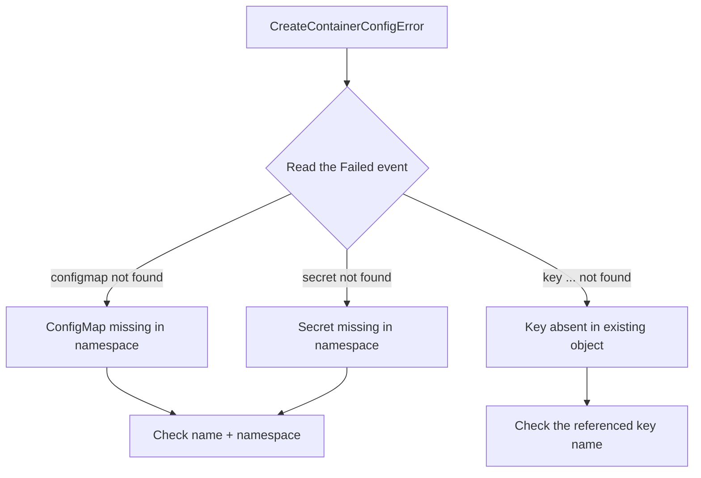

# CreateContainerConfigError

> **Severity:** High · **Typical recovery time:** 5–20 min · **Affected versions:** 1.20+

## Error Message

```text
Warning  Failed  4s (x5 over 23s)  kubelet  Error: configmap "app-config" not found
```

## Description

`CreateContainerConfigError` means the kubelet successfully pulled the image but
cannot build the container's configuration because a referenced object is
missing or invalid. The most common trigger is a referenced ConfigMap or Secret
that does not exist in the pod's namespace, or a key that is absent from one that
does exist.

The container never starts — it is stuck in `Waiting` with this reason. Crucially
this is a *configuration* problem, not a runtime crash: nothing in your image is
wrong, the spec simply points at data Kubernetes cannot find. These are quick
fixes once you read the exact message naming the missing object.

## Affected Kubernetes Versions

All supported versions (1.20+). The reason string is stable. The message
specifies whether it is a `configmap`, `secret`, or a missing `key`, which is the
fastest path to the cause.

## Likely Root Causes

- Referenced ConfigMap or Secret does not exist in the namespace
- A specific `key` referenced via `valueFrom.configMapKeyRef`/`secretKeyRef` is missing
- Secret/ConfigMap exists in a different namespace than the pod
- Typo in the object name or key reference
- Object was deleted or not yet created (ordering/timing in a deploy)

## Diagnostic Flow



## Verification Steps

Read the `Error:` event in `describe` — it names the exact ConfigMap/Secret/key.
Then confirm whether that object exists in the pod's namespace and contains the
referenced key. The container `State` will be `Waiting` /
`CreateContainerConfigError`.

## kubectl Commands

```bash
kubectl describe pod <pod> -n <namespace>
kubectl get events -n <namespace> --sort-by=.lastTimestamp
kubectl get configmap -n <namespace>
kubectl get secret -n <namespace>
kubectl describe configmap app-config -n <namespace>
kubectl get configmap app-config -n <namespace> -o jsonpath='{.data}'
```

## Expected Output

```text
    State:          Waiting
      Reason:       CreateContainerConfigError
Events:
  Type     Reason   Age               From     Message
  ----     ------   ----              ----     -------
  Normal   Pulled   24s               kubelet  Successfully pulled image "app:1.0"
  Warning  Failed   4s (x5 over 23s)  kubelet  Error: configmap "app-config" not found
```

## Common Fixes

1. Create the missing ConfigMap/Secret in the pod's namespace (or fix the name).
2. Add the missing key to an existing ConfigMap/Secret, or correct the
   `configMapKeyRef`/`secretKeyRef` key name in the spec.
3. Ensure the object lives in the same namespace as the pod (they are not shared
   across namespaces).
4. Fix deploy ordering so config objects are applied before the workload.

## Recovery Procedures

1. Identify the exact missing object/key from the event message.
2. Create or correct the ConfigMap/Secret. Once present, the kubelet retries
   automatically — no pod deletion required.
3. If you change the workload spec (e.g. fix a key reference), the controller
   does a rolling update — **blast radius: only the workload's pods; replicas
   stay available.** A safer alternative to manually deleting pods is to let the
   reconcile/retry happen after the object exists.

## Validation

The `Failed` event stops, a `Created`/`Started` event appears, and the pod
becomes `Running`/`READY`. Verify the app sees the expected config values.

## Prevention

- Manage config objects and workloads together (same Helm chart/Kustomize set).
- Validate references in CI (e.g. policy checks that referenced objects exist).
- Use immutable ConfigMaps/Secrets and explicit names, avoiding silent drift.
- Apply config before dependent workloads in your pipeline.

## Related Errors

- [CreateContainerError](./createcontainererror.md)
- [RunContainerError](./runcontainererror.md)
- [CrashLoopBackOff](./crashloopbackoff.md)
- [ErrImagePull](./errimagepull.md)

## References

- [ConfigMaps](https://kubernetes.io/docs/concepts/configuration/configmap/)
- [Secrets](https://kubernetes.io/docs/concepts/configuration/secret/)
- [Configure a Pod to Use a ConfigMap](https://kubernetes.io/docs/tasks/configure-pod-container/configure-pod-configmap/)

## Further Reading

- [DevOps AI ToolKit — Kubernetes guides](https://devopsaitoolkit.com/blog/)
