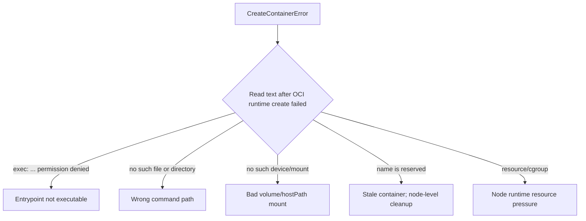

# CreateContainerError

> **Severity:** High · **Typical recovery time:** 10–45 min · **Affected versions:** 1.20+

## Error Message

```text
Warning  Failed  3s (x4 over 41s)  kubelet  Error: failed to create containerd task:
failed to create shim task: OCI runtime create failed: runc create failed:
unable to start container process: exec: "/app/start.sh": permission denied: unknown
```

## Description

`CreateContainerError` is reported when the container runtime (containerd via
runc) accepted the config but failed to actually *create* the container task.
Unlike `CreateContainerConfigError` (a missing ConfigMap/Secret), this is a
lower-level runtime failure: the OCI runtime could not set up the container —
often due to the entrypoint, mounts, devices, or runtime resources.

The `desc =`/trailing text after "OCI runtime create failed" is the key. It will
name the precise problem: a missing executable, a permission issue, a bad mount
path, a duplicate container name, or runtime resource exhaustion. Read it before
guessing.

## Affected Kubernetes Versions

All supported versions (1.20+). Since dockershim removal (1.24), this message
comes from containerd/runc directly, so wording references `containerd task`,
`shim task`, and `runc create`. CRI-O produces analogous messages with the same
diagnostic approach.

## Likely Root Causes

- Entrypoint/command not found or not executable (`exec: ... permission denied`,
  `no such file or directory`)
- Invalid or missing host path / volume mount the runtime cannot set up
- Duplicate container name left from a prior failed create (`name is reserved`)
- Runtime resource limits hit (open files, PIDs, cgroup/device issues)
- Read-only root filesystem conflicting with required writes at create time

## Diagnostic Flow



## Verification Steps

Read the full `Error:` event in `describe`, focusing on the substring after
"OCI runtime create failed". Confirm reason is `CreateContainerError` (runtime),
not `CreateContainerConfigError` (config object missing).

## kubectl Commands

```bash
kubectl describe pod <pod> -n <namespace>
kubectl get events -n <namespace> --sort-by=.lastTimestamp
kubectl get pod <pod> -n <namespace> -o yaml
kubectl describe node <node>
kubectl logs <pod> -n <namespace> --previous
```

## Expected Output

```text
    State:          Waiting
      Reason:       CreateContainerError
Events:
  Normal   Pulled  42s               kubelet  Successfully pulled image "app:1.0"
  Warning  Failed  3s (x4 over 41s)  kubelet  Error: failed to create containerd task:
           failed to create shim task: OCI runtime create failed: runc create failed:
           unable to start container process: exec: "/app/start.sh": permission denied: unknown
```

## Common Fixes

1. Fix the entrypoint: ensure the binary/script exists, is executable
   (`chmod +x` at build time), and the path is correct in `command`/`args`.
2. Correct invalid volume/hostPath mounts so the runtime can create them.
3. Resolve a stale/duplicate container name by clearing the leftover container on
   the node (out-of-band runtime cleanup) so the kubelet can recreate it.
4. Relieve node runtime resource pressure (PID/open-file/cgroup limits).

## Recovery Procedures

1. Read the OCI error text and reproduce the image's entrypoint behaviour
   locally where possible.
2. Rebuild/fix the image or correct the spec, then apply. The controller rolls
   pods gradually — **blast radius: only the workload's pods; multi-replica
   Deployments stay available.**
3. If a stale container blocks recreation, node-level runtime cleanup or
   draining the node is **disruptive — draining evicts all pods on that node.**
   A safer alternative is to reschedule the single pod elsewhere via node
   selection rather than draining the whole node.

## Validation

`Created` and `Started` events appear; pod reaches `Running`/`READY`. Confirm the
process is the expected entrypoint and mounts are present inside the container.

## Prevention

- Set executable bits in the image and verify the entrypoint in CI smoke tests.
- Avoid hostPath mounts where possible; validate mount paths exist on nodes.
- Monitor node-level PID/file-descriptor limits and runtime health.
- Use admission policies to catch invalid mount/security settings before deploy.

## Related Errors

- [CreateContainerConfigError](./createcontainerconfigerror.md)
- [RunContainerError](./runcontainererror.md)
- [Stuck in ContainerCreating](./containercreating-stuck.md)
- [CrashLoopBackOff](./crashloopbackoff.md)

## References

- [Container Runtimes](https://kubernetes.io/docs/setup/production-environment/container-runtimes/)
- [Debug Running Pods](https://kubernetes.io/docs/tasks/debug/debug-application/debug-running-pod/)
- [Pod Lifecycle](https://kubernetes.io/docs/concepts/workloads/pods/pod-lifecycle/)

## Further Reading

- [DevOps AI ToolKit — Kubernetes guides](https://devopsaitoolkit.com/blog/)
