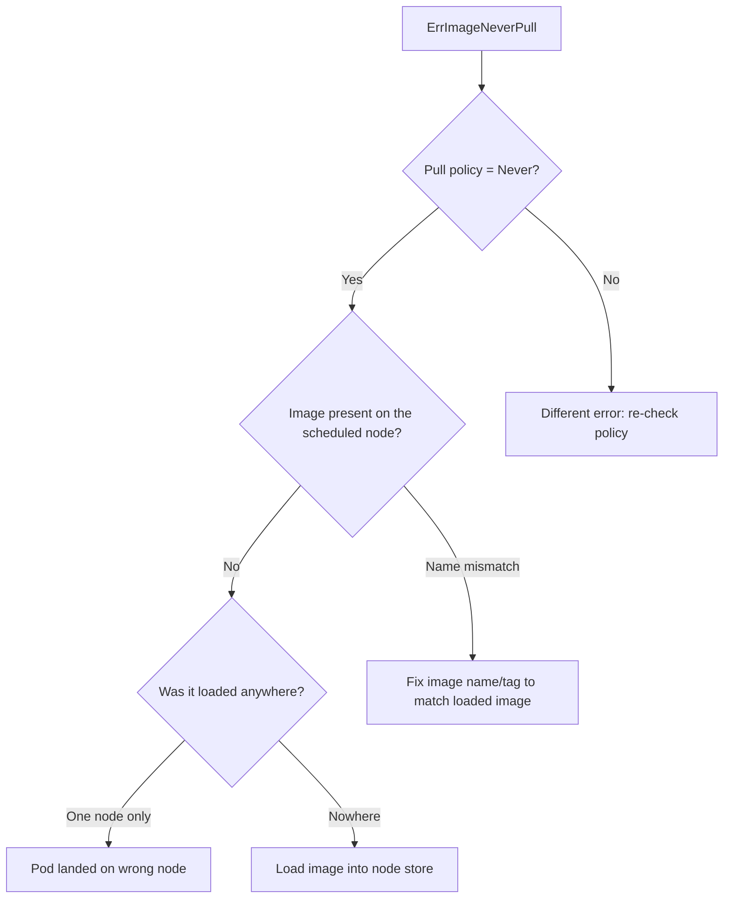

# ErrImageNeverPull

> **Severity:** Medium · **Typical recovery time:** 5–20 min · **Affected versions:** 1.20+

## Error Message

```text
Warning  ErrImageNeverPull  6s (x3 over 25s)  kubelet  Container image "myapp:dev" is not present
with pull policy of Never
```

## Description

`ErrImageNeverPull` happens when a container has `imagePullPolicy: Never` but the
image is **not already present in the node's local image store**. With this
policy the kubelet will never attempt to pull from a registry, so if the image
was not pre-loaded onto that specific node, the container cannot start.

This is most common in local/dev clusters (kind, minikube, k3s) where you build
images and load them directly into the node, and in air-gapped clusters that
pre-stage images. The fix is conceptually simple: either make the image present
on the scheduled node, or change the pull policy so a pull can occur.

## Affected Kubernetes Versions

All supported versions (1.20+). The `Never` pull policy semantics are stable.
Remember the default policy depends on the tag: `:latest` defaults to `Always`,
any other tag defaults to `IfNotPresent` — so `Never` is always explicit.

## Likely Root Causes

- Image was loaded onto one node but the pod scheduled to a different node
- Image was never loaded into the node's container runtime at all
- Image name/tag mismatch between what was loaded and what the pod requests
- Multi-node cluster where preloading was not done on every node

## Diagnostic Flow



## Verification Steps

Confirm the container's `imagePullPolicy` is `Never` and identify which node the
pod was scheduled to. Then confirm whether the exact image reference exists in
that node's runtime image list (via the node's CRI tooling, out of band).

## kubectl Commands

```bash
kubectl describe pod <pod> -n <namespace>
kubectl get pod <pod> -n <namespace> -o wide
kubectl get pod <pod> -n <namespace> -o jsonpath='{.spec.containers[*].imagePullPolicy}'
kubectl get pod <pod> -n <namespace> -o jsonpath='{.spec.containers[*].image}'
kubectl get events -n <namespace> --sort-by=.lastTimestamp
```

## Expected Output

```text
NAME              READY   STATUS              NODE
myapp-xxxx        0/1     ErrImageNeverPull   kind-worker2

# describe excerpt
    Image:          myapp:dev
    Image Pull Policy: Never
Events:
  Warning  ErrImageNeverPull  6s  kubelet  Container image "myapp:dev" is not present
           with pull policy of Never
```

## Common Fixes

1. Load the image into the runtime on the target node(s), e.g. `kind load
   docker-image myapp:dev` or `minikube image load myapp:dev`.
2. Change `imagePullPolicy` to `IfNotPresent` (or `Always`) and make the image
   pullable from a registry.
3. Correct the image name/tag so it matches exactly what was preloaded.
4. In multi-node clusters, preload the image on every node a pod could land on.

## Recovery Procedures

1. Determine the scheduled node and whether the image is present there.
2. Preload the image on the appropriate node(s), or update the manifest's pull
   policy. Updating the spec triggers a rolling update — **blast radius: only the
   workload's pods; multi-replica Deployments stay available.**
3. Deleting the stuck pod to reschedule is **disruptive to that one replica
   only**; a safer alternative is to load the image and let the kubelet retry, or
   set a node selector so the pod lands where the image already exists.

## Validation

`kubectl get pods -o wide` shows `Running` on a node that has the image; the
`ErrImageNeverPull` event stops recurring and the container reaches `READY`.

## Prevention

- Standardise a preload step in dev tooling (kind/minikube load) per node.
- Prefer `IfNotPresent` with a real registry for anything beyond local dev.
- Pin node affinity when relying on node-local images.
- In air-gapped clusters, automate image staging to all nodes.

## Related Errors

- [ImagePullBackOff](./imagepullbackoff.md)
- [ErrImagePull](./errimagepull.md)
- [CreateContainerError](./createcontainererror.md)
- [Pending Pod](./pending.md)

## References

- [Images — Image pull policy](https://kubernetes.io/docs/concepts/containers/images/#image-pull-policy)
- [Pod Lifecycle](https://kubernetes.io/docs/concepts/workloads/pods/pod-lifecycle/)
- [Debug Pods](https://kubernetes.io/docs/tasks/debug/debug-application/debug-pods/)

## Further Reading

- [DevOps AI ToolKit — Kubernetes guides](https://devopsaitoolkit.com/blog/)
