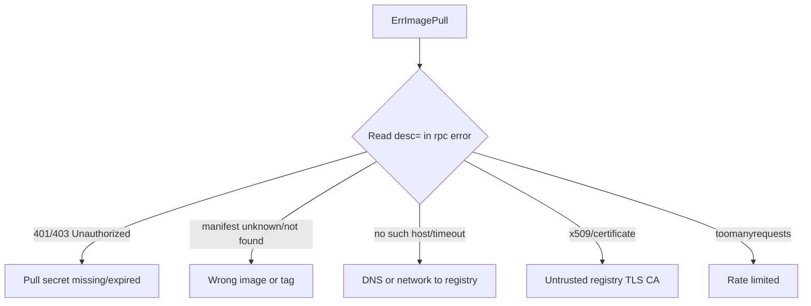

# ErrImagePull

> **Severity:** High · **Typical recovery time:** 5–30 min · **Affected versions:** 1.20+

## Error Message

```text
Warning  Failed  18s  kubelet  Failed to pull image "myregistry.io/app:1.2.3":
rpc error: code = Unknown desc = failed to pull and unpack image
"myregistry.io/app:1.2.3": failed to resolve reference: unexpected status: 401 Unauthorized
```

## Description

`ErrImagePull` is the *first* failure the kubelet reports when it cannot pull a
container image. After repeated `ErrImagePull` failures the pod transitions to
`ImagePullBackOff`, where retries are throttled. So `ErrImagePull` is the fresh,
un-backed-off version of the same problem and usually carries the most detailed
`rpc error` text from the container runtime (containerd/CRI-O).

The `rpc error: code = Unknown` wrapper comes from the CRI gRPC layer; the
meaningful part is the `desc =` suffix (401 Unauthorized, manifest unknown,
no such host, etc.). Read that suffix — it pinpoints the cause.

## Affected Kubernetes Versions

All supported versions (1.20+). Since dockershim removal in 1.24, the error text
is generated by containerd or CRI-O rather than Docker, so the wording
(`failed to resolve reference`, `failed to pull and unpack`) reflects the CRI
runtime. The diagnostic approach is identical.

## Likely Root Causes

- Authentication failure to a private registry (401/403) — missing/expired secret
- Image or tag does not exist (`manifest unknown`, `not found`)
- Registry hostname unresolvable or unreachable (`no such host`, `i/o timeout`)
- TLS problems (self-signed CA not trusted by the node)
- Rate limiting (`toomanyrequests`) or wrong image architecture

## Diagnostic Flow



## Verification Steps

Open `describe` and copy the full `desc =` portion of the `rpc error`. That
string is authoritative. Distinguish from `ErrImageNeverPull`, which means the
image is simply absent and the pull policy is `Never` (no pull attempted at all).

## kubectl Commands

```bash
kubectl describe pod <pod> -n <namespace>
kubectl get events -n <namespace> --sort-by=.lastTimestamp
kubectl get pod <pod> -n <namespace> -o jsonpath='{.spec.containers[*].image}'
kubectl get pod <pod> -n <namespace> -o jsonpath='{.spec.imagePullSecrets[*].name}'
kubectl get serviceaccount <sa> -n <namespace> -o yaml
```

## Expected Output

```text
Events:
  Type     Reason   Age   From     Message
  ----     ------   ----  ----     -------
  Normal   Pulling  20s   kubelet  Pulling image "myregistry.io/app:1.2.3"
  Warning  Failed   18s   kubelet  Failed to pull image "myregistry.io/app:1.2.3":
           rpc error: code = Unknown desc = failed to resolve reference:
           unexpected status: 401 Unauthorized
  Warning  Failed   18s   kubelet  Error: ErrImagePull
```

## Common Fixes

1. Create/refresh a `kubernetes.io/dockerconfigjson` secret with valid
   credentials and reference it (pod `imagePullSecrets` or ServiceAccount).
2. Fix the image reference if the tag/digest does not exist.
3. Resolve node DNS/network access to the registry, or add a registry mirror.
4. Distribute the registry's CA to nodes for self-hosted TLS registries.

## Recovery Procedures

1. Diagnose from the `desc =` text before editing anything.
2. Apply corrected pull secret or image reference; the controller rolls pods
   gradually — **blast radius: only the affected workload's pods; replicas remain
   available during a rolling update.**
3. Forcing a retry by deleting the pod is **disruptive to that single replica
   only**; prefer fixing the spec and letting the kubelet retry, or perform a
   controlled rollout restart of the owning controller.

## Validation

Look for a `Pulled` event and `Running`/`READY` status. Confirm the back-off
escalation to `ImagePullBackOff` does not recur.

## Prevention

- Attach pull secrets at the ServiceAccount level for consistency.
- Use immutable digests and verify image existence in CI before rollout.
- Monitor registry credential expiry; rotate before they lapse.
- Authenticate registry access to avoid anonymous rate limits.

## Related Errors

- [ImagePullBackOff](./imagepullbackoff.md)
- [ErrImageNeverPull](./errimageneverpull.md)
- [CreateContainerError](./createcontainererror.md)
- [Pending Pod](./pending.md)

## References

- [Images](https://kubernetes.io/docs/concepts/containers/images/)
- [Pull an Image from a Private Registry](https://kubernetes.io/docs/tasks/configure-pod-container/pull-image-private-registry/)
- [Container Runtimes](https://kubernetes.io/docs/setup/production-environment/container-runtimes/)

## Further Reading

- [DevOps AI ToolKit — Kubernetes guides](https://devopsaitoolkit.com/blog/)
