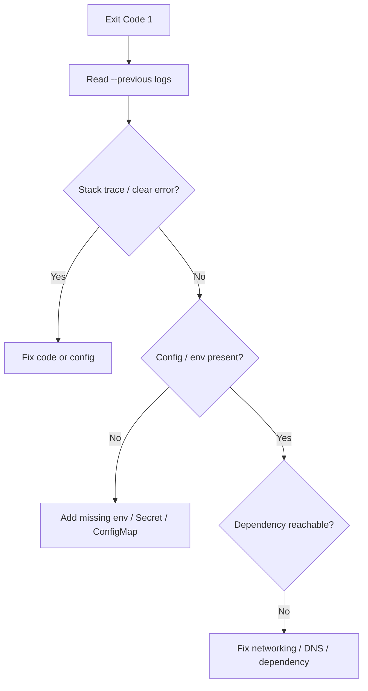

# Container Exit Code 1

> **Severity:** High · **Typical recovery time:** 10–60 min · **Affected versions:** 1.20+

## Error Message

```text
Last State:     Terminated
  Reason:       Error
  Exit Code:    1
  Started:      ...
  Finished:     ...
Reason: CrashLoopBackOff   (after repeated exit 1)
```

## Description

Exit code 1 is the generic "application error" — the process started successfully
but then exited non-zero on its own. This is not Kubernetes killing the container;
it is the program deciding to quit (unhandled exception, failed config validation,
missing dependency, panic that maps to exit 1). Repeated exits drive the pod into
`CrashLoopBackOff`. Because the cause lives in *your* code or config, the container
logs are almost always the authoritative source of truth.

## Affected Kubernetes Versions

Exit codes are passed through from the container runtime and are version-independent
(1.20+ and earlier behave identically). What changes between versions is only the
backoff display and event formatting, not the meaning of code 1.

## Likely Root Causes

- Unhandled application exception or stack trace on startup
- Missing/invalid configuration: env var, config file, feature flag
- Dependency unreachable at boot (DB, cache, downstream API) with no retry
- Failed schema/migration or assertion that calls `exit(1)`
- Wrong command/args causing the framework to error out

## Diagnostic Flow



## Verification Steps

Confirm `Exit Code: 1` (not 137/OOM, 139/SIGSEGV, or 143/SIGTERM) in `describe`.
Code 1 with `Reason: Error` means the app self-terminated; rule out look-alikes by
checking the exact numeric code.

## kubectl Commands

```bash
kubectl describe pod <pod> -n <namespace>
kubectl logs <pod> -n <namespace> --previous
kubectl logs <pod> -n <namespace> --previous --timestamps
kubectl get events -n <namespace> --sort-by=.lastTimestamp
kubectl get pod <pod> -n <namespace> -o jsonpath='{.status.containerStatuses[*].lastState.terminated.exitCode}'
```

## Expected Output

```text
$ kubectl logs api-5f --previous
Error: DATABASE_URL is required
    at loadConfig (/app/config.js:21)
process exited with code 1

$ kubectl get pod api-5f -o jsonpath='{...exitCode}'
1
```

## Common Fixes

1. Read `--previous` logs and fix the specific error (exception, panic, validation)
2. Supply the missing/invalid env var, ConfigMap, or Secret value
3. Make startup resilient: retry transient dependency connections with backoff
4. Correct `command`/`args` if the framework is mis-invoked

## Recovery Procedures

1. Capture `--previous` logs immediately — the next restart overwrites current logs.
2. Patch the config (ConfigMap/Secret/env) or ship a code fix.
3. **Disruptive — rollout the fix** (`kubectl rollout restart`/new image): blast
   radius = all replicas of the workload; use a rolling update so healthy pods serve
   traffic during the swap.
4. **Disruptive — delete one crashing pod** to pick up updated config: blast
   radius = a single replica.

## Validation

```bash
kubectl get pod <pod> -n <namespace>
kubectl logs <pod> -n <namespace>
```

Pod stays `Running` with `RESTARTS` no longer incrementing; logs show normal
startup and readiness probes pass.

## Prevention

- Fail fast with clear, single-line error messages on misconfiguration
- Validate config at deploy time (admission policy, CI smoke test, config schema)
- Add startup/liveness probes tuned to real boot time, with retry-on-dependency logic
- Add a CI step that boots the image with production-like env vars

## Related Errors

- [CrashLoopBackOff](../pods/crashloopbackoff.md)
- [Container Exit Code 139 (SIGSEGV)](../pods/exit-code-139.md)
- [Container Exit Code 143 (SIGTERM)](../pods/exit-code-143.md)

## References

- [Debug Running Pods](https://kubernetes.io/docs/tasks/debug/debug-application/debug-running-pod/)
- [Determine the Reason for Pod Failure](https://kubernetes.io/docs/tasks/debug/debug-application/determine-reason-pod-failure/)

## Further Reading

- [DevOps AI ToolKit — Kubernetes guides](https://devopsaitoolkit.com/blog/)
