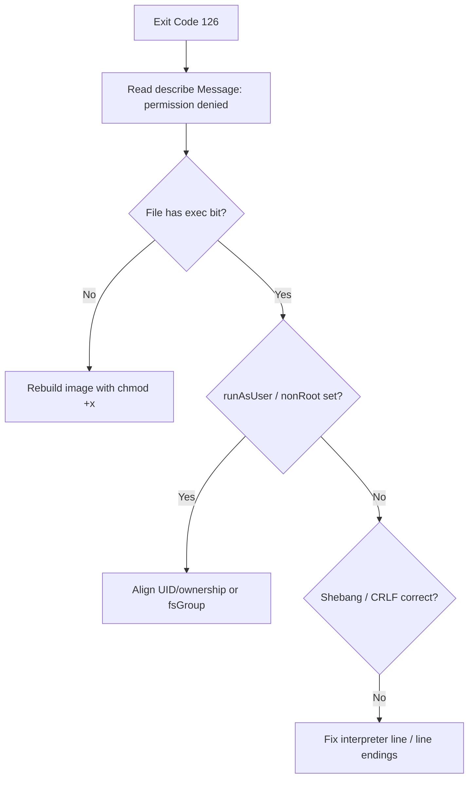

# Container Exit Code 126

> **Severity:** High · **Typical recovery time:** 5–25 min · **Affected versions:** 1.20+

## Error Message

```text
Last State:     Terminated
  Reason:       StartError
  Exit Code:    126
  Message:      exec: "/app/entrypoint.sh": permission denied: unknown
Reason: CrashLoopBackOff
```

## Description

Exit code 126 means "command found but not executable." Unlike 127 (binary missing),
the file *exists* at the path given — the runtime simply cannot run it. Usual causes
are a missing execute bit, a non-root `securityContext` that cannot read/exec the
file, a read-only filesystem blocking interpreter behaviour, or a script with the
wrong interpreter line. The process never starts, so there are no app logs; the
`describe` message is the key signal.

## Affected Kubernetes Versions

Version-independent (1.20+). The runtime message comes from runc/containerd. Note
that `readOnlyRootFilesystem`, `runAsNonRoot`, and `runAsUser` enforcement (Pod
Security Admission, 1.25+ Restricted profile) makes 126 more common on hardened
clusters because the chosen UID may not own or be able to exec the file.

## Likely Root Causes

- Entry script/binary lacks the execute bit (`chmod +x` never applied in the image)
- `securityContext.runAsUser`/`runAsNonRoot` runs a UID that cannot exec the file
- Wrong shebang or CRLF line endings in a shell script
- `readOnlyRootFilesystem: true` plus an entrypoint that writes before exec
- A directory used as a command, or mount shadowing the executable

## Diagnostic Flow



## Verification Steps

Confirm `Exit Code: 126` with a `permission denied` message (vs. 127 "not found").
Check whether a restrictive `securityContext` is in play and which UID the container
runs as.

## kubectl Commands

```bash
kubectl describe pod <pod> -n <namespace>
kubectl get pod <pod> -n <namespace> -o jsonpath='{.spec.containers[*].securityContext}'
kubectl get pod <pod> -n <namespace> -o jsonpath='{.spec.securityContext}'
kubectl get pod <pod> -n <namespace> -o jsonpath='{.status.containerStatuses[*].lastState.terminated.message}'
kubectl get events -n <namespace> --sort-by=.lastTimestamp
```

## Expected Output

```text
Last State:  Terminated  Reason: StartError  Exit Code: 126
  Message:   exec: "/app/entrypoint.sh": permission denied: unknown

securityContext: {"runAsNonRoot":true,"runAsUser":1000,"readOnlyRootFilesystem":true}
```

## Common Fixes

1. Rebuild the image with `RUN chmod +x /app/entrypoint.sh` (and correct ownership)
2. Align `runAsUser`/`fsGroup` with the file owner, or `COPY --chown` in the build
3. Fix the shebang (`#!/bin/sh`) and convert CRLF→LF in scripts
4. If a read-only root FS blocks startup writes, mount an `emptyDir` for scratch paths

## Recovery Procedures

1. Read the `describe` message to confirm permission vs. interpreter issue.
2. Most fixes require an image rebuild (exec bit, ownership, shebang) — produce a new tag.
3. If purely a `securityContext` mismatch, patch the spec (config-only change).
4. **Disruptive — roll out the corrected image/spec**: blast radius = all replicas;
   use a rolling update. **Deleting one pod** picks up a spec-only fix with blast
   radius of a single replica.

## Validation

```bash
kubectl get pod <pod> -n <namespace>
kubectl logs <pod> -n <namespace>
```

Container reaches `Running`, restart count stabilizes, and the entrypoint's own
output appears, confirming it executed under the configured user.

## Prevention

- Set `chmod +x` / `COPY --chown` in the Dockerfile and test the image as the prod UID
- Keep `securityContext` consistent with image file ownership; document the runtime UID
- Lint scripts for shebang and line endings in CI
- Test images against the cluster's Pod Security profile before deploy

## Related Errors

- [Container Exit Code 127](../pods/exit-code-127.md)
- [Container Exit Code 1](../pods/exit-code-1.md)
- [CrashLoopBackOff](../pods/crashloopbackoff.md)

## References

- [Configure a Security Context for a Pod or Container](https://kubernetes.io/docs/tasks/configure-pod-container/security-context/)
- [Pod Security Standards](https://kubernetes.io/docs/concepts/security/pod-security-standards/)

## Further Reading

- [Free Kubernetes config validators](https://devopsaitoolkit.com/validators/)
