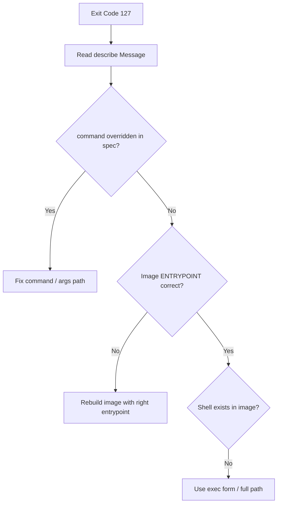

# Container Exit Code 127

> **Severity:** High · **Typical recovery time:** 5–20 min · **Affected versions:** 1.20+

## Error Message

```text
Last State:     Terminated
  Reason:       StartError
  Exit Code:    127
  Message:      exec: "myapp": executable file not found in $PATH: unknown
Reason: CrashLoopBackOff
```

## Description

Exit code 127 means "command not found." The container runtime tried to exec the
configured entrypoint/command and could not locate the binary on `$PATH` (or the
file does not exist at the given path). The process never really started, so there
are typically no application logs — the failure is purely about *what* you asked the
container to run versus what actually exists inside the image. This is one of the
fastest errors to fix once identified.

## Affected Kubernetes Versions

Version-independent (1.20+). The exact runtime message wording (`exec: ...: executable
file not found in $PATH`) comes from the OCI runtime (runc/containerd) and is stable.
Older Docker-shim clusters print a similar message.

## Likely Root Causes

- `command`/`args` in the pod spec points to a binary not in the image
- Typo in the entrypoint, or wrong absolute path (`/usr/bin/app` vs `/app/app`)
- Binary depends on a shell that the minimal/`scratch`/`distroless` image lacks
- Wrong architecture binary (amd64 image on arm64 node) reported as not executable
- Build did not copy the binary, or it is not on `$PATH`

## Diagnostic Flow



## Verification Steps

Confirm `Exit Code: 127` and read the `Message:` field — it names the missing
binary. Distinguish from 126 (found but not executable) and from 1 (app-level error
after a successful start).

## kubectl Commands

```bash
kubectl describe pod <pod> -n <namespace>
kubectl get pod <pod> -n <namespace> -o jsonpath='{.spec.containers[*].command}'
kubectl get pod <pod> -n <namespace> -o jsonpath='{.status.containerStatuses[*].lastState.terminated.message}'
kubectl logs <pod> -n <namespace> --previous
kubectl get events -n <namespace> --sort-by=.lastTimestamp
```

## Expected Output

```text
$ kubectl describe pod web-1
Last State:  Terminated  Reason: StartError  Exit Code: 127
  Message:   exec: "server": executable file not found in $PATH: unknown

$ kubectl get pod web-1 -o jsonpath='{.spec.containers[*].command}'
["server"]
```

## Common Fixes

1. Correct `command`/`args` to the exact binary name and absolute path in the image
2. Rebuild the image so the binary exists and is on `$PATH` (or use full path)
3. Use exec-form entrypoints; in shell-less images call the binary directly, not via `sh -c`
4. Match the image architecture to the node (build/pull the right arch)

## Recovery Procedures

1. From `describe`, identify the missing binary name.
2. If it is a spec mistake, fix `command`/`args` (config-only change).
3. If it is an image problem, rebuild and push a corrected image tag.
4. **Disruptive — roll out the corrected spec/image** (`kubectl set image` /
   `rollout restart`): blast radius = all replicas; rolling update keeps healthy
   pods serving. For a single test pod, **delete it** (blast radius = one pod).

## Validation

```bash
kubectl get pod <pod> -n <namespace>
kubectl logs <pod> -n <namespace>
```

Container reaches `Running`, restarts stop, and the application's own startup logs
now appear (proving the binary executed).

## Prevention

- Pin and test the entrypoint in CI by actually running the image
- Avoid `sh -c` in distroless/scratch images; prefer exec-form `command`
- Use multi-arch builds and verify the manifest matches node architecture
- Lint manifests so `command` paths are reviewed before deploy

## Related Errors

- [Container Exit Code 126](../pods/exit-code-126.md)
- [Container Exit Code 1](../pods/exit-code-1.md)
- [CrashLoopBackOff](../pods/crashloopbackoff.md)

## References

- [Define a Command and Arguments for a Container](https://kubernetes.io/docs/tasks/inject-data-application/define-command-argument-container/)
- [Images](https://kubernetes.io/docs/concepts/containers/images/)

## Further Reading

- [DevOps AI ToolKit — Kubernetes guides](https://devopsaitoolkit.com/blog/)
