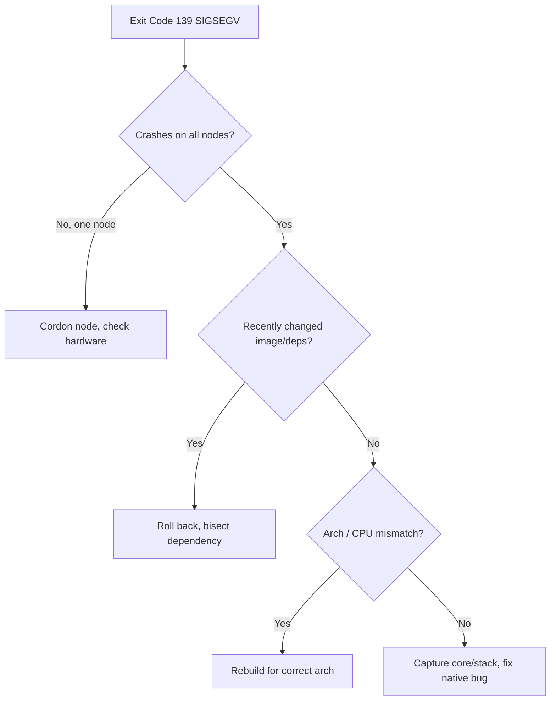

# Container Exit Code 139 (SIGSEGV)

> **Severity:** High · **Typical recovery time:** 20–90 min · **Affected versions:** 1.20+

## Error Message

```text
Last State:     Terminated
  Reason:       Error
  Exit Code:    139
  Signal:       11 (SIGSEGV)
Reason: CrashLoopBackOff
segmentation fault (139)
```

## Description

Exit code 139 = 128 + 11, meaning the process was killed by signal 11 (SIGSEGV) —
a segmentation fault. The application tried to access memory it was not allowed to,
and the kernel terminated it. This is a *crash inside the process*, not Kubernetes
evicting it. Causes range from genuine native bugs (C/C++/Rust/cgo, bad pointer) to
incompatible binaries (wrong CPU instructions/architecture), corrupted dependencies,
or rarely hardware/memory faults. It is harder to fix than exit 1 because the crash
is often in compiled or third-party code.

## Affected Kubernetes Versions

Version-independent (1.20+). The `Signal: 11` field requires the runtime to report
it; containerd/CRI-O populate it consistently. Do not confuse with 137 (SIGKILL,
often OOMKilled) — 139 is a segfault, not an out-of-memory kill.

## Likely Root Causes

- Native code bug: null/invalid pointer dereference, buffer overrun (cgo, C extensions)
- Binary built for a different CPU/arch or using unsupported instructions (e.g. AVX)
- Corrupted or mismatched shared library / dependency version
- A third-party library/driver crashing inside the container
- Rarely: faulty node memory (recurs only on one node)

## Diagnostic Flow



## Verification Steps

Confirm `Exit Code: 139` and `Signal: 11 (SIGSEGV)` in `describe` — not 137/SIGKILL
(OOM) or 143/SIGTERM. Check whether the crash is reproducible across nodes or
isolated to one (hardware hint).

## kubectl Commands

```bash
kubectl describe pod <pod> -n <namespace>
kubectl logs <pod> -n <namespace> --previous
kubectl get pod <pod> -n <namespace> -o jsonpath='{.status.containerStatuses[*].lastState.terminated.signal}'
kubectl get events -n <namespace> --sort-by=.lastTimestamp
kubectl get pods -n <namespace> -o wide
```

## Expected Output

```text
Last State:  Terminated  Reason: Error  Exit Code: 139  Signal: 11
$ kubectl logs api-2 --previous
[INFO] handling request id=842
SIGSEGV: segmentation violation
runtime stack: ...
```

## Common Fixes

1. Roll back to the last known-good image; the crash usually rode in with a change
2. Rebuild the image for the correct architecture/CPU baseline (multi-arch, no exotic flags)
3. Pin/repair the offending native dependency or library version
4. Fix the underlying native code bug using the captured stack/core dump

## Recovery Procedures

1. Capture `--previous` logs and any stack trace before it rotates.
2. **Disruptive — roll back the workload** (`kubectl rollout undo` after diagnosis):
   blast radius = all replicas, but restores service fastest; do this first if a recent
   deploy introduced the segfault.
3. If isolated to one node, **cordon/drain that node** (disruptive: its pods
   reschedule elsewhere) and open a hardware/memory check.
4. Ship the real fix (rebuilt binary/dependency) via a normal rolling update.

## Validation

```bash
kubectl get pod <pod> -n <namespace>
```

Pods stay `Running` with no further 139 terminations across multiple nodes over a
sustained period; restart counts hold steady and logs show clean request handling.

## Prevention

- Run native code under sanitizers (ASan/UBSan) and fuzzing in CI
- Build with a conservative CPU baseline; verify image arch matches node pool
- Pin dependency versions and test upgrades in staging
- Alert on repeated SIGSEGV exits and on per-node crash clustering

## Related Errors

- [Container Exit Code 1](../pods/exit-code-1.md)
- [Container Exit Code 143 (SIGTERM)](../pods/exit-code-143.md)
- [OOMKilled](../pods/oomkilled.md)

## References

- [Determine the Reason for Pod Failure](https://kubernetes.io/docs/tasks/debug/debug-application/determine-reason-pod-failure/)
- [Debug Running Pods](https://kubernetes.io/docs/tasks/debug/debug-application/debug-running-pod/)

## Further Reading

- [DevOps AI ToolKit — Kubernetes guides](https://devopsaitoolkit.com/blog/)
