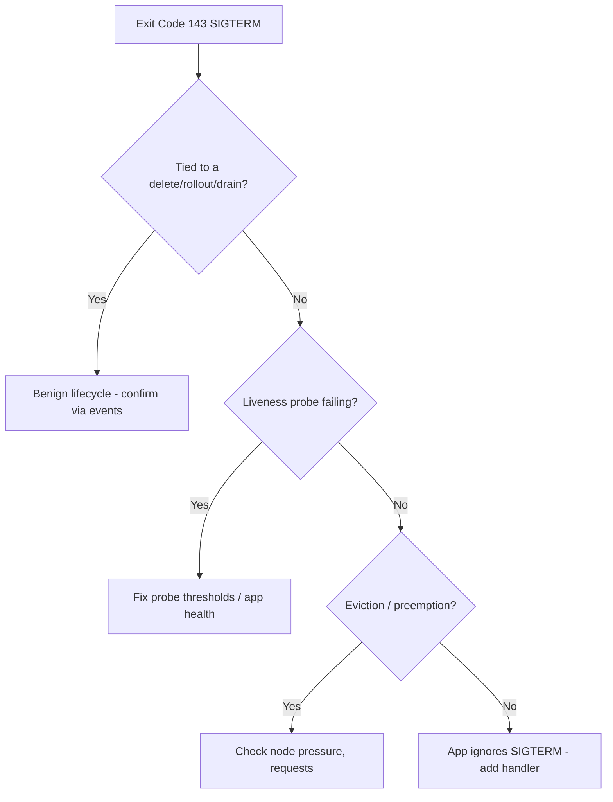

# Container Exit Code 143 (SIGTERM)

> **Severity:** Medium · **Typical recovery time:** 10–45 min · **Affected versions:** 1.20+

## Error Message

```text
Last State:     Terminated
  Reason:       Error
  Exit Code:    143
  Signal:       15 (SIGTERM)
terminated with SIGTERM (143)
```

## Description

Exit code 143 = 128 + 15, meaning the process exited because it received SIGTERM —
the signal Kubernetes sends to ask a container to shut down gracefully. Very often
143 is *expected* (normal pod deletion, scale-down, rollout, eviction, node drain).
It becomes a problem when it is unexpected or repeated: a failing liveness probe,
too-short `terminationGracePeriodSeconds`, OOM-adjacent eviction, or an app that
does not handle SIGTERM and looks like it "crashes." The job is to determine
whether this is benign lifecycle behaviour or a real signal you need to act on.

## Affected Kubernetes Versions

Version-independent (1.20+). The pod termination lifecycle (preStop hook → SIGTERM →
grace period → SIGKILL/137) is unchanged. Note: if the app ignores SIGTERM, you may
instead later see 137 when the grace period expires and SIGKILL is sent.

## Likely Root Causes

- Normal lifecycle: deletion, rollout, scale-in, HPA, node drain/eviction (benign)
- Liveness probe failing, so the kubelet restarts the container
- `terminationGracePeriodSeconds` too short for the app to finish shutdown
- App does not trap SIGTERM (e.g. shell-wrapped PID 1 not forwarding signals)
- Node pressure / preemption evicting the pod

## Diagnostic Flow



## Verification Steps

Confirm `Exit Code: 143` / `Signal: 15` and correlate timing with events. If a
`Killing`/`Preempting`/probe-failure event matches the termination, you know the
source. Absence of any delete/rollout event points to a probe or signal-handling bug.

## kubectl Commands

```bash
kubectl describe pod <pod> -n <namespace>
kubectl get events -n <namespace> --sort-by=.lastTimestamp
kubectl logs <pod> -n <namespace> --previous
kubectl get pod <pod> -n <namespace> -o jsonpath='{.spec.terminationGracePeriodSeconds}'
kubectl get pod <pod> -n <namespace> -o jsonpath='{.spec.containers[*].livenessProbe}'
```

## Expected Output

```text
Last State:  Terminated  Reason: Error  Exit Code: 143  Signal: 15

Events:
  Warning  Unhealthy  1m  kubelet  Liveness probe failed: HTTP 500
  Normal   Killing    1m  kubelet  Container failed liveness probe, will be restarted
```

## Common Fixes

1. If benign (delete/rollout/drain), no action — document expected behaviour
2. Fix or relax the liveness probe (path, period, `failureThreshold`, `timeoutSeconds`)
3. Increase `terminationGracePeriodSeconds` so shutdown can complete
4. Add a SIGTERM handler / use exec-form entrypoint so PID 1 forwards the signal

## Recovery Procedures

1. Correlate the 143 with events to classify benign vs. real.
2. For probe-driven kills, adjust probe config (config-only change).
3. For shutdown truncation, raise the grace period and/or add a `preStop` hook.
4. **Disruptive — roll out the corrected spec** (`rollout restart`): blast radius =
   all replicas; rolling update keeps service up. A single benign 143 needs no
   recovery at all.

## Validation

```bash
kubectl get pod <pod> -n <namespace>
kubectl get events -n <namespace> --sort-by=.lastTimestamp
```

Unexpected 143s stop recurring; liveness probes pass; shutdowns complete within the
grace period with no follow-on 137/SIGKILL.

## Prevention

- Trap SIGTERM and drain connections gracefully in the application
- Use exec-form `command`/`ENTRYPOINT` so signals reach PID 1
- Tune liveness probes conservatively to avoid flapping restarts
- Set realistic `terminationGracePeriodSeconds` and a `preStop` hook for in-flight work

## Related Errors

- [OOMKilled](../pods/oomkilled.md)
- [Container Exit Code 1](../pods/exit-code-1.md)
- [CrashLoopBackOff](../pods/crashloopbackoff.md)

## References

- [Pod Lifecycle — Termination](https://kubernetes.io/docs/concepts/workloads/pods/pod-lifecycle/#pod-termination)
- [Configure Liveness, Readiness and Startup Probes](https://kubernetes.io/docs/tasks/configure-pod-container/configure-liveness-readiness-startup-probes/)

## Further Reading

- [DevOps AI ToolKit — Kubernetes guides](https://devopsaitoolkit.com/blog/)
