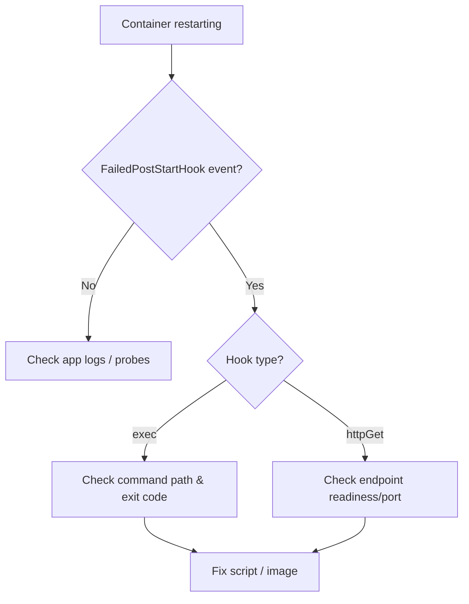

# FailedPostStartHook

> **Severity:** High · **Typical recovery time:** 5–20 min · **Affected versions:** 1.20+

## Error Message

```text
Events:
  Type     Reason               Age   From     Message
  ----     ------               ----  ----     -------
  Warning  FailedPostStartHook  12s   kubelet  PostStartHook failed
  Warning  FailedPostStartHook  12s   kubelet  Exec lifecycle hook ([/bin/sh -c /init.sh]) for Container "app" failed - error: command '/init.sh' exited with 1
```

## Description

A `postStart` hook runs immediately after a container's main process starts, but
Kubernetes makes **no guarantee** about ordering relative to the entrypoint — they
fire concurrently. If the hook command fails (non-zero exit for `exec`, or a bad
response for `httpGet`), the kubelet kills the container and applies the pod's
restart policy. So a failing postStart hook typically presents as a restart loop
with `FailedPostStartHook` warnings, not a clean error from the app itself.

This matters during incidents because the application logs may look fine — the
container is being torn down by the hook, not by the app crashing. Operators
often chase the wrong process logs before noticing the hook is the culprit.

## Affected Kubernetes Versions

Applies to 1.20+. Hook behavior (exec/httpGet/tcpSocket handlers, "at least
once" delivery, and the kill-on-failure semantics) has been stable. The
`sleep` hook handler type is a newer addition (beta 1.29, GA 1.32) and only
affects preStop, not postStart.

## Likely Root Causes

- The hook command/script is missing, not executable, or not on `PATH`
- The hook depends on a service or file not yet ready when it runs
- `httpGet` postStart probes an endpoint the app hasn't bound yet
- Hook exceeds expectations and the container terminates before it completes
- Wrong shell/interpreter inside a minimal/distroless image

## Diagnostic Flow



## Verification Steps

Confirm the restart is driven by a `FailedPostStartHook` event and identify the
hook handler (exec vs httpGet) and its exact failure message.

## kubectl Commands

```bash
kubectl describe pod <pod> -n <namespace>
kubectl get events -n <namespace> --field-selector reason=FailedPostStartHook
kubectl get pod <pod> -n <namespace> -o jsonpath='{.spec.containers[*].lifecycle.postStart}'
kubectl logs <pod> -n <namespace> --previous
```

## Expected Output

```text
$ kubectl describe pod app-5f7 -n web
Last State:  Terminated
  Reason:    Error
  Exit Code: 137
Warning  FailedPostStartHook  Exec lifecycle hook ([/bin/sh -c /init.sh])
  for Container "app" failed - error: command '/init.sh' exited with 1,
  message: "/bin/sh: /init.sh: not found"
```

## Common Fixes

1. Correct the hook command path, permissions, and interpreter for the image
2. Make the hook idempotent and tolerant of "not yet ready" dependencies
3. Move dependency-waiting logic into an `initContainer` instead of postStart
4. For `httpGet` hooks, point at an endpoint guaranteed available at start

## Recovery Procedures

Ordered, production-safe steps:

1. Reproduce by inspecting the hook definition and the prior container logs
   (read-only).
2. Patch the workload's pod template to fix or temporarily remove the hook.
   Apply via your GitOps/CD pipeline. **Disruptive — blast radius: the whole
   Deployment/StatefulSet**, since changing the template triggers a rolling
   update of all replicas. Use a controlled rollout, not a manual pod edit.
3. If the bad template already rolled out, roll back to the previous known-good
   revision. **Disruptive — blast radius: all replicas** of that workload.

## Validation

Containers reach `Running`/`Ready` with restart count stable, no new
`FailedPostStartHook` events appear, and the hook's intended side effect (file
created, cache warmed, registration done) is present.

## Prevention

- Prefer `initContainers` for setup that must complete before the app serves
- Keep postStart hooks fast, idempotent, and dependency-light
- Test hook scripts in the actual container image in CI
- Validate that referenced binaries exist in distroless/minimal images

## Related Errors

- [FailedPreStopHook](../pods/failed-pre-stop-hook.md)
- [Completed Pod Restart Loop](../pods/completed-restart-loop.md)

## References

- [Container Lifecycle Hooks](https://kubernetes.io/docs/concepts/containers/container-lifecycle-hooks/)
- [Attach Handlers to Container Lifecycle Events](https://kubernetes.io/docs/tasks/configure-pod-container/attach-handler-lifecycle-event/)

## Further Reading

- [DevOps AI ToolKit — Kubernetes guides](https://devopsaitoolkit.com/blog/)
