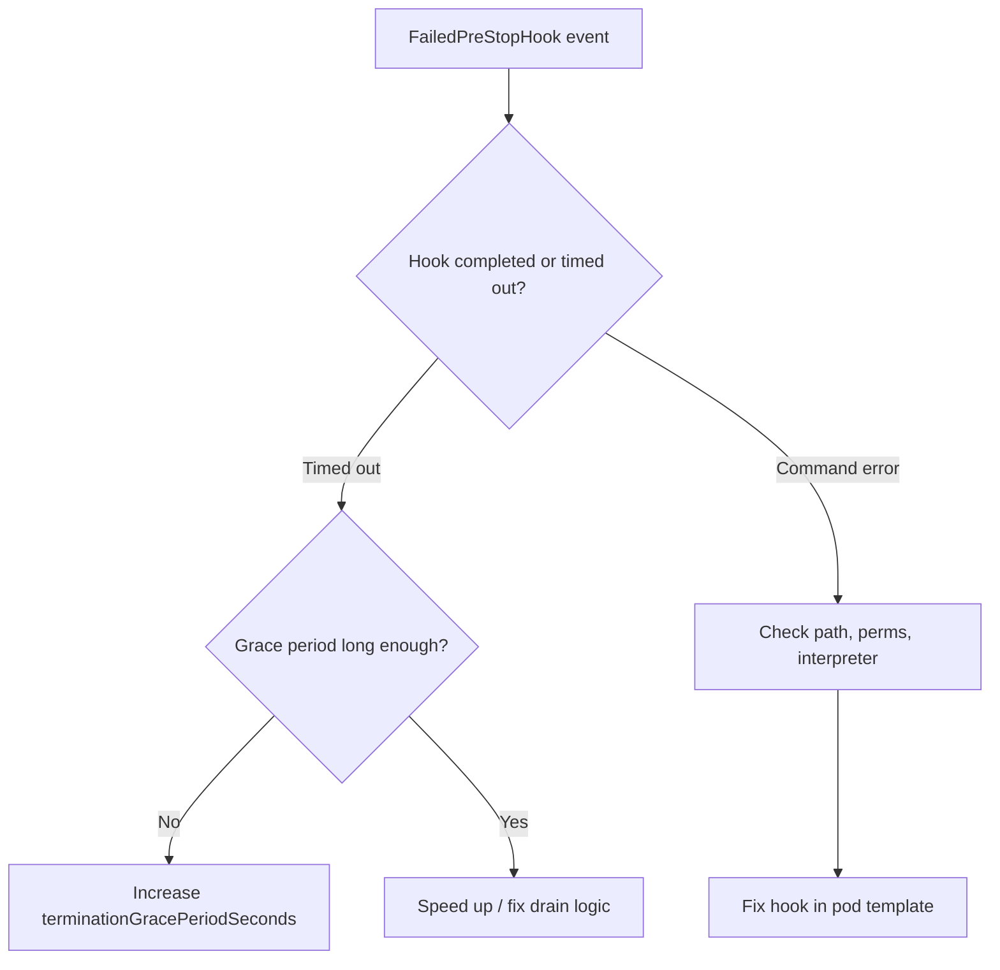

# FailedPreStopHook

> **Severity:** Medium · **Typical recovery time:** 5–20 min · **Affected versions:** 1.20+

## Error Message

```text
Events:
  Type     Reason             Age   From     Message
  ----     ------             ----  ----     -------
  Warning  FailedPreStopHook  3s    kubelet  PreStopHook failed
  Warning  FailedPreStopHook  3s    kubelet  Exec lifecycle hook ([/bin/sh -c /drain.sh]) for Container "app" failed - error: command timed out
```

## Description

A `preStop` hook runs *before* the kubelet sends `SIGTERM`, and it runs within
the pod's termination grace period. The hook is meant for graceful shutdown:
deregistering from a load balancer, finishing in-flight requests, flushing
buffers. If the hook fails or runs long, the kubelet logs `FailedPreStopHook`
and proceeds with termination — and if the grace period elapses while the hook
is still running, the container is `SIGKILL`ed regardless.

During an incident this surfaces two ways: as a warning event during otherwise
normal pod deletion, or as a contributor to a pod that appears stuck
terminating. The key insight is that the grace period is shared — a slow preStop
hook eats the same budget that `SIGTERM` handling needs.

## Affected Kubernetes Versions

Applies to 1.20+. The native `sleep` preStop handler (avoiding a shell/`sleep`
binary dependency) is beta in 1.29 and GA in 1.32; a zero-second sleep is
permitted from 1.33. On older versions you must use an `exec` hook for delays.

## Likely Root Causes

- Hook command exceeds the termination grace period and gets `SIGKILL`ed
- The hook script is missing, non-executable, or uses a missing interpreter
- Hook depends on an external endpoint that is unreachable during shutdown
- Grace period too short for the drain logic the hook performs
- `httpGet` preStop hitting a port the app has already closed

## Diagnostic Flow



## Verification Steps

Confirm the warning is `FailedPreStopHook`, determine whether it timed out vs.
errored, and compare hook duration against `terminationGracePeriodSeconds`.

## kubectl Commands

```bash
kubectl describe pod <pod> -n <namespace>
kubectl get events -n <namespace> --field-selector reason=FailedPreStopHook
kubectl get pod <pod> -n <namespace> -o jsonpath='{.spec.containers[*].lifecycle.preStop}'
kubectl get pod <pod> -n <namespace> -o jsonpath='{.spec.terminationGracePeriodSeconds}'
```

## Expected Output

```text
$ kubectl get pod app-5f7 -n web -o jsonpath='{.spec.terminationGracePeriodSeconds}'
30

$ kubectl describe pod app-5f7 -n web
Warning  FailedPreStopHook  Exec lifecycle hook ([/bin/sh -c /drain.sh])
  for Container "app" failed - error: command timed out
```

## Common Fixes

1. Increase `terminationGracePeriodSeconds` to cover the drain time
2. Make the preStop hook fast and idempotent; remove blocking external calls
3. Fix the hook command path/permissions/interpreter for the image
4. Use the native `sleep` handler (1.32+) instead of shelling out to `sleep`

## Recovery Procedures

Ordered, production-safe steps:

1. Inspect the hook definition and grace period (read-only) to classify the
   failure.
2. Patch the workload's pod template to fix the hook or raise the grace period,
   and roll it out through CD. **Disruptive — blast radius: the entire
   Deployment/StatefulSet**, because editing the template rolls all replicas.
3. If a critical drain is failing in production right now (e.g. LB
   deregistration), prefer scaling the workload down gradually rather than
   force-deleting. **Disruptive — force-deleting skips the hook entirely**,
   dropping in-flight connections for that pod.

## Validation

Pods terminate within the grace period without `FailedPreStopHook` warnings,
the drain side effect occurs (LB shows the endpoint removed before kill), and no
client-visible connection errors appear during rollouts.

## Prevention

- Keep drain logic well under the grace period; tune both together
- Combine a short preStop sleep with proper `SIGTERM` handling in the app
- Avoid hooks that depend on unreliable external services at shutdown
- Test shutdown behavior in CI, including grace-period expiry

## Related Errors

- [Pod Stuck Terminating](../pods/pod-stuck-terminating.md)
- [FailedPostStartHook](../pods/failed-post-start-hook.md)

## References

- [Container Lifecycle Hooks](https://kubernetes.io/docs/concepts/containers/container-lifecycle-hooks/)
- [Pod Lifecycle — Termination](https://kubernetes.io/docs/concepts/workloads/pods/pod-lifecycle/#pod-termination)

## Further Reading

- [DevOps AI ToolKit — Kubernetes guides](https://devopsaitoolkit.com/blog/)
