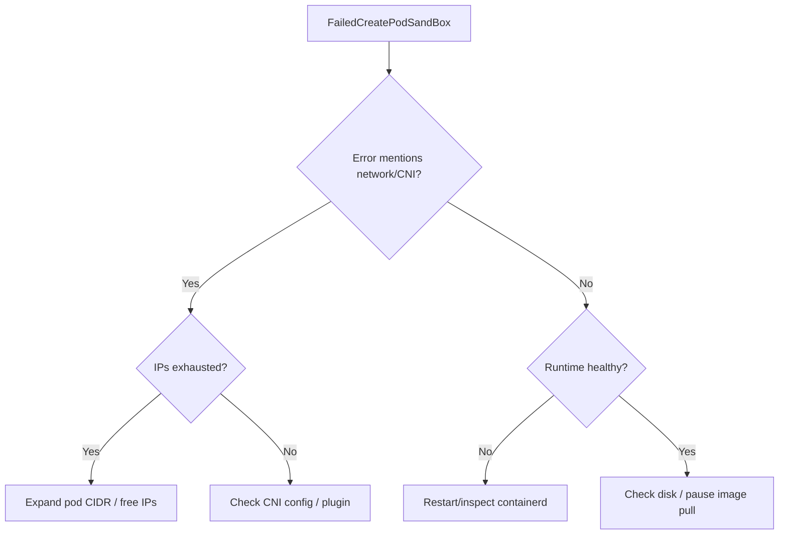

# FailedCreatePodSandBox

> **Severity:** Critical · **Typical recovery time:** 10–60 min · **Affected versions:** 1.18+

## Error Message

```text
Failed to create pod sandbox: rpc error: code = Unknown desc = failed to setup
network for sandbox "abc123": plugin type="bridge" failed (add): failed to
allocate for range 0: no IP addresses available in range set
Warning  FailedCreatePodSandBox  kubelet  Failed to create pod sandbox: rpc error
```

## Description

Before any container runs, the kubelet asks the container runtime (containerd,
CRI-O) to create the pod "sandbox" — the shared network/IPC namespace and pause
container that all containers in the pod join. `FailedCreatePodSandBox` means
that step failed, so the pod is stuck in `ContainerCreating` and no application
container ever starts.

This is frequently a node-level or CNI problem rather than an app problem, which
makes it Critical: a single bad node can block every pod scheduled to it, and a
cluster-wide CNI fault can stall all new pods.

## Affected Kubernetes Versions

Applies to all CRI-based clusters (1.18+). Since dockershim removal in 1.24, the
runtime is containerd or CRI-O; the sandbox concept and error string are
unchanged across them.

## Likely Root Causes

- CNI failure / IP pool (IPAM) exhausted on the node
- Container runtime unhealthy or out of disk for the pause image
- CNI plugin binaries/config missing in `/etc/cni/net.d` or `/opt/cni/bin`
- Cgroup driver mismatch between kubelet and runtime
- Failure pulling the `pause` sandbox image

## Diagnostic Flow



## Verification Steps

Confirm the pod is stuck in `ContainerCreating` and the event reason is
`FailedCreatePodSandBox`, then identify whether the message points at CNI,
runtime, or image.

## kubectl Commands

```bash
kubectl describe pod <pod> -n <namespace>
kubectl get events -n <namespace> --field-selector reason=FailedCreatePodSandBox
kubectl get pod <pod> -n <namespace> -o wide
kubectl describe node <node>
```

## Expected Output

```text
Status:  Pending
Events:
  Warning  FailedCreatePodSandBox  kubelet  Failed to create pod sandbox: rpc error:
  code = Unknown desc = failed to setup network for sandbox "...": no IP addresses
  available in range set
```

## Common Fixes

1. Free or expand the node/cluster pod IP range (IPAM exhaustion)
2. Restore CNI config/plugins under `/etc/cni/net.d` and `/opt/cni/bin`
3. Recover the container runtime (restart containerd; clear disk pressure)
4. Align the cgroup driver (`systemd`) between kubelet and runtime

## Recovery Procedures

1. Read the full event message to classify network vs. runtime vs. image.
2. For IPAM exhaustion, reclaim leaked IPs or widen the CIDR per your CNI's docs.
3. If the runtime is wedged, restart it on the affected node. **Disruptive —
   node-level:** restarting containerd recreates all sandboxes on that node;
   blast radius is every pod on the node. Cordon and drain first.
4. If only one node is bad, cordon it so the scheduler routes new pods elsewhere
   while you repair. **Disruptive:** drain evicts running pods.

## Validation

Confirm new pods on the node progress past `ContainerCreating` to `Running` and
that `FailedCreatePodSandBox` events stop appearing.

## Prevention

- Monitor CNI IP utilization and alert before pool exhaustion
- Track node disk for the runtime/image store
- Pin and validate CNI versions in your node image build
- Standardize the `systemd` cgroup driver across the fleet

## Related Errors

- [NetworkPluginNotReady](../pods/networkpluginnotready.md)
- [ImagePullBackOff](../pods/imagepullbackoff.md)

## References

- [Network Plugins (CNI)](https://kubernetes.io/docs/concepts/extend-kubernetes/compute-storage-net/network-plugins/)
- [Container Runtimes](https://kubernetes.io/docs/setup/production-environment/container-runtimes/)

## Further Reading

- [Free Kubernetes config validators](https://devopsaitoolkit.com/validators/)
