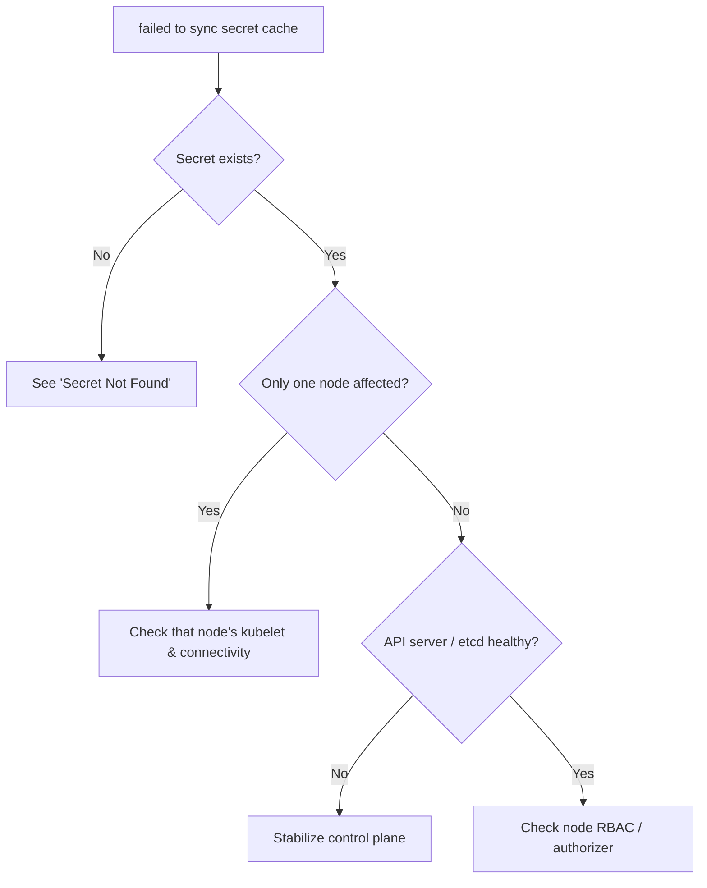

# Failed To Sync Secret Cache

> **Severity:** High · **Typical recovery time:** 10–30 min · **Affected versions:** 1.20+

## Error Message

```text
Events:
  Type     Reason       Age   From     Message
  ----     ------       ----  ----     -------
  Warning  FailedMount  21s   kubelet  MountVolume.SetUp failed for volume "creds" :
           failed to sync secret cache: timed out waiting for the condition
```

## Description

Unlike `secret not found`, this error means the Secret almost certainly *exists*
— the kubelet simply couldn't retrieve it from the API server in time. The
kubelet maintains a watch/cache of the Secrets (and ConfigMaps) referenced by
the pods on its node. When that cache fails to populate within the timeout, the
mount setup fails. The root cause is almost always **connectivity or
performance between the kubelet and the API server**, or an overloaded API
server / etcd, not the Secret itself.

This is a high-severity signal during incidents because it usually affects
*many* pods on a node (or across the cluster) simultaneously, and it often
coincides with control-plane stress, networking faults, or RBAC changes that
blocked the kubelet's node identity from reading Secrets.

## Affected Kubernetes Versions

Applies to 1.20+. The kubelet's secret/configmap caching strategy
(`configMapAndSecretChangeDetectionStrategy`, default `Watch`) is consistent
across these versions. Behavior is the same on cgroup v1 and v2.

## Likely Root Causes

- Network problems between kubelet and the API server (timeouts/packet loss)
- API server or etcd overloaded / slow, so watches don't sync in time
- Node `NotReady` or kubelet under resource pressure
- RBAC/Node-authorizer issue preventing the node from reading the Secret
- A very large Secret/ConfigMap or thousands of watched objects bloating cache

## Diagnostic Flow



## Verification Steps

Confirm the Secret exists (ruling out `not found`), check whether the issue is
node-local or cluster-wide, and assess API server / etcd health.

## kubectl Commands

```bash
kubectl get secret <name> -n <namespace>
kubectl describe pod <pod> -n <namespace>
kubectl get nodes
kubectl get componentstatuses
kubectl get --raw='/readyz?verbose'
kubectl get events -A --field-selector reason=FailedMount --sort-by=.lastTimestamp
```

## Expected Output

```text
$ kubectl get secret db-credentials -n web
NAME             TYPE     DATA   AGE
db-credentials   Opaque   2      40d        # secret DOES exist

$ kubectl get --raw='/readyz?verbose'
[+]ping ok
[-]etcd failed: reason withheld
readyz check failed                          # control-plane stress
```

## Common Fixes

1. Restore kubelet ↔ API server connectivity (network path, DNS, firewall)
2. Relieve API server / etcd load (scale control plane, fix slow etcd disk)
3. Recover the affected node / restart its kubelet if node-local
4. Fix node RBAC so the Node authorizer can read the referenced Secret

## Recovery Procedures

Ordered, production-safe steps:

1. Verify the Secret exists and determine node-local vs cluster-wide scope
   (read-only).
2. If node-local, restart the kubelet on that node. **Disruptive — blast
   radius: pods on that node** may briefly lose management; mounts re-sync after
   restart. Cordon first if you intend to drain.
3. If control-plane wide, prioritize etcd/API server health (disk latency, CPU,
   client load). **Disruptive — control-plane changes affect the whole
   cluster;** make them through your managed/HA process, one member at a time.
4. Once the cache syncs, stuck pods mount on the next retry — no pod delete
   needed in most cases.

## Validation

`FailedMount` / sync-cache events stop, `/readyz` reports healthy, affected pods
reach `Running`/`Ready`, and the Secret content is correctly mounted in-pod.

## Prevention

- Run a highly available control plane with fast (low-latency) etcd disks
- Monitor API server latency and etcd health; alert before saturation
- Keep Secret/ConfigMap counts and sizes reasonable per node
- Ensure reliable kubelet↔API networking and DNS

## Related Errors

- [Secret Not Found](../pods/secret-not-found.md)
- [ConfigMap Change Not Applied](../pods/configmap-immutable-not-updating.md)

## References

- [Secrets](https://kubernetes.io/docs/concepts/configuration/secret/)
- [Node Authorization](https://kubernetes.io/docs/reference/access-authn-authz/node/)

## Further Reading

- [DevOps AI ToolKit — Kubernetes guides](https://devopsaitoolkit.com/blog/)
