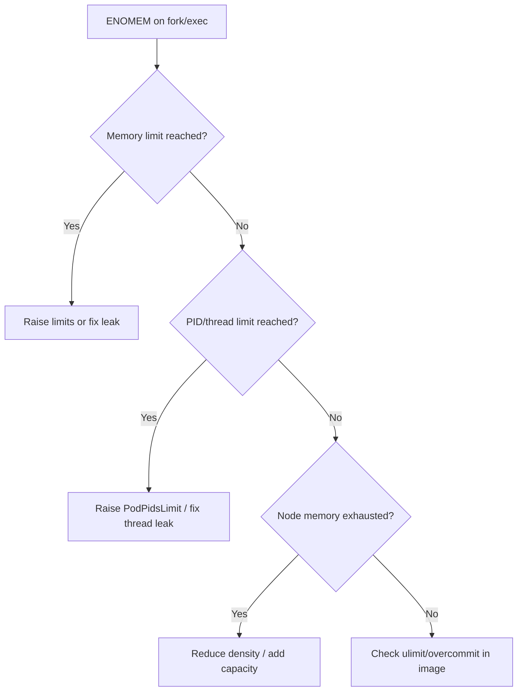

# Cannot Allocate Memory

> **Severity:** High · **Typical recovery time:** 10–40 min · **Affected versions:** 1.20+

## Error Message

```text
fork/exec /usr/local/bin/app: cannot allocate memory

# or, from inside the container:
sh: can't fork: Cannot allocate memory
runtime: failed to create new OS thread (have 12 already; errno=12)
```

## Description

`errno 12` (`ENOMEM`) on `fork`/`exec` means the kernel refused to create a new
process or thread. Critically, this is often *not* a raw memory shortage — it is
frequently a **PID/thread limit** being hit, a too-small `memory.limit`
including kernel accounting, or kernel overcommit policy denying the allocation.
The error appears when a container tries to spawn a subprocess (entrypoint
scripts, `exec` probes, sidecar tooling, a JVM/runtime creating threads).

This is insidious during incidents because the symptom (`cannot allocate
memory`) points operators at RAM, when the real cap is often
`pids.limit` from `PodPidsLimit`/cgroup, or the container hitting its
`memory.limits` ceiling where page-cache and kernel memory count against it.

## Affected Kubernetes Versions

Applies to 1.20+. Per-pod PID limiting via `--pod-max-pids` /
`SupportPodPidsLimit` is GA from 1.20. cgroup v2 (default on many distros from
1.25+) changes memory accounting (kernel memory and page cache fold into the
unified limit), which can make `ENOMEM` appear at thresholds that cgroup v1
tolerated.

## Likely Root Causes

- Container hit its cgroup `pids.limit` (too many threads/processes)
- `memory.limits` set too low; allocation pushed over the cgroup ceiling
- Node-level memory exhaustion / overcommit policy denying allocations
- Thread/connection leak in the app exhausting the PID quota
- ulimit/`nproc` restrictions inside the image

## Diagnostic Flow



## Verification Steps

Distinguish a true memory ceiling from a PID/thread ceiling: compare current
usage against both the memory limit and the configured PID limit.

## kubectl Commands

```bash
kubectl describe pod <pod> -n <namespace>
kubectl get pod <pod> -n <namespace> -o jsonpath='{.spec.containers[*].resources}'
kubectl top pod <pod> -n <namespace> --containers
kubectl get node <node> -o jsonpath='{.status.allocatable}'
kubectl logs <pod> -n <namespace> --previous
```

## Expected Output

```text
$ kubectl logs api-6d4 -n prod --previous
runtime: failed to create new OS thread (have 250 already; errno=12)
runtime: may need to increase max user processes (ulimit -u)

$ kubectl get pod api-6d4 -n prod -o jsonpath='{.spec.containers[*].resources}'
{"limits":{"memory":"256Mi"},"requests":{"memory":"128Mi"}}
```

## Common Fixes

1. Raise the container memory `limits` if it is genuinely memory-bound
2. Increase the per-pod PID limit (`--pod-max-pids`) or fix the thread/process
   leak in the application
3. Reduce node memory density / add capacity if the node is exhausted
4. Adjust `ulimit -u`/`nproc` in the image or pod security context

## Recovery Procedures

Ordered, production-safe steps:

1. Confirm whether memory or PIDs is the binding limit (read-only commands).
2. Patch the workload's resource limits and roll out via CD. **Disruptive —
   blast radius: the whole Deployment/StatefulSet**, since the template change
   rolls all replicas.
3. If the kubelet `PodPidsLimit` is too low cluster-wide, update kubelet config
   and restart kubelets. **Disruptive — blast radius: every pod on each node**
   restarted; do it node-by-node behind cordon/drain.
4. Add a node or larger instance type if node memory is the limit, then
   uncordon.

## Validation

The container starts and stays `Running`/`Ready`, `fork`/`exec` succeeds (probes
pass), thread/PID count is stable below the limit, and memory usage sits
comfortably under the configured limit.

## Prevention

- Set `PodPidsLimit` defensively and alert on PID usage per pod
- Right-size memory limits with headroom for kernel/page-cache (esp. cgroup v2)
- Fix thread/connection pools that grow unbounded
- Load-test to surface fork/thread exhaustion before production

## Related Errors

- [OOMKilled](../pods/oomkilled.md)
- [Pod Evicted (MemoryPressure)](../pods/pod-evicted-memorypressure.md)

## References

- [Process ID Limits And Reservations](https://kubernetes.io/docs/concepts/policy/pid-limiting/)
- [Resource Management for Pods and Containers](https://kubernetes.io/docs/concepts/configuration/manage-resources-containers/)

## Further Reading

- [DevOps AI ToolKit — Kubernetes guides](https://devopsaitoolkit.com/blog/)
